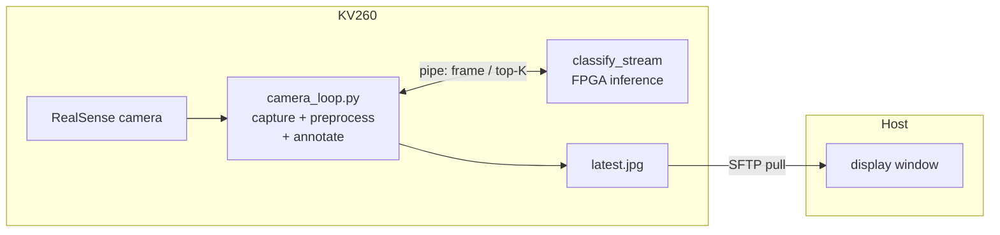

# Camera classification KV260 demo

Real-time ImageNet classification from a live **Intel RealSense** camera on
the KV260 FPGA platform, using **MobileNetV1 1.0/224** running on this
repo's own HLS kernels (Conv / Pool / VectorOP) — no Vitis-AI / DPU.
The shipped `mobilenet_v1_1.0_224_no_softmax` variant ends in a 1×1 Conv
classifier, so MatmulKernel is not on the active path.

Connect a RealSense camera to the board, run the orchestrator, and the demo
will

  1. download the MobileNetV1 ONNX model + the ImageNet 1001-class labels,
  2. generate a self-contained KV260 inference project with
     `inference-scheduler`,
  3. build it on the board over SSH,
  4. start a board-side loop that captures camera frames, runs inference on
     the FPGA, and annotates each frame with the top-5 prediction,
  5. stream the annotated frames back over SSH and show them in a window on
     your host.



> **Expect ~0.4 FPS.** MobileNetV1 inference on the FPGA takes a few seconds
> per frame, so the live view updates slowly — that is the kernel cost, not a
> pipeline stall. The overlay shows inference latency, display refresh rate,
> and whole-board (SOM) power draw.

## Layout

```
demo/camera/
├── README.md
├── requirements.txt                      — host Python deps
├── camera_config.json.example
├── run_demo.py                           — one-shot orchestrator
├── scripts/
│   ├── download_assets.py                — fetch ONNX + labels
│   ├── generate_project.py               — schedule the model into a CMake project
│   └── deploy_and_run.py                 — upload, build, run, display
├── src/
│   ├── classify_stream.c                 — persistent board-side inference host
│   └── board/                            — uploaded to the KV260
│       ├── camera_loop.py                —   RealSense capture + annotate loop
│       ├── preprocessing.py              —   NCHW ap_fixed<16,8> frame encoder
│       └── visualization.py              —   OpenCV overlay helpers
├── assets/
│   ├── labels/imagenet_1001_labels.txt   — populated by download_assets.py
│   └── models/                           — ONNX downloads
└── build/
    ├── projects/<model>/                 — generated CMake project
    ├── stream/latest.jpg                 — host-pulled annotated frames
    └── ...
```

## How it works

The camera demo cannot use a one-shot batch classifier: `inference_init()`
loads all the model weights into DDR and binds the kernel drivers, which is
expensive. So the board runs a **persistent** inference host:

- **`classify_stream`** (C, on the board) — calls `inference_init()` *once*,
  then loops forever: read one raw frame from stdin, run inference, write a
  one-line top-K JSON to stdout.
- **`camera_loop.py`** (Python, on the board) — captures RealSense colour
  frames, preprocesses them, drives `classify_stream` over a pipe (one frame
  in flight), annotates the frame, and writes `latest.jpg` atomically.
- **`deploy_and_run.py`** (host) — builds the project, launches the board
  loop, and SFTP-pulls `latest.jpg` into a display window.

## Prerequisites

### Host

* Python 3.10+, `pip install -r requirements.txt`
  (gdown, numpy, onnx, onnxsim, paramiko, **opencv-python** for the display
  window — a headless host can use `--save-only` instead).
* HLS-generated driver sources for the kernels:

  ```bash
  # from the repo root
  mkdir -p build && cd build
  cmake -DAXI_BUS_WIDTH=32 ..
  make synthesize_kv260
  ```

  `AXI_BUS_WIDTH` must match the AXI master width of the cormorant overlay
  loaded on the board. Override `local.driver_dirs` if you keep the build
  tree elsewhere.

### KV260 board

* Linux with the cormorant overlay loaded (so `/dev/uio*` exposes
  `fabric_vecop` / `fabric_matmul` / `fabric_conv` / `fabric_pool`).
* `gcc`, `cmake ≥ 3.19`, `make`.
* XRT runtime via `pkg-config xrt` or `/opt/xilinx/xrt`.
* Passwordless `sudo` for the SSH user (XRT requires root).
* An **Intel RealSense** camera on USB 3.0.
* **Board setup** — the board-side capture loop needs these in the Python
  interpreter named by `run.board_python`:

  ```bash
  # RealSense — librealsense + the Python bindings
  sudo apt-get install -y librealsense2-utils python3-pyrealsense2
  # ... or, if your distro lacks the package, build librealsense from source:
  #   https://github.com/IntelRealSense/librealsense  (enable -DBUILD_PYTHON_BINDINGS=ON)

  # OpenCV + numpy
  sudo apt-get install -y python3-opencv python3-numpy
  ```

  Verify on the board:

  ```bash
  python3 -c "import pyrealsense2, cv2, numpy; print('deps ok')"
  rs-enumerate-devices            # should list the connected camera
  ```

  If `run.board_python` points at a venv (e.g. the PYNQ venv
  `/usr/local/share/pynq-venv/bin/python3`), install the packages there
  instead. `deploy_and_run.py --check-only` probes all of this for you.

## Configure

```bash
cd demo/camera
cp camera_config.json.example camera_config.json
$EDITOR camera_config.json          # set ssh.host, key_file, etc.
```

Key fields beyond the SSH / driver paths:

| Field | Meaning |
|-------|---------|
| `run.board_python` | Python on the board with pyrealsense2/opencv/numpy |
| `camera.{width,height,fps}` | RealSense colour stream geometry |
| `run.duration_s` | Auto-stop after N seconds (0 = run until `q`) |
| `run.target_fps` | Throttle the board loop (0 = uncapped) |
| `display.poll_interval_ms` | How often the host pulls a fresh frame |
| `display.save_only` | Headless host: save frames instead of a window |

## Run the demo

One-liner that does download → generate → deploy:

```bash
.venv/bin/python run_demo.py
```

Or step-by-step:

```bash
.venv/bin/python scripts/download_assets.py
.venv/bin/python scripts/generate_project.py
.venv/bin/python scripts/deploy_and_run.py
```

A window opens showing the live annotated camera feed. Press **`q`** (or
`ESC`) in the window — or `Ctrl-C` — to stop; the board loop is signalled to
shut down cleanly and the remote scratch directory is removed.

Sample output (host `~/projects/axi_demo/demo/camera`, board at
`192.168.100.8` with a RealSense D435):

```
$ ./run_demo.py

=== download_assets ===
ONNX models → demo/camera/assets/models
  ✓ mobilenet_v1_1.0_224_no_softmax.onnx  (16,908,384 B)
  cached imagenet_1001_labels.txt (1001 lines)
done

=== generate_project ===
[mobilenet_v1] scheduling mobilenet_v1_1.0_224_no_softmax.onnx
Model      : demo/camera/assets/models/mobilenet_v1_1.0_224_no_softmax.onnx
Inputs     : ['input:0[1, 3, 224, 224]']
Outputs    : ['MobilenetV1/Logits/SpatialSqueeze:0[1, 1001]']
Nodes      : 58
  [  0] Conv         [1, 3, 224, 224] x [32, 3, 3, 3] x [32]   -> [1, 32, 112, 112]
  [  1] Clip         [1, 32, 112, 112]                          -> [1, 32, 112, 112]
  …  (depthwise-separable Conv / Clip blocks repeating to 14×14, 7×7) …
  [ 54] AveragePool  [1, 1024, 7, 7]                            -> [1, 1024, 1, 1]
  [ 55] Conv         [1, 1024, 1, 1] x [1001, 1024, 1, 1] x [1001] -> [1, 1001, 1, 1]
  [ 56] Reshape      [1, 1001, 1, 1]                            -> [1, 1, 1, 1001]
  [ 57] Squeeze      [1, 1, 1, 1001]                            -> [1, 1001]
Weights    : 20 large weight(s) written to build/projects/mobilenet_v1/weights/
[mobilenet_v1] active kernels: VectorOPKernel, ConvKernel, PoolKernel
wrote 1 project(s) under demo/camera/build/projects

=== deploy_and_run ===

Preflight (local)
    OK   assets/labels/imagenet_1001_labels.txt    10,484 B
    OK   project 'mobilenet_v1' on disk
    OK     driver/xvectoropkernel.h  (VectorOPKernel)
    OK     driver/xconvkernel.h      (ConvKernel)
    OK     driver/xpoolingkernel.h   (PoolKernel)
    OK     board/camera_loop.py
    OK     board/preprocessing.py
    OK     board/visualization.py
    OK     board/power_monitor.py

Connecting to root@192.168.100.8:22 …
  connected

Preflight (remote)
    OK   cmake                                 cmake version 3.22.1
    OK   gcc                                   gcc 11.4.0
    OK   xrt headers                           xrt via pkg-config
    OK   uio (VectorOPKernel: fabric)          /dev/uio4
    OK   uio (ConvKernel:     fabric_conv)     /dev/uio6
    OK   uio (PoolKernel:     fabric_pool)     /dev/uio7
    OK   board python deps (pyrealsense2, numpy, cv2)
    OK   RealSense camera detected             1 device(s)

Uploading → /tmp/camera_demo
  uploaded 54 project + 2 label file(s)
  cmake …
  make classify_stream …
  build OK

  ── streaming from the KV260 — press q to quit ──
    camera_loop: loaded 1001 class labels
    power_monitor: source='xlnx_platformstats'  initial=3.18 W
    camera_loop: launching /tmp/camera_demo/projects/mobilenet_v1/build/classify_stream
    classify_stream: model=mobilenet_v1 classes=1001 input_numel=150528 warmup=1 top_k=5
    classify_stream: ready — streaming frames
    camera_loop: RealSense 'Intel RealSense D435' streaming 640x480@30
      frame 0:  patio    (12.8%)  infer=2463.6ms  display=0.3fps  power=3.2W
      frame 10: umbrella (17.5%)  infer=2463.6ms  display=0.4fps  power=3.4W
      frame 20: yurt     (16.4%)  infer=2463.6ms  display=0.4fps  power=3.3W
      frame 30: yurt     (22.6%)  infer=2463.3ms  display=0.4fps  power=3.4W
    camera_loop: stopping (stop file) after 38 frame(s)
    classify_stream: 38 frame(s) processed — shutting down

cleanup /tmp/camera_demo
```

Each annotated frame's bottom strip reads
`infer <ms>   display <fps>   power <W>   frame <N>`.

Notable behaviour visible in the run:

- **Only three kernels are active.**  The `no_softmax` MobileNetV1 ends
  in a 1×1 `Conv` (node 55) rather than a fully-connected `MatMul`, so
  `[mobilenet_v1] active kernels: VectorOPKernel, ConvKernel, PoolKernel`.
- **Power source picked automatically.**  `xlnx_platformstats` (the SOM
  INA260 sensor, 3.18 W idle) was selected at startup; see *Power
  measurement* below for the fallback chain.
- **Per-frame inference latency ≈ 2.46 s.**  Same as the
  image-classification demo's MobileNetV1 column — that's pure HLS
  kernel cost; the pipeline is one-frame-in-flight, so display refresh
  caps at ~0.4 fps.

### Power measurement

The board samples whole-board (SOM) power on a background thread and picks a
source once at startup, in this order:

1. **XRT** — `pyxrt` electrical info. The XRT power API
   (`xrt::info::device::electrical`) is an Alveo datacenter-card feature and
   is normally **not** populated on the KV260's embedded zocl stack, so this
   is tried first but usually falls through.
2. **`xmutil xlnx_platformstats`** — the SOM INA260 sensor (`SOM total
   power`). This is the reliable KV260 source and what the demo typically
   uses.
3. **hwmon** — `/sys/class/hwmon/*/power1_input`. Best-effort last resort.

If none are available the overlay shows `power n/a`. Tune the sample rate
with `run.power_poll_s`.

## Useful options

| Flag | Effect |
|------|--------|
| `--skip-download` | reuse cached ONNX + labels |
| `--skip-deploy` | only regenerate the local CMake project |
| `--force-download` | re-fetch all assets |
| `--save-only` | headless host: save frames to `build/stream/` instead of a window |
| `--check-only` | run preflight checks for every stage and exit |

`--check-only` is the fastest way to confirm the board is ready — it probes
SSH, the kernels' UIO devices, and the board-side RealSense / OpenCV
dependencies without uploading anything.

## Troubleshooting

| Symptom | Fix |
|---------|-----|
| `board python deps … MISSING` | install pyrealsense2 / opencv / numpy on the board — see *Board setup* |
| `RealSense camera detected … MISSING` | check the USB 3.0 connection; run `rs-enumerate-devices` on the board |
| `opencv-python not installed on the host` | `pip install -r requirements.txt`, or run with `--save-only` |
| display window never updates | the first FPGA inference takes a few seconds; watch the per-frame log on the console |
| every prediction looks wrong | usually a normalize mismatch — `preprocess.normalize` must match how the model was trained (`tf` for the stock MobileNetV1) |
