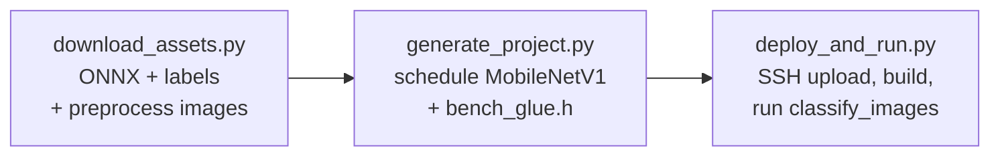

# Image classification KV260 demo

End-to-end ImageNet classification demo for the KV260 FPGA platform using
**MobileNetV1 1.0/224**.  Drop a few JPG/PNG files into `assets/images/`,
run the orchestrator, and the demo will

  1. download the ONNX model from a shared Google Drive folder,
  2. fetch the ImageNet 1001-class label list,
  3. preprocess each image to NCHW `ap_fixed<16,8>` on the host,
  4. generate a self-contained KV260 inference project with
     `inference-scheduler`,
  5. build the project on the board over SSH,
  6. run `classify_images`, which prints the top-5 predictions per image
     and reports per-image latency.



## Layout

```
demo/image_classification/
├── README.md
├── requirements.txt
├── image_classification_config.json.example
├── run_demo.py                             — one-shot orchestrator
├── scripts/
│   ├── download_assets.py                  — fetch ONNX + labels, preprocess images
│   ├── generate_project.py                 — schedule the model into a CMake project
│   └── deploy_and_run.py                   — upload, build, classify on KV260
├── src/
│   └── classify_images.c                   — board-side host (compiled on the board)
├── assets/                                 — populated by you + download_assets.py
│   ├── images/                             — drop JPG/PNG inputs here
│   ├── labels/imagenet_1001_labels.txt     — derived from imagenet_class_index.json
│   ├── models/                             — ONNX downloads
│   └── preprocessed/                       — images.bin + manifest.txt
└── build/
    ├── projects/<model>/                   — generated CMake project per model
    │   ├── driver/                         —   HLS driver sources copied in
    │   └── test/
    │       ├── classify_images.c           —   copied from demo/image_classification/src/
    │       └── bench_glue.h                —   generated; per-model glue + macros
    ├── logs/<model>.<step>.log             — per-step build/run output
    └── results.json                        — final summary (top-5 + latency per image)
```

## Prerequisites

### Host

* Python 3.10+, `pip install -r requirements.txt` (paramiko, gdown, Pillow, numpy, onnx, onnxsim).
* HLS-generated driver sources for the four kernels:

  ```bash
  # from the repo root
  mkdir -p build && cd build
  cmake -DAXI_BUS_WIDTH=32 ..
  make synthesize_kv260
  ```

  `AXI_BUS_WIDTH` must match the AXI master width of the cormorant overlay
  loaded on the board; the sample numbers below were measured at 32-bit.
  Override `local.driver_dirs` if you keep the build tree elsewhere.

### KV260 board

* Linux with the cormorant overlay loaded (so `/dev/uio*` exposes
  `fabric_vecop` / `fabric_matmul` / `fabric_conv` / `fabric_pool`).
* `gcc`, `cmake ≥ 3.19`, `make`.
* XRT runtime via `pkg-config xrt` or `/opt/xilinx/xrt`.
* Passwordless `sudo` for the SSH user (XRT requires root for buffer allocation).

## First-time setup

```bash
cd demo/image_classification
python3 -m venv .venv
.venv/bin/pip install -r requirements.txt

cp image_classification_config.json.example image_classification_config.json
$EDITOR image_classification_config.json    # set ssh.host, key_file, etc.

# Drop a few JPG/PNG files into assets/images/
cp ~/Pictures/cat.jpg assets/images/
cp ~/Pictures/dog.jpg assets/images/
```

## Run the demo

```bash
.venv/bin/python run_demo.py
```

Or step-by-step (lets you iterate without re-downloading):

```bash
.venv/bin/python scripts/download_assets.py
.venv/bin/python scripts/generate_project.py
.venv/bin/python scripts/deploy_and_run.py --verbose
```

Sample output:

```
  ── IMAGE CLASSIFICATION KV260 ──

  image: greyfox-672194.JPEG  latency=2463.174 ms
    1) [ 281] grey_fox                          prob= 69.06%  logit=  3034
    2) [ 278] red_fox                           prob=  4.96%  logit=  2360
    3) [ 264] Pembroke                          prob=  2.83%  logit=  2216
    4) [ 272] red_wolf                          prob=  2.32%  logit=  2165
    5) [ 279] kit_fox                           prob=  2.15%  logit=  2146

  Model         Status   Images   mean(ms)    p50(ms)    p99(ms)        IPS
  ─────────────────────────────────────────────────────────────────────────
  mobilenet_v1  OK           1   2463.174   2463.174   2463.174        0.4
```

The full per-image top-K table is also written to `build/results.json`.

## Useful options

| Flag | Effect |
|------|--------|
| `--skip-download` | reuse cached ONNX + preprocessed images |
| `--skip-deploy` | only regenerate the local CMake project |
| `--force-download` | re-fetch ONNX, labels, and rebuild `images.bin` |
| `--check-only` | run preflight checks for every stage and exit |
| `--profile-layers` | enable per-layer wall-clock profiling on the board |
| `--no-cleanup` (deploy) | leave the remote work_dir for inspection |
| `--verbose` | print full build / run output for failed steps |

## Tuning the run

Edit `image_classification_config.json`:

* **`preprocess.normalize`** — default input encoding for every model:
  `tf` for TF-style MobileNet inputs (`(p/127.5)-1`),
  `unit` for Keras-style (`p/255`),
  `imagenet` for the torchvision recipe (`p/255` then per-channel
  `(x − μ)/σ` with `mean=[0.485,0.456,0.406]`, `std=[0.229,0.224,0.225]` —
  required by the ONNX Model Zoo MobileNetV2),
  `none` for raw bytes (`p/256`).
* **Per-model override** — each entry under `models` may carry its own
  `preprocess: { "normalize": ... }` block that overrides specific fields
  (currently `input_size`, `normalize`, `resize`).  The defaults above
  apply to any field a model leaves unset.  `download_assets.py` writes
  one bin per model under `assets/preprocessed/<model>/images.bin`, and
  `deploy_and_run.py` swaps the right one into the canonical
  `preprocessed/images.bin` path before each model runs on the board.
* **`labels.skip_background_class`** (per-model) — set to `true` for
  models whose output has 1000 logits (no synthetic 'background' slot at
  index 0), e.g. the ONNX Model Zoo MobileNetV2 / ResNet.  The host
  rebuilds `classify_images` per model with `-DBENCH_LABEL_OFFSET=1`,
  so the shared 1001-line labels file maps each predicted class index
  `i` to `labels[i+1]` instead of `labels[i]`.  Leave at `false`
  (or omit) for TF MobileNetV1 (1001 logits, slot 0 == `background`).
* **`run.top_k`** — how many predictions to print per image.
* **`run.warmup`** — inferences run before timing starts.

## Troubleshooting

* **`assets/images/` is empty** — drop at least one JPG/PNG into that
  folder before running `download_assets.py`.
* **`gdown failed`** — Google Drive sometimes throttles.  Run
  `python3 -m gdown --folder <url> -O assets/models/` manually, or download
  the `.onnx` file via a browser and place it in `assets/models/`.
* **`Driver file not found: driver/xconvkernel.h`** during cmake — the HLS
  driver sources weren't on this host.  Run `make synthesize_kv260` from
  the repo root, or point `local.driver_dirs` at an existing build output.
* **All images classified as "background", or wildly off top-K** — the input
  encoding is wrong for that model.  TF MobileNetV1 wants
  `normalize: "tf"`; the ONNX Model Zoo MobileNetV2 wants
  `normalize: "imagenet"`.  Set the right value (globally or per-model)
  and re-run the download stage with `--force` to rebuild
  `assets/preprocessed/<model>/images.bin`.
