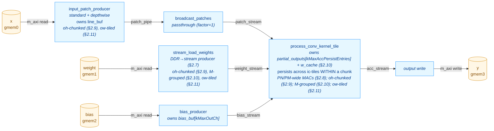

# ConvKernel — Optimization Log

This document records the structural and performance optimizations applied to
`kernels/conv/kernel/ConvKernel.cpp` after the initial scalar implementation
shipped. Each section describes one change, the rationale, and the measured
HW behavior simulation (`make behavior_test_conv`) impact on the kv260 RTL.

For the high-level kernel description see [CONV_KERNEL.md](CONV_KERNEL.md);
this file is a complement focused on the optimization arc and the current
final architecture.

> **Status (2026-05-15).**  §2.7 (weight streaming), §2.8 (PN/PM
> parallel MACs + X-prop guard), §2.9 (oh-chunking), §2.10 (weight
> caching + M-grouping), and §2.11 (ow-tiling — lifted the in_w cap)
> are written up against measured `conv-verify` snapshots.  §2.1–§2.6
> still have TODO cells — structural outlines reflect the optimisation
> passes visible in the current source (dataflow stages in
> `csynth.rpt`, the Option-A IC-tiling design in `Config.h.in`, the
> existing branch history `conv_optimisation_1..3`); per-step numbers
> and rationale for those earlier steps need to come from the commit
> history and the original author's notes.  §2.12 (URAM double-buffer)
> is the next planned step.

---

## 1. Performance progression at a glance

All numbers are total `sim_time_ns` reported by the kv260 behavior testbench
after running the full TestConvRef case list.

> Latest baseline (branch `conv_optimisation_3`, 30 RTL tests, post-§2.11):
> **sim_time_ns = 2,673,625 ns** (sum of per-test `duration_ns` =
> 2,671,425 ns).  Captured by `conv-verify` Gate 4 on **2026-05-15** —
> see `build/kernels/conv/kv260/conv_timing_last.json`.

| Stage | Tests | sim_time_ns | Δ vs prior | Δ vs §2.7 |
|---|---:|---:|---:|---:|
| Baseline — single fused loop, no caching | TODO | TODO | — | — |
| + Dataflow restructuring (producer/consumer/writer) | TODO | TODO | TODO | — |
| + Line buffer (rows persistent across `oh`) | TODO | TODO | TODO | — |
| + Option-A IC-tiling + persistent partial-output accumulator | TODO | TODO | TODO | — |
| + Depthwise / standard producer split | TODO | TODO | TODO | — |
| + Broadcast patches (`broadcast_patches` stage) | TODO | TODO | TODO | — |
| + Bias producer fused with replay (`bias_producer`) | TODO | TODO | TODO | — |
| Snapshot post-§2.6 (captured 2026-05-12) | 30 | 5,204,375 | — | — |
| + Weight streaming (`stream_load_weights`, §2.7) | 30 | 4,913,835 | **-5.6 %** | — |
| **Snapshot post-§2.7 (captured 2026-05-12)** | **30** | **4,913,835** | — | reference |
| + PN/PM parallel MACs (§2.8) | 30 | 3,844,095 | **-21.8 %** | -21.8 % |
| + oh-chunking (§2.9) | 30 | 3,861,515 | +0.5 % | -21.4 % |
| + Weight caching + M-grouping (§2.10) | 30 | 2,636,945 | **-31.7 %** | -46.3 % |
| + ow-tiling (§2.11, this snapshot) | 30 | 2,673,625 | +1.4 % | **-45.6 %** |
| **Current state (post-§2.11, captured 2026-05-15)** | **30** | **2,673,625** | — | **-45.6 %** |
| **+ Double buffering (planned — see [CONV_DOUBLE_BUFFER_PLAN.md](CONV_DOUBLE_BUFFER_PLAN.md), §2.12)** | TODO | TODO | TODO | TODO |

**Net result vs §2.7 snapshot: 1.84× faster across 30 RTL tests; 45.6 %
reduction in total HW sim time.  Net result vs original baseline: TODO
(needs `conv_optimisation_1` re-run for the pre-§2.1 column).**

---

## 2. Optimization steps

> Numbering and step boundaries should follow the commit history on
> `conv_optimisation_1/2/3`.  Below is a sketch of the passes I can identify
> from the current source — adjust ordering and split/merge to match what
> actually happened.

### 2.1. Dataflow restructuring (HLS DATAFLOW)

**Problem.** TODO — describe the original monolithic loop, the m_axi
read/write serialization, and why it dominated end-to-end latency.

**Change.** Split the body into N dataflow sub-functions wired by
`hls::stream`.  Current top-level stages (visible in `csynth.rpt`):
`entry_proc`, `Block_entry_proc`, `input_patch_producer`,
`bias_producer`, `broadcast_patches`, `process_conv_kernel_tile`.

**Result.** TODO — quote the prior-vs-now sim_time_ns and the per-test
pattern that dropped most.

### 2.2. Line buffer with row-incremental loading

**Problem.** TODO — adjacent `(oh, ow)` and `(oh, ow+stride_w)` windows
re-read the same `x[]` rows, multiplying DDR fetches by `kh × kw`.

**Change.** TODO — describe the line buffer (`line_buf[kTileIC]
[kMaxLineBufRows][kMaxInW]`), the row-incremental load schedule, the
`ih & (kMaxLineBufRows-1)` slot mapping.

**Result.** TODO.

### 2.3. Option-A IC-tiling + persistent partial-output accumulator

**Problem.** TODO — describe why a `kMaxInCh`-deep line buffer was
infeasible at the target channel counts (mobilenet, etc.).

**Change.** The current design (Config.h.in §"Option-A IC-tiling")
shrinks the per-channel buffers (`line_buf`, broadcast `local_buf`,
`w_buf`) from `kMaxInCh` to `kTileIC` channels.  In exchange, a
`partial_outputs[kMaxAccPersistEntries]` buffer of `AccData_t`
accumulators survives across ic-tiles in the consumer, initialised from
bias once per `ni` and drained to `acc_stream` after the `ict` loop.

**Result.** TODO — buffer-size deltas, sim_time_ns impact.

### 2.4. Depthwise / standard producer split

**Problem.** TODO — the standard-conv patch producer and the
depthwise-conv patch producer have different IC iteration shapes; sharing
a single function blocked II=1 for both.

**Change.** Split `input_patch_producer` into
`input_patch_producer_standard` (visible in `csynth.rpt` at
`VITIS_LOOP_385_*` / `VITIS_LOOP_416_*` etc.) and
`input_patch_producer_depthwise` (`VITIS_LOOP_587_*` /
`VITIS_LOOP_614_*` etc.), dispatched via the `is_depthwise` runtime flag.

**Result.** TODO.

### 2.5. `broadcast_patches` stage

**Problem.** TODO — describe the IC×M broadcast inefficiency the stage was
added to amortize.

**Change.** New `broadcast_patches` dataflow stage between the patch
producer and the conv tile consumer (`VITIS_LOOP_516_*` /
`VITIS_LOOP_517_*` / `VITIS_LOOP_528_*` in `csynth.rpt`).

**Result.** TODO.

### 2.6. `bias_producer` and bias-replay restructure

**Problem.** TODO.

**Change.** Bias load split into its own `bias_producer` dataflow stage
that loads `bias_buf[kMaxOutCh]` once per `ni` and replays it in
`(r, mt, m1)` order into the persistent accumulator init.

**Result.** TODO.

### 2.7. Weight streaming via dedicated DDR producer

**Problem.** Before this change, `process_conv_kernel_tile` called
`load_standard_weights(weight, ...)` inline once per
`(ict, oh, ow, mt)` iteration in Phase 2a, and
`load_depthwise_weights(weight, ...)` once per `mt` in Phase 2b.  The
`gmem1` DDR transfer was serialised with the patch read, the
partial-accumulator read/write, and the accumulate loop — every inner
iteration paid the full weight-load latency before MACs could start.
This was "Bottleneck A" of [CONV_DOUBLE_BUFFER_PLAN.md](CONV_DOUBLE_BUFFER_PLAN.md)
§1, but achievable without the URAM rework.

**Change.**

- Added a new `stream_load_weights` dataflow producer that owns the
  `gmem1` AXI master and pushes one `Data_t` per cycle to a
  `weight_stream` FIFO.  Iteration order matches the consumer's read
  pattern exactly:
  - Standard (`is_depthwise=0`): per `(ni, ict, oh, ow, mt)` emit
    `m_valid × ic_valid × kh × kw` values in `(m1, ic_l, khi, kwi)`
    order — same DDR bandwidth as the old inline replay, just
    overlapped.
  - Depthwise (`is_depthwise=1`): per `(ni, mt)` emit
    `m_valid × kh × kw` values in `(m1, khi, kwi)` order — no spatial
    replay, matching the consumer's existing once-per-`mt` hoist.
- `process_conv_kernel_tile` signature: `const Data_t* weight` →
  `hls::stream<Data_t>& weight_stream`.  Both inline
  `load_*_weights(...)` call sites replaced with II=1 stream-read
  loops into the existing `w_buf`.
- `weight_stream` depth = `kTileM × kTileIC × kMaxKH × kMaxKW` = 6,272
  at defaults — one full max-tile, large enough for the producer to
  pre-fetch the next iteration's slice during the consumer's
  accumulate.
- Removed the now-unused `load_standard_weights` /
  `load_depthwise_weights` helpers.

**Result.** **-5.6 % sim_time_ns** (5,204,375 → 4,913,835).  Wins
concentrated on the 1×1 and large-spatial layers where weight DDR
loads dominated the inner iteration:

| Test | Δ% |
|---|---:|
| `1x1 IC=TILE_IC*2 M=TILE_M*2 bias exact tiles` (was #2 heaviest) | **-19.8 %** |
| `partial_M_tile out_ch=TILE_M+3` | **-18.1 %** |
| `1x1_kernel 1ch no_bias` | -17.3 % |
| `saturation +/- overflow` (both STD variants) | -15.8 % |
| `batch_3 ResNet-style 7x7 stride=2` (heaviest test overall) | **-9.2 %** |

Five small-spatial 3×3 tests regressed +2–7 % (largest absolute
regression: `partial_IC_tile in_ch=TILE_IC+5` at +6.7 %, +34 k ns;
largest relative: `3x3_input_3x3_kernel → 1x1_out` at +23.0 %, +8 k ns)
— the new dataflow stage's prologue overhead doesn't amortise on tiny
iteration counts (single-output tiles, few channels).  Aggregate
regression across the 6 worst movers is ~+25 k ns; the savings on the
five biggest tests alone are -347 k ns.

**Synthesis impact.** Top-level slack on `ConvKernel*` improved
slightly: -0.93 → **-0.90 ns**.  No new II violations.  Resources
grew modestly (the new producer's address arithmetic):
BRAM 72 (25 %) → 80 (27 %); DSP 113 (9 %) → **151 (12 %, +34 %)**;
FF 46,086 → 51,052 (+11 %); LUT 37,948 (32 %) → 42,541 (36 %, +12 %).
m_axi data widths unchanged at 16 → 16 on all four ports — `gmem1`
widening still blocked by ap_fixed alignment; potential follow-up
optimisation (manual pack into `ap_uint<128>`).

### 2.8. PN/PM parallel MACs

**Problem.** After §2.7 the consumer's MAC reduction
(`accumulate_standard` / `accumulate_depthwise`) ran one MAC per cycle via
the lane-rotation trick (`m1 = ri & (kTileM-1)`), which only spaces
accumulator writes apart — it doesn't actually parallelise the multiplies.
On `batch_3 ResNet-style` (the heaviest test) the inner reduction
`ic_valid · kh · kw · kTileM = 16·9·8 = 1152` cycles per `(oh, ow, mt)`
dominated the consumer's pipeline.  At only 1 DSP busy per cycle out of
the ~178 on the device, the kernel was DSP-starved.

**Change.**

- **`accumulate_standard` → PN-wide adder tree.**  Inside the existing
  lane-rotated outer (`ri` from 0 to `kh·kw·kTileM-1`), the `ic_l` loop
  is `#pragma HLS UNROLL`ed across `kTileIC = 16` lanes.  Each PIPELINE
  iteration fires 16 parallel multiplies whose outputs reduce through a
  4-level adder tree, then add into the lane-rotated `acc[m1]` once per
  cycle.  Loop bound shrinks from `ic_valid · kh · kw · kTileM` to
  `kh · kw · kTileM` (≈ 16× faster inner reduction).  The lane-rotation
  RAW distance on `acc[m1]` is still `kTileM` cycles, so the multi-cycle
  MAC pipeline (multiply + tree + accumulate) closes without an II bump.
- **`accumulate_depthwise` → PM-wide channel-parallel lanes.**  Depthwise
  has no input-channel reduction, so the inner `m1` loop is unrolled
  across `kTileM = 8` lanes inside a flat `(khi, kwi)` outer PIPELINE.
  Loop bound shrinks from `kh · kw · kTileM` to `kh · kw` (kTileM× faster).
  Per-lane RAW distance on `acc[m1]` is 1 cycle; the `ap_fixed<32,16>`
  add is a single-cycle 32-bit integer adder at 300 MHz, so the
  recurrence closes at II=1 without `DEPENDENCE` or lane rotation.
- **`w_buf` partitioning** required to feed the parallel reads:
  - Standard: `#pragma HLS ARRAY_PARTITION variable=w_buf complete dim=2`
    (kTileIC parallel banks along the ic_l axis).
  - Depthwise: `#pragma HLS ARRAY_PARTITION variable=w_buf complete dim=1`
    (kTileM parallel banks along the m1 axis).
- **X-propagation guard (standard only).**  Catching this fix took a
  Gate-3 round trip.  For partial IC tiles (`ic_valid < kTileIC`),
  `stream_load_weights` emits only `m_valid · ic_valid · kh · kw` values,
  so `w_buf[m1][ic_l ≥ ic_valid][…]` is left uninitialised — `X` in RTL.
  C-sim treats these as 0 because `patch[ic_l ≥ ic_valid][…]` is
  producer-zero-padded and `0 · garbage = 0` in C; RTL `0 · X = X`
  propagates through the adder tree, into `acc[m1]`, and out to the AXI
  output (Test 1: `1x1_kernel__1ch__no_bias` triggered
  `AXI4_ERRM_WDATA_X` on `gmem3`).  Fix: gate the BRAM read so invalid
  lanes return `Data_t(0)` directly:
  ```cpp
  const Data_t w_val = (ic_l < ic_valid)
      ? w_buf[m1][ic_l][khi_cnt][kwi_cnt]
      : Data_t(0);
  ```
  Cost: one LUT per PN lane on the weight input; no DSP impact.

**Result.** **-21.8 % sim_time_ns** vs §2.7 (4,913,835 → 3,844,095).
Wins concentrate on tests where the inner reduction dominated:

| Test | Δ% | Δns |
|---|---:|---:|
| `partial_IC_tile in_ch=TILE_IC+5` | **-62.7 %** | -339,010 |
| `batch_3 ResNet-style 7×7 stride=2` (heaviest) | **-37.4 %** | -472,290 |
| `DW 5×5 kernel, 4ch` | **-30.1 %** | -42,000 |
| `DW batch_2, 4ch, pad=1` | -26.5 % | -47,500 |
| `DW 3×3, 4ch, pad=1+bias` | -26.1 % | -42,230 |

Small-spatial 3×3 standard tests showed +1–2 % regressions from the
extra LUT in the X-prop MUX (single LUT on every PN lane); aggregate
regression: < 5 k ns vs. -1,069 k ns aggregate gain.

**Synthesis impact.** No II violations; top-level slack on `ConvKernel*`
unchanged at **-0.90 ns**.  Resources:
BRAM 80 (27 %) → 94 (32 %);
DSP 151 (12 %) → **178 (14 %)** (+18 %);
FF 51,052 → 56,018 (+10 %);
LUT 42,541 (36 %) → 45,412 (38 %).
m_axi data widths unchanged at 16 → 16 on all four ports.

### 2.9. oh-chunking (relaxed persistent-accumulator constraint)

**Problem.** The Option-A persistent accumulator (§2.3) imposed
`out_h · out_w · out_ch ≤ kMaxAccPersistEntries` (16,384 at defaults).
Larger output tensors — common in early layers of high-resolution
networks (e.g. 224×224 with even modest channel counts) — were rejected
by the scheduler.  The alternative of degrading to a no-persistent-acc
mode would re-read every input pixel `ic_tiles · m_tiles` times per
`(oh, ow)` — a bandwidth catastrophe.

**Change.**  Split the output along the `oh` axis into chunks whose
footprint fits the buffer.  A `compute_oh_chunking()` helper computes:

```
oh_per_chunk = max(1, kMaxAccPersistEntries / (out_w · out_ch))
num_chunks   = ceil(out_h / oh_per_chunk)
```

Each chunk runs the full three-phase Option-A pipeline for its `oh`
sub-range; `partial_outputs[]` is reused per chunk, indexed by
`oh_local = oh - oh_start`.  A chunk loop is added INNER to `ni` (and
outer to everything else) in four functions:

- `input_patch_producer_standard`
- `input_patch_producer_depthwise`
- `stream_load_weights`
- `process_conv_kernel_tile`

The chunk loop is placed INNER to `ni` so the linear `(ni, oh, ow, mt, m1)`
order seen by `bias_producer`, `broadcast_patches`, and
`write_output_tile` is preserved — those three need no chunk-awareness.

At a chunk transition the patch producer's `line_buf` is invalidated;
`last_loaded_row` is reset to `(oh_start · stride_h - pad_top) - 1` so
the next chunk's first `oh` triggers a fresh kh-row load.  The
`(kh-1)·stride_h`-row overlap between chunks is re-fetched from DDR —
this is the "duplicated reading" the user accepted in exchange for
supporting larger layers.

**Relaxed constraint.**
- Was: `out_h · out_w · out_ch ≤ kMaxAccPersistEntries`
- Now: `out_w · out_ch ≤ kMaxAccPersistEntries`  *(one output row must fit)*

**Result.** **+0.5 % sim_time_ns** vs §2.8 (3,844,095 → 3,861,515).
All 30 existing RTL tests have `num_chunks = 1` (their full output fits
the buffer), so they pay only the per-(ni) wrapper-loop overhead — a few
cycles of `oh_start` / `oh_end` arithmetic per chunk-loop iteration,
distributed uniformly across all tests (+500–700 ns each, no outlier).
Two new C-sim tests exercise the multi-chunk path:

| Test | num_chunks | Notes |
|---|---:|---|
| `oh-chunking standard (out=32×32×32)` | 2 | row_size = 1024; oh_per_chunk = 16 |
| `DW oh-chunking (32 ch, 32×32 out)` | 2 | same chunking, depthwise path |

RTL fixtures haven't been regenerated, so the new tests are C-sim-only
for now (running `make gen_conv_test_data` would update the fixtures).

**Synthesis impact.** No II violations; top-level slack unchanged at
**-0.90 ns**.  Resources:
BRAM 94 (32 %) → 87 (30 %);
DSP 178 (14 %) → 178 (14 %) unchanged;
FF 56,018 → 62,195 (+11 %);
LUT 45,412 (38 %) → 52,492 (44 %) (+15 %).
The FF/LUT growth covers the chunk loop counters (`chunk`, `oh_start`,
`oh_end`, `chunk_oh_count`) and the `oh_local` arithmetic in the
consumer's three phases.

**Documentation.**  Constraint and chunking rationale moved into
`kernels/conv/include/Config.h.in` (header block on
`kMaxAccPersistEntries`) and `kernels/conv/kernel/ConvKernel.cpp`
(`compute_oh_chunking()` helper).

### 2.10. Weight caching + M-grouping

**Problem.**  After §2.7–§2.9 the consumer's MAC reduction was no longer
the long pole — the `weight_stream` drain was.  `stream_load_weights`
replayed the full `(ic_valid · kh · kw)` weight slab per `(oh, ow, mt)`
iteration, so every DDR weight was read `out_h · out_w` times per
`(ni, chunk, ict)`.  On `batch_3 ResNet-style` (the heaviest test) this
came to ~7M DDR weight reads for what is actually a 9 KB filter.

**Change.**  Hoist the weight load out of `(oh, ow)`.  The consumer now
caches one `(ict, M-group)` slab on-chip and reuses it across the chunk's
spatial sweep.  When `m_tiles` exceeds the cache capacity, M-axis splits
into groups of `mt_per_group` mt-tiles; each group's slab is loaded
fresh from DDR.

- **`compute_m_grouping()` helper:**
  ```
  mt_per_group = min(kMaxMperGroup, m_tiles)
  num_m_groups = ceil(m_tiles / mt_per_group)
  ```
  New CMake var `CONV_MAX_M_PER_GROUP` (default 4, = up to 32 channels
  per group at kTileM=8).
- **`stream_load_weights` standard path:** rewritten as
  `(ni, chunk, ict, mg, mt_in_group)` — weights emitted ONCE per
  `(ni, chunk, ict, mg)`, no per-spatial replay.
- **`process_conv_kernel_tile` Phase 2a:** added `mg` loop inside `ict`.
  New `w_cache[kMaxMperGroup][kTileM][kTileIC][kMaxKH][kMaxKW]` with
  `#pragma HLS ARRAY_PARTITION variable=w_cache complete dim=3` (kTileIC
  banks on the ic_l axis to feed the §2.8 PN-wide adder tree).  Per
  `(ict, mg)`: load `w_cache` once from `weight_stream`, then sweep
  `(oh_local, ow, mt_in_group)` reusing cached weights.  Patches read
  once per `(mg, oh_local, ow)` and reused across `mt_in_group`.
- **`input_patch_producer_standard`:** added `mg` loop OUTER of
  `(oh, ow)` inside `(chunk, ict)`.  line_buf retained across m_groups
  so patches are re-emitted from on-chip BRAM without DDR re-read.
- **`ConvKernel` top:** `broadcast_iters` multiplies by `num_m_groups`
  for standard; `broadcast_factor = 1u` (the producer handles the
  m_group replay so `broadcast_patches` is a passthrough).

**Result.** **-31.7 % sim_time_ns** vs §2.9 (3,861,515 → 2,636,945).
Wins concentrated on tests where the weight DDR replay dominated:

| Test | Δ% | Δns |
|---|---:|---:|
| `1x1 IC=TILE_IC*2 M=TILE_M*2 bias exact tiles` | **-79.7 %** | -501,020 |
| `batch_3 ResNet-style 7×7 stride=2` (heaviest) | **-69.7 %** | -550,930 |
| `partial_M_tile out_ch=TILE_M+3` | **-37.1 %** | -84,490 |
| `partial_IC_tile in_ch=TILE_IC+5` | -23.6 % | -47,810 |
| `3×3 → 1×1 out` | -22.2 % | -7,560 |

The 11 depthwise tests move ≤ ±60 ns (≤ 0.1 %) — depthwise already
loaded weights once per `(chunk, mt)` so the caching has no effect
there.  New C-sim test `M-grouping standard (out_ch=64, 2 M-groups)`
exercises `num_m_groups = 2` (m_tiles=8, kMaxMperGroup=4) and validates
the multi-group path.

**Synthesis impact.** No II violations; top-level slack unchanged at
**-0.90 ns**.  Resources:
BRAM 87 (30 %) → 102 (35 %) — the new w_cache slab;
DSP 178 → 191 (+7 %);
FF 62,195 → 66,606 (+7 %);
LUT 52,492 (44 %) → 55,938 (47 %, +7 %).

### 2.11. ow-tiling — lift the in_w cap

**Problem.**  `line_buf` was sized `[…][kMaxLineBufRows][kMaxInW]` and
the runtime invariant required `in_w ≤ kMaxInW` (= 64 by default), which
ruled out a lot of real-world layers (any 128- or 224-column input
needed at minimum).  The Python scheduler validated the bound and
rejected oversized layers up-front.

**Change.**  Rename `CONV_MAX_IN_W` → `CONV_MAX_LINE_BUF_COLS`: the
constant now bounds the line-buffer column dim, NOT `in_w`.  Wider
inputs are handled by tiling the output column axis.

- **`compute_ow_tiling()` helper:**
  ```
  window_w     = (kw - 1) · dilation_w + 1
  ow_per_tile  = max(1, (kMaxLineBufCols - window_w) / stride_w + 1)
  num_ow_tiles = ceil(out_w / ow_per_tile)
  ```
  Relaxed constraint: `(kw-1)·dilation_w + 1 ≤ kMaxLineBufCols`
  (one kernel-width window must fit) — versus the old `in_w ≤ kMaxInW`.
- **`line_buf` reshape:** `[…][kMaxLineBufRows][kMaxLineBufCols]` with
  CIRCULAR indexing on both dims now:
  ```
  row_slot = ih & (kMaxLineBufRows - 1)
  col_slot = iw & (kMaxLineBufCols - 1)
  ```
  Both `kMaxLineBufRows` and `kMaxLineBufCols` are static_assert'd as
  powers of 2.
- **Both patch producers:** ow_tile loop INSIDE `ict` (standard) /
  `mt` (depthwise), OUTSIDE `mg` (standard) / `(oh, ow)` (depthwise).
  `last_loaded_row` resets per `(chunk, ict|mt, ow_tile)`.  Phase 1
  clips iw to `[max(0, iw_load_start), min(in_w-1, iw_load_last)]`,
  loading only the tile's iw range.  Phase 2 reads via
  `col_slot = iw & (kMaxLineBufCols-1)`.
- **`stream_load_weights` standard path:** ow_tile loop INSIDE `ict`,
  OUTSIDE `mg`.  Weights re-emitted per `(ict, ow_tile, mg)` —
  multi-tile layers pay an `num_ow_tiles ×` weight DDR replay.  New
  signature: takes `stride_w` and `dilation_w` so it can call
  `compute_ow_tiling()`.
- **`process_conv_kernel_tile`:**
  - Phase 2a (standard): `(ict, ow_tile, mg, oh_local, ow_in_tile, mt_in_group)` nest.
  - Phase 2b (depthwise): `(mt, ow_tile, oh_local, ow_in_tile)` — `w_buf` stays cached across all ow_tiles for the mt (depthwise weights are tiny, no need to re-load per tile).

**Result.** **+1.4 % sim_time_ns** vs §2.10 (2,636,945 → 2,673,625).
All 30 RTL tests have `in_w ≤ 64` so `num_ow_tiles = 1` for all of
them; the +1.4 % is the wrapper-loop overhead (ow_start/ow_end
arithmetic + clipped-iw range computation in Phase 1).  New C-sim test
`wide input ow-tiling (in_w=128, 3 ow-tiles)` exercises the multi-tile
path (default `kMaxLineBufCols=64`, kw=3, stride=1 →
`ow_per_tile = 62`, `out_w=128 → num_ow_tiles=3`).

**Synthesis impact.** No II violations; top-level slack unchanged at
**-0.90 ns**.  Resources:
BRAM 102 (35 %) → 102 (35 %) — unchanged (line_buf shape changed but
total cells unchanged at the default kMaxLineBufCols=64);
DSP 191 → 188;
FF 66,606 → 74,726 (+12 %) — ow_tile counters, iw clipping state;
LUT 55,938 (47 %) → 66,802 (57 %, +19 %) — Phase 1 clipped-iw range
arithmetic + circular col-slot computation.  LUT is now the tightest
resource; further optimisation here (e.g. shifting line_buf cols across
tiles instead of reloading) could trim the LUT growth back.

**Documentation.**  Constraint summary in `kernels/conv/include/Config.h.in`
fully rewritten — `in_h`, `in_w`, and `out_h` are now ALL handled by
transparent tiling (oh-chunking, ow-tiling); only the kernel-window
fits and `out_w·out_ch ≤ kMaxAccPersistEntries` remain as hard
constraints.

### 2.12. Double buffering (planned)

See [CONV_DOUBLE_BUFFER_PLAN.md](CONV_DOUBLE_BUFFER_PLAN.md) for the
full plan.  Summary: slab-level double-buffering on the URAM weight
slab so the next ic-tile's `w_slab` loads while the current tile is
computing.  After §2.7 the weight load is already overlapped within a
single tile; after §2.8 the compute is PN/PM-wide; after §2.10 the
weight DDR replay is eliminated; after §2.11 there is no in_w cap.
The URAM step's remaining wins are (a) bulk weight loads into URAM at
m_axi widening (today the inner loops are bound by stream rate, not
DDR), and (b) larger ic-tiles (`TILE_IC_WIDE` ≥ 64) per outer
iteration for higher arithmetic intensity.

**Status.** Deferred — not yet started.  §2.7 captured the overlap
win, §2.8 captured the inner-MAC parallelism, §2.9 relaxed the
output-size constraint, §2.10 eliminated weight DDR replay, §2.11
eliminated the in_w constraint; the URAM rework's remaining wins
(stream widening, larger ic-tiles) are unrealised.

---

## 3. Current architecture (post-§2.11)



> Verify against `csynth.rpt`: the top-level `ConvKernel*` row reports
> `Pipelined = dataflow` and the immediate children are `entry_proc`,
> `Block_entry_proc`, `input_patch_producer`, `bias_producer`,
> `broadcast_patches`, `stream_load_weights`,
> `process_conv_kernel_tile`.

**Six dataflow stages**, all running concurrently:

1. **`input_patch_producer`** — owns
   `line_buf[kTileIC][kMaxLineBufRows][kMaxLineBufCols]` (standard) or
   `line_buf[kTileM][…][…]` (depthwise) with circular indexing on BOTH
   row and column dims; reads `x[]` from `gmem0`.  Standard variant
   iterates `(ni, chunk, ict, ow_tile, mg, oh, ow_in_tile, ic_l, khi,
   kwi)` — chunk wraps (ict, oh) for §2.9, ow_tile wraps (mg, oh, ow)
   for §2.11, mg wraps (oh, ow) for §2.10 patch re-emission;
   depthwise variant substitutes `mt` for `ict` and skips `mg`.  Within
   a `(chunk, ict|mt, ow_tile)` each x pixel in the tile's iw range is
   fetched from DDR exactly once per `(ni, c)`; the
   `(kh-1)·stride_h`-row overlap is re-fetched at chunk transitions and
   the `(kw-1)·dilation_w`-col overlap at ow_tile transitions.
   Emits to `patch_pipe`.
2. **`broadcast_patches`** — passthrough since §2.10 (the standard
   producer's `mg` loop already emits patches `num_m_groups` times per
   `(ict, ow_tile, oh, ow_in_tile)`).  Kept for ABI stability with the
   pre-§2.10 dataflow graph; degenerate `broadcast_factor=1`.
3. **`bias_producer`** — loads `bias_buf[kMaxOutCh]` once from `gmem2`
   and replays it `batch × out_h × out_w × m_tiles` times in
   `(r, mt, m1)` order to match the consumer's Phase-1 init pattern.
   Chunk-/tile-agnostic.
4. **`stream_load_weights`** (§2.7, restructured by §2.9/§2.10/§2.11)
   — owns the `gmem1` AXI master.  Standard path emits weights in
   `(ni, chunk, ict, ow_tile, mg, mt_in_group, m1, ic_l, khi, kwi)`
   order — ONCE per `(ict, ow_tile, mg)`, no per-spatial replay
   (§2.10).  Depthwise path emits `m_valid × kh × kw` once per
   `(ni, chunk, mt)`.  Emits to `weight_stream` (depth 6,272).
5. **`process_conv_kernel_tile`** — owns
   `partial_outputs[kMaxAccPersistEntries]` (BRAM, ~64 KB at defaults)
   AND `w_cache[kMaxMperGroup][kTileM][kTileIC][kMaxKH][kMaxKW]` (§2.10).
   Per `(ni, chunk)`: Phase 1 inits the chunk's
   `chunk_oh_count·out_w·out_ch` accumulators from `bias_stream`;
   Phase 2a/2b accumulates with `oh_local = oh - oh_start` indexing,
   the inner loop reading patch from `patch_stream` and weights from
   `w_cache` (loaded once per `(ict, ow_tile, mg)`) and running:
   - Standard: an II=1 lane-rotated reduce with a `kTileIC`-wide PN
     adder tree (§2.8) → **kTileIC MACs/cycle**.
   - Depthwise: an II=1 PM-wide channel-parallel reduce (§2.8) →
     **kTileM MACs/cycle**.
   Phase 3 drains the chunk's `partial_outputs` to `acc_stream`.
6. **`write_output_tile`** — saturates `AccData_t → Data_t` and writes
   to `gmem3` in `(ni, oh, ow, mt, m1)` order.  Chunk-/tile-agnostic —
   the consumer's drain phase concatenates the per-chunk sub-ranges
   into the linear stream order this stage expects.

**Loop nest** (consumer, standard path, post-§2.11):
`(ni, chunk, ict, ow_tile, mg, oh_in_chunk, ow_in_tile, mt_in_group)`
with a PN-wide lane-rotated inner reduction reading from `w_cache`.
Depthwise consumer: `(ni, chunk, mt, ow_tile, oh_in_chunk, ow_in_tile)`
with a PM-wide parallel reduce and `w_buf` cached across all ow_tiles.

**Cycle counts per `(oh, ow, mt)` iteration** at the consumer's hot loop
(standard path, post-§2.11):

| Loop body | II | Cycles per iteration | Δ vs §2.7 |
|---|---:|---:|---|
| Patch read (`patch_stream` drain) | 1 | `kTileIC × kh × kw` | unchanged |
| Weight read (`weight_stream` drain) | 1 | **hoisted out of (oh, ow)** (§2.10) — amortised across the chunk's spatial sweep |
| `accumulate_standard` MAC reduction | 1 | `kh × kw × kTileM` | **÷ `ic_valid` (§2.8)** |
| Partial accumulator read/write | 1 | `2 × m_valid` | unchanged |

Depthwise hot loop, per `(oh, ow)`:

| Loop body | II | Cycles per iteration | Δ vs §2.7 |
|---|---:|---:|---|
| Patch read | 1 | `kTileM × kh × kw` | unchanged |
| `accumulate_depthwise` MAC reduction | 1 | `kh × kw` | **÷ `kTileM` (§2.8)** |
| Partial accumulator read/write | 1 | `2 × m_valid` | unchanged |

**Current bottleneck.**  After §2.10 the standard path's weight read is
no longer per-(oh, ow) and after §2.8 the MAC reduction is parallel,
so the inner hot loop is now dominated by the **patch read** for
standard (kTileIC · kh · kw cycles per (oh, ow, mt_in_group)) — exactly
the same situation as depthwise.  Remaining throughput paths:

- **Stream widening / `ap_uint<128>` patch packing.**  `patch_stream`
  carries one `Data_t` per cycle.  Packing N patches per beat into a
  wider stream type would let the consumer's patch-read loop drop by
  N×.  Risk: requires touching all four AXI clients consistently.
- **URAM weight slab + loop inversion** — §2.12 below.

---

## 4. Knobs

### 4.1. Source of truth — CMake cache vars (migration to JSON pending)

Unlike `kernels/pool`, conv's compile-time bounds currently live as CMake
`CACHE STRING`s in `kernels/conv/CMakeLists.txt` rather than in
`platforms/<name>.json`.  Moving them under `kernels.conv` in the
platform JSON to match pool is **TODO** — see the issue/PR for the
migration.

| CMake var | C++ name (Config.h) | Default | Hard constraint | Notes |
|---|---|---:|---|---|
| `CONV_TILE_M` | `kTileM` | 8 | power of 2; ≥ MAC latency (~3 cyc) | Output channel tile; II=1 lane rotation depth. |
| `CONV_TILE_IC` | `kTileIC` | 16 | power of 2 | Input channel tile; sets `w_buf` and patch-buffer IC depth. |
| `CONV_MAX_KH` | `kMaxKH` | 7 | `kh ≤ this` | Compile-time kernel-height bound. |
| `CONV_MAX_KW` | `kMaxKW` | 7 | `kw ≤ this` | Compile-time kernel-width bound. |
| `CONV_MAX_IN_CH` | `kMaxInCh` | 1024 | `in_ch ≤ this` | Sizes `bias_buf` only — line_buf is IC-tiled. |
| `CONV_MAX_OUT_CH` | `kMaxOutCh` | 1024 | `out_ch ≤ this` | Sizes `bias_buf` in `bias_producer`. |
| `CONV_MAX_LINE_BUF_COLS` | `kMaxLineBufCols` | 64 | power of 2; `(kw-1)*dil_w + 1 ≤ this` *(was `in_w ≤ this` pre-§2.11)* | Column capacity of `line_buf`; bitmask for col-slot wrapping.  Wider inputs auto-split along `ow` — see §2.11 / `compute_ow_tiling()`. |
| `CONV_MAX_LINE_BUF_ROWS` | `kMaxLineBufRows` | 16 | power of 2; `(kh-1)*dil_h + 1 ≤ this` | Circular row capacity. |
| `CONV_MAX_ACC_PERSIST_ENTRIES` | `kMaxAccPersistEntries` | 16384 | `out_w*out_ch ≤ this`  *(was `out_h*out_w*out_ch ≤ this` pre-§2.9)* | Persistent accumulator (Option-A) size; sized to hold one output chunk.  Larger outputs auto-split along `oh` — see §2.9 / `compute_oh_chunking()`. |
| `CONV_MAX_M_PER_GROUP` | `kMaxMperGroup` | 4 | none (runtime clamped to `m_tiles`) | Max mt-tiles cached together in the standard path's `(ict, M-group)` weight slab.  Sizes `w_cache` in `process_conv_kernel_tile`.  Larger values eliminate weight DDR replay for more layers in one group; smaller saves BRAM/LUT.  See §2.10 / `compute_m_grouping()`. |

### 4.2. How CMake reads the values

TODO — fill in once the JSON migration lands (mirror §4.2 of
POOL_OPTIMIZATION.md: `conv_load_constants(...)`,
`CMAKE_CONFIGURE_DEPENDS`, etc.).

### 4.3. How the Python scheduler reads the values

TODO — `inference-scheduler/src/_conv_hw_config.py` does not exist yet;
the conv validator currently reads from `<source>` (verify).  Migration
mirrors `_pool_hw_config.py::resolve(platform_name)`.

### 4.4. Test predictor and cache-extreme verification

TODO — does `TestConvSim.cpp` have a cache-aware `dup_reads` predictor
like `TestPoolingSim.cpp`?  If yes, document the cache-extreme matrix;
if not, mark as a deferred TODO.

---

## 5. Per-test progression highlights

All 30 RTL tests, five snapshots: post-§2.7 (2026-05-12), post-§2.8
(2026-05-13), post-§2.9 (2026-05-14), post-§2.10 (2026-05-14),
post-§2.11 (2026-05-15, current).  Sorted by `Post-§2.7` descending so
the cumulative drop is easy to read off.  Source:
`build/kernels/conv/kv260/conv_timing_last.json` (post-§2.11 totals:
sum-of-`duration_ns` = 2,671,425 ns; `sim_time_ns` = 2,673,625 ns).
The `Baseline (pre-§2.1)` column is TODO.

| Test | §2.7 | §2.8 | §2.9 | §2.10 | Δ§2.10 | §2.11 | Δ§2.11 |
|---|---:|---:|---:|---:|---:|---:|---:|
| `batch_3 ResNet-style` | 1,262,520 | 790,230 | 790,930 | 240,000 | **-69.7 %** | 243,680 | +1.5 % |
| `1x1 IC*2 M*2 bias exact tiles` | 629,550 | 628,390 | 628,980 | 127,960 | **-79.7 %** | 129,680 | +1.3 % |
| `partial_IC_tile in_ch=TILE_IC+5` | 540,890 | 201,880 | 202,510 | 154,700 | -23.6 % | 156,640 | +1.3 % |
| `partial_M_tile out_ch=TILE_M+3` | 227,080 | 227,220 | 227,850 | 143,360 | **-37.1 %** | 144,690 | +0.9 % |
| `DW_ch=TILE_M*2 exact bias` | 211,900 | 167,310 | 168,090 | 168,150 | +0.0 % | 169,080 | +0.6 % |
| `DW_partial_M ch=TILE_M+3` | 192,610 | 145,170 | 145,810 | 145,870 | +0.0 % | 146,720 | +0.6 % |
| `DW_batch_2 4ch pad=1` | 179,020 | 131,520 | 132,110 | 132,150 | +0.0 % | 133,710 | +1.2 % |
| `DW_3x3 4ch pad bias` | 161,550 | 119,320 | 119,310 | 119,290 | -0.0 % | 120,090 | +0.7 % |
| `batch_2 3x3 pad_1` | 158,880 | 161,910 | 162,510 | 158,180 | -2.7 % | 160,750 | +1.6 % |
| `DW_5x5 4ch` | 139,500 | 97,500 | 98,130 | 98,100 | -0.0 % | 99,010 | +0.9 % |
| `DW_asym stride 8ch` | 109,170 | 103,950 | 104,570 | 104,580 | +0.0 % | 105,370 | +0.8 % |
| `1x5 horizontal pad=2` | 95,620 | 98,000 | 98,560 | 94,780 | -3.8 % | 96,340 | +1.6 % |
| `DW_3x3 4ch no_pad` | 96,220 | 77,950 | 78,650 | 78,640 | -0.0 % | 79,490 | +1.1 % |
| `3x3 pad_1 bias 2 outch` | 88,760 | 90,300 | 90,280 | 86,190 | -4.5 % | 87,500 | +1.5 % |
| `3x3 dilation=2` | 85,340 | 86,870 | 87,490 | 84,840 | -3.0 % | 86,110 | +1.5 % |
| `3x3 asym dilation h=1 w=2` | 84,190 | 85,720 | 86,310 | 84,140 | -2.5 % | 85,380 | +1.5 % |
| `3x3 pad_1 same` | 84,290 | 85,790 | 86,380 | 84,210 | -2.5 % | 85,440 | +1.5 % |
| `non-square 6x8 3x5` | 83,970 | 84,890 | 85,540 | 81,110 | -5.2 % | 82,230 | +1.4 % |
| `DW_stride_2 8ch pad=1` | 77,900 | 75,250 | 75,910 | 75,900 | -0.0 % | 76,720 | +1.1 % |
| `DW_3x3 dilation=2 4ch` | 74,980 | 64,130 | 64,790 | 64,770 | -0.0 % | 65,620 | +1.3 % |
| `5x5 kernel` | 71,670 | 72,130 | 72,770 | 70,520 | -3.1 % | 71,490 | +1.4 % |
| `3x3 → 1x1 out` | 44,090 | 33,390 | 34,020 | 26,460 | **-22.2 %** | 27,220 | +2.9 % |
| `1x1 kernel 1ch` | 38,545 | 38,615 | 39,245 | 36,725 | -6.4 % | 37,995 | +3.5 % |
| `3x3 no_pad no_bias` | 35,030 | 35,590 | 36,150 | 35,310 | -2.3 % | 36,250 | +2.7 % |
| `7x7 stride_2 asym pad` | 34,640 | 35,160 | 35,740 | 35,340 | -1.1 % | 36,340 | +2.8 % |
| `3x3 asym stride h=2 w=1` | 33,140 | 33,670 | 34,230 | 32,830 | -4.1 % | 33,770 | +2.9 % |
| `3x3 stride_2` | 19,790 | 20,020 | 20,640 | 20,340 | -1.5 % | 21,170 | +4.1 % |
| `saturation positive AP_MAX` | 17,920 | 17,990 | 18,600 | 17,850 | -4.0 % | 18,760 | +5.1 % |
| `saturation negative AP_MIN` | 17,880 | 17,950 | 18,550 | 17,780 | -4.2 % | 18,710 | +5.2 % |
| `DW saturation AP_MAX` | 14,990 | 14,080 | 14,660 | 14,670 | +0.1 % | 15,470 | +5.5 % |
| **TOTAL** | **4,911,635** | **3,841,895** | **3,859,315** | **2,634,745** | **-31.7 %** | **2,671,425** | **+1.4 %** |

Observations on the post-§2.11 snapshot:

- `batch_3 ResNet-style` (0.24 ms) — was 1.26 ms at §2.7 (5.2× faster
  cumulative).  §2.8 PN/PM unroll cut the MAC reduction; §2.10 weight
  caching eliminated the `out_h·out_w` weight DDR replay.  Now **9 %**
  of total sim time, down from 26 % at §2.7.
- `1x1 IC*2 M*2 bias exact tiles` (0.13 ms) — was 0.63 ms at §2.7
  (4.9× faster cumulative).  §2.10 dominates the win here (1×1 layers
  have a cheap reduction but pay full weight DDR replay).
- The 11 depthwise tests collectively: 1.11 ms (**41 %** of total,
  up from 24 % at §2.9 — depthwise tests didn't benefit from §2.10
  weight caching since they already cached weights once per (chunk,
  mt)).  Depthwise is now the relative hot spot of the workload.
- §2.9 (chunking) + §2.10 (M-grouping) + §2.11 (ow-tiling) add a small
  per-test wrapper-loop overhead.  All 30 RTL tests have
  `num_chunks=1`, `num_m_groups=1`, AND `num_ow_tiles=1`, so they pay
  only the cost of the loop scaffolding — biggest individual mover
  +5.5 % on the tiny `DW_saturation` test.

TODO: backfill the `Baseline (pre-§2.1)` column from a
`conv_optimisation_1`-tag re-run.

---

## 6. Where the floor is now

After §2.11 the heaviest test (`batch_3 ResNet-style`) is at 0.24 ms
out of 2.67 ms total — 5.2× faster than at §2.7.  Worst-slack
sub-block in `csynth.rpt` is `process_conv_kernel_tile` at **-0.90 ns**
— unchanged across §2.8 → §2.11, so the MAC pipeline is still the
timing-critical path.  Resource pressure is now LUT-dominated: at
57 % usage after §2.11, room for more loop scaffolding is shrinking.

Distribution of the remaining work (§2.11 snapshot):

- 11 depthwise tests: 1.11 ms / 2.67 ms (**41 %**) — depthwise didn't
  benefit from §2.10 since it already had once-per-mt weight caching.
  Now the relative hot spot.
- 19 standard tests: 1.56 ms / 2.67 ms (**59 %**) — wide spread, with
  `batch_3 ResNet-style` (240 k ns) and `1x1 IC*2 M*2 bias exact tiles`
  (130 k ns) the dominant contributors after the §2.10 weight-replay
  collapse.

Remaining throughput paths:

- **Stream widening (packed patch / weight streams).**  After §2.10
  weight reads are amortised across the chunk's spatial sweep, but the
  inner hot loop is now bound by the patch-stream drain
  (`kTileIC · kh · kw` cycles per `(oh, ow, mt_in_group)`).  Packing
  N patches per `hls::stream` beat (e.g. `ap_uint<128>` carrying 8
  ap_fixed<16,8>) would let the consumer read N× faster.  Risk:
  requires touching the producer, the consumer, and the
  `broadcast_patches` stage consistently.
- **Stream-rate-matched accumulator.**  The MAC reduce is now faster
  than the patch read; reordering so the patch read overlaps multiple
  mt_in_group accumulations would help.
- **URAM weight slab** — §2.12 below.
- **LUT optimisation.**  The §2.11 ow-tiling added ~10 % LUT.  Some
  could be reclaimed by simplifying the iw-clipping arithmetic
  (currently sign-aware int math); switching to unsigned with a
  pre-padded virtual range might be cleaner.

### 6.1. Tried and rejected: TODO

TODO — list speculative changes that were tried and discarded, with the
measurement that ruled them out.

### 6.2. Pending: double-buffered URAM weight slab (§2.12)

See [CONV_DOUBLE_BUFFER_PLAN.md](CONV_DOUBLE_BUFFER_PLAN.md).  Note
that §2.7 captured the *overlap* portion of "Bottleneck A" from the
plan, §2.8 captured the inner-MAC parallelism, §2.9 relaxed the
output-buffer constraint, §2.10 eliminated the spatial weight replay
(via the (ict, ow_tile, M-group) cache), §2.11 lifted the in_w cap.
The remaining wins of the URAM rework are (a) larger ic-tiles per
outer iteration (`TILE_IC_WIDE` ≥ 64) for higher arithmetic intensity,
and (b) bulk weight loads that benefit from m_axi widening — today
the consumer is no longer weight-bound but the m_axi adapter still
reads `Data_t`-sized cells.  Expected speedup: TODO × — re-estimate
against the post-§2.11 baseline (2.67 ms).  **Status:** deferred, not
yet started.

---

## 7. Verification matrix

| Configuration | C-sim (TestConvRef) | RTL sim (behavior_test_conv) |
|---|---|---|
| Default (kMaxLineBufCols=64, kMaxLineBufRows=16, kMaxAccPersistEntries=16384, kMaxMperGroup=4) | 34/34 PASS | 30/30 PASS |
| Reduced cache (TODO) | TODO | (not run) |
| Increased cache (TODO) | TODO | (not run) |

**C-sim (34) vs RTL (30) delta:** four C-sim tests added in §2.9–§2.11
exercise the new tiling/grouping paths but the HDL fixtures under
`build/kernels/conv/kv260/conv_test_data/` are still the 30-test set
captured before §2.9:

| Test | Section | num_chunks | num_m_groups | num_ow_tiles |
|---|---|---:|---:|---:|
| `oh-chunking standard (out=32×32×32)` | §2.9 | 2 | 1 | 1 |
| `DW oh-chunking (32ch, 32×32 out)` | §2.9 | 2 | n/a | 1 |
| `M-grouping standard (out_ch=64)` | §2.10 | 1 | 2 | 1 |
| `wide input ow-tiling (in_w=128)` | §2.11 | 1 | 1 | 3 |

Regenerating with `make gen_conv_test_data` + re-running
`make behavior_test_conv` would extend RTL coverage to 34/34.  Deferred
until the next behavior-test sweep.

---

## 8. Related files

| File | What changed |
|---|---|
| `kernels/conv/kernel/ConvKernel.cpp` | TODO — list the dataflow split, line_buf, IC-tiling Option-A persistent accumulator, depthwise/standard producer split, broadcast_patches, bias_producer (one bullet per §2.1–§2.6).  **§2.7:** new `stream_load_weights` dataflow producer owning `gmem1`; `process_conv_kernel_tile` reads from `weight_stream` instead of `const Data_t* weight`; deleted `load_standard_weights` / `load_depthwise_weights` helpers.  **§2.8:** `accumulate_standard` PN-wide adder tree over `ic_l` (UNROLL kTileIC); `accumulate_depthwise` PM-wide UNROLL over `m1`; X-prop guard on the weight read for `ic_l ≥ ic_valid`.  **§2.9:** new `compute_oh_chunking()` helper; chunk loop INNER to `ni` in both producers + `stream_load_weights` + consumer; `last_loaded_row` per-chunk init; `partial_outputs` indexed by `oh_local`.  **§2.10:** new `compute_m_grouping()` helper; mg loop in standard producer (patch re-emission), in `stream_load_weights` standard path (once per (ict, mg)), and in consumer Phase 2a; `w_cache[kMaxMperGroup][kTileM][kTileIC][kMaxKH][kMaxKW]` with `ARRAY_PARTITION complete dim=3`; `broadcast_factor` reduced to 1.  **§2.11:** new `compute_ow_tiling()` helper; ow_tile loop in both producers + `stream_load_weights` standard path + consumer Phase 2a/2b; `line_buf` reshaped to `[…][kMaxLineBufRows][kMaxLineBufCols]` with circular indexing on BOTH dims; Phase 1 iw clipping. |
| `kernels/conv/include/Config.h.in` | Templates `kTileM`, `kTileIC`, `kMaxKH`, `kMaxKW`, `kMaxInCh`, `kMaxOutCh`, `kMaxLineBufCols`, `kMaxLineBufRows`, `kMaxAccPersistEntries`, `kMaxMperGroup` from CMake-side variables.  **§2.9:** documented `out_w·out_ch ≤ kMaxAccPersistEntries` relaxed constraint.  **§2.10:** added `kMaxMperGroup` constant + doc block.  **§2.11:** renamed `kMaxInW` → `kMaxLineBufCols`; doc block fully rewritten — `in_h`/`in_w`/`out_h` no longer capped, only kernel-window-fits and `out_w·out_ch ≤ kMaxAccPersistEntries` remain.  Added `static_assert((kMaxLineBufCols & …) == 0)`. |
| `kernels/conv/CMakeLists.txt` | TODO — currently CMake `CACHE STRING`s; migrate to `kernels.conv` block in `platforms/<name>.json` to match pool (§4.1).  **§2.10:** added `CONV_MAX_M_PER_GROUP` cache var.  **§2.11:** renamed `CONV_MAX_IN_W` → `CONV_MAX_LINE_BUF_COLS`. |
| `platforms/<name>.json` | TODO — add `kernels.conv` section once the migration lands. |
| `inference-scheduler/src/_conv_hw_config.py` | TODO — does not yet exist; create when the JSON migration lands.  Mirror `_pool_hw_config.py::resolve(platform_name)`. |
| `inference-scheduler/src/nodes.py` | TODO — `ConvNode.from_onnx_node` validation against compile-time bounds.  **§2.9:** persistent-accumulator constraint relaxed to `out_w·out_ch ≤ kMaxAccPersistEntries`.  **§2.11:** `in_w ≤ kMaxInW` constraint REMOVED — replaced by `(kw-1)·dil_w + 1 ≤ kMaxLineBufCols`.  Scheduler validator should be updated to match. |
| `kernels/conv/test/TestConvSim.cpp` | 34 tests (was 30 pre-§2.9).  **§2.9:** + `oh-chunking standard` + `DW oh-chunking`.  **§2.10:** + `M-grouping standard (out_ch=64)`.  **§2.11:** + `wide input ow-tiling (in_w=128)`. |
| `hw/test_data/conv_test_data/` | 30-test fixtures for kv260 RTL sim.  Four §2.9–§2.11 tests not yet captured; regenerate via `make gen_conv_test_data` to extend RTL coverage to 34/34. |
| `doc/CONV_KERNEL.md` | Implementation reference — kept in sync with §2.8 (PN/PM unroll), §2.9 (oh-chunking), §2.10 (M-grouping + w_cache), §2.11 (ow-tiling, kMaxLineBufCols rename, relaxed constraint set). |
