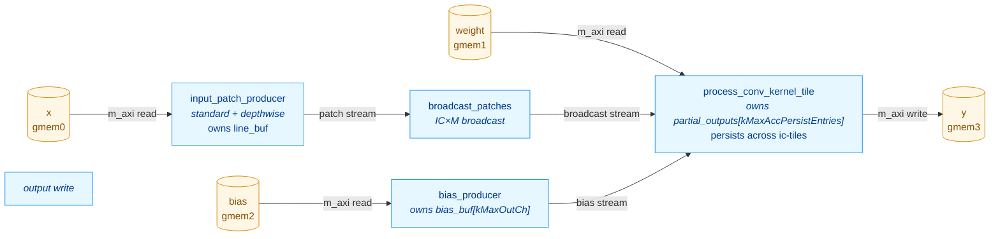

# ConvKernel — Optimization Log

This document records the structural and performance optimizations applied to
`kernels/conv/kernel/ConvKernel.cpp` after the initial scalar implementation
shipped. Each section describes one change, the rationale, and the measured
HW behavior simulation (`make behavior_test_conv`) impact on the kv260 RTL.

For the high-level kernel description see [CONV_KERNEL.md](CONV_KERNEL.md);
this file is a complement focused on the optimization arc and the current
final architecture.

> **Skeleton — fill in the TODOs.**  This file is a structural template that
> mirrors [POOL_OPTIMIZATION.md](POOL_OPTIMIZATION.md).  Section outlines
> reflect the optimisation passes visible in the current source (dataflow
> stages observable in `csynth.rpt`, the Option-A IC-tiling design in
> `Config.h.in`, the existing branch history `conv_optimisation_1..3`); per-step
> numbers and rationale need to come from the commit history and your notes.

---

## 1. Performance progression at a glance

All numbers are total `sim_time_ns` reported by the kv260 behavior testbench
after running the full TestConvRef case list.

> Baseline for this run (current branch, 30 RTL tests): **5,204,375 ns**
> (sum of per-test `duration_ns` = 5,202,175 ns).  Captured by
> `conv-verify` Gate 4 on `<DATE>` — see `build/kernels/conv/kv260/conv_timing_last.json`.

| Stage | Tests | sim_time_ns | Δ vs prior | Δ vs base |
|---|---:|---:|---:|---:|
| Baseline — single fused loop, no caching | TODO | TODO | — | — |
| + Dataflow restructuring (producer/consumer/writer) | TODO | TODO | TODO | TODO |
| + Line buffer (rows persistent across `oh`) | TODO | TODO | TODO | TODO |
| + Option-A IC-tiling + persistent partial-output accumulator | TODO | TODO | TODO | TODO |
| + Depthwise / standard producer split | TODO | TODO | TODO | TODO |
| + Broadcast patches (`broadcast_patches` stage) | TODO | TODO | TODO | TODO |
| + Bias producer fused with replay (`bias_producer`) | TODO | TODO | TODO | TODO |
| **+ Double buffering (planned — see [CONV_DOUBLE_BUFFER_PLAN.md](CONV_DOUBLE_BUFFER_PLAN.md))** | TODO | TODO | TODO | TODO |

**Net result on the <N>-test suite: TODO× faster than the baseline; TODO%
reduction in total HW sim time.**

---

## 2. Optimization steps

> Numbering and step boundaries should follow the commit history on
> `conv_optimisation_1/2/3`.  Below is a sketch of the passes I can identify
> from the current source — adjust ordering and split/merge to match what
> actually happened.

### 2.1. Dataflow restructuring (HLS DATAFLOW)

**Problem.** TODO — describe the original monolithic loop, the m_axi
read/write serialization, and why it dominated end-to-end latency.

**Change.** Split the body into N dataflow sub-functions wired by
`hls::stream`.  Current top-level stages (visible in `csynth.rpt`):
`entry_proc`, `Block_entry_proc`, `input_patch_producer`,
`bias_producer`, `broadcast_patches`, `process_conv_kernel_tile`.

**Result.** TODO — quote the prior-vs-now sim_time_ns and the per-test
pattern that dropped most.

### 2.2. Line buffer with row-incremental loading

**Problem.** TODO — adjacent `(oh, ow)` and `(oh, ow+stride_w)` windows
re-read the same `x[]` rows, multiplying DDR fetches by `kh × kw`.

**Change.** TODO — describe the line buffer (`line_buf[kTileIC]
[kMaxLineBufRows][kMaxInW]`), the row-incremental load schedule, the
`ih & (kMaxLineBufRows-1)` slot mapping.

**Result.** TODO.

### 2.3. Option-A IC-tiling + persistent partial-output accumulator

**Problem.** TODO — describe why a `kMaxInCh`-deep line buffer was
infeasible at the target channel counts (mobilenet, etc.).

**Change.** The current design (Config.h.in §"Option-A IC-tiling")
shrinks the per-channel buffers (`line_buf`, broadcast `local_buf`,
`w_buf`) from `kMaxInCh` to `kTileIC` channels.  In exchange, a
`partial_outputs[kMaxAccPersistEntries]` buffer of `AccData_t`
accumulators survives across ic-tiles in the consumer, initialised from
bias once per `ni` and drained to `acc_stream` after the `ict` loop.

**Result.** TODO — buffer-size deltas, sim_time_ns impact.

### 2.4. Depthwise / standard producer split

**Problem.** TODO — the standard-conv patch producer and the
depthwise-conv patch producer have different IC iteration shapes; sharing
a single function blocked II=1 for both.

**Change.** Split `input_patch_producer` into
`input_patch_producer_standard` (visible in `csynth.rpt` at
`VITIS_LOOP_385_*` / `VITIS_LOOP_416_*` etc.) and
`input_patch_producer_depthwise` (`VITIS_LOOP_587_*` /
`VITIS_LOOP_614_*` etc.), dispatched via the `is_depthwise` runtime flag.

**Result.** TODO.

### 2.5. `broadcast_patches` stage

**Problem.** TODO — describe the IC×M broadcast inefficiency the stage was
added to amortize.

**Change.** New `broadcast_patches` dataflow stage between the patch
producer and the conv tile consumer (`VITIS_LOOP_516_*` /
`VITIS_LOOP_517_*` / `VITIS_LOOP_528_*` in `csynth.rpt`).

**Result.** TODO.

### 2.6. `bias_producer` and bias-replay restructure

**Problem.** TODO.

**Change.** Bias load split into its own `bias_producer` dataflow stage
that loads `bias_buf[kMaxOutCh]` once per `ni` and replays it in
`(r, mt, m1)` order into the persistent accumulator init.

**Result.** TODO.

### 2.7. Double buffering (planned)

See [CONV_DOUBLE_BUFFER_PLAN.md](CONV_DOUBLE_BUFFER_PLAN.md) for the full
plan.  Summary: slab-level double-buffering on the URAM weight slab so
the next ic-tile's `w_slab` loads while the current tile is computing.

**Status.** TODO — landed / in-progress / deferred?

---

## 3. Current architecture (post-2.<latest>)

> Verify against `csynth.rpt`: the top-level `ConvKernel*` row reports
> `Pipelined = dataflow` and the immediate children are `entry_proc`,
> `Block_entry_proc`, `input_patch_producer`, `bias_producer`,
> `broadcast_patches`, `process_conv_kernel_tile`.

**Dataflow stages**, all running concurrently:

1. **`input_patch_producer`** — TODO: describe iteration order, the
   standard/depthwise dispatch, the line_buf load schedule.
2. **`bias_producer`** — TODO.
3. **`broadcast_patches`** — TODO.
4. **`process_conv_kernel_tile`** — owns `partial_outputs` (size
   `kMaxAccPersistEntries`), initialised from `bias_producer` once per
   `ni`, accumulated across the `ict` loop, drained to the output write
   after the last ic-tile.

**Loop nest** (all stages in lockstep): TODO — `(ni, ?, ict, oh, ow, …)`.

**Cycle counts per output position** at the consumer's MAC loop:

| Loop body | II | Cycles per output |
|---|---:|---:|
| `process_conv_kernel_tile` inner | TODO | TODO |
| `input_patch_producer_standard` inner | TODO | TODO |
| `input_patch_producer_depthwise` inner | TODO | TODO |

The producer is matched at TODO cycles per ow-group; the consumer's
TODO loop is the current bottleneck.

---

## 4. Knobs

### 4.1. Source of truth — CMake cache vars (migration to JSON pending)

Unlike `kernels/pool`, conv's compile-time bounds currently live as CMake
`CACHE STRING`s in `kernels/conv/CMakeLists.txt` rather than in
`platforms/<name>.json`.  Moving them under `kernels.conv` in the
platform JSON to match pool is **TODO** — see the issue/PR for the
migration.

| CMake var | C++ name (Config.h) | Default | Hard constraint | Notes |
|---|---|---:|---|---|
| `CONV_TILE_M` | `kTileM` | 8 | power of 2; ≥ MAC latency (~3 cyc) | Output channel tile; II=1 lane rotation depth. |
| `CONV_TILE_IC` | `kTileIC` | 16 | power of 2 | Input channel tile; sets `w_buf` and patch-buffer IC depth. |
| `CONV_MAX_KH` | `kMaxKH` | 7 | `kh ≤ this` | Compile-time kernel-height bound. |
| `CONV_MAX_KW` | `kMaxKW` | 7 | `kw ≤ this` | Compile-time kernel-width bound. |
| `CONV_MAX_IN_CH` | `kMaxInCh` | 1024 | `in_ch ≤ this` | Sizes `bias_buf` only — line_buf is IC-tiled. |
| `CONV_MAX_OUT_CH` | `kMaxOutCh` | 1024 | `out_ch ≤ this` | Sizes `bias_buf` in `bias_producer`. |
| `CONV_MAX_IN_W` | `kMaxInW` | 64 | `in_w ≤ this` | Sizes the column dim of `line_buf`. |
| `CONV_MAX_LINE_BUF_ROWS` | `kMaxLineBufRows` | 16 | power of 2; `(kh-1)*dil_h + 1 ≤ this` | Circular row capacity. |
| `CONV_MAX_ACC_PERSIST_ENTRIES` | `kMaxAccPersistEntries` | 16384 | `out_h*out_w*out_ch ≤ this` | Persistent accumulator (Option-A) size. |

### 4.2. How CMake reads the values

TODO — fill in once the JSON migration lands (mirror §4.2 of
POOL_OPTIMIZATION.md: `conv_load_constants(...)`,
`CMAKE_CONFIGURE_DEPENDS`, etc.).

### 4.3. How the Python scheduler reads the values

TODO — `inference-scheduler/src/_conv_hw_config.py` does not exist yet;
the conv validator currently reads from `<source>` (verify).  Migration
mirrors `_pool_hw_config.py::resolve(platform_name)`.

### 4.4. Test predictor and cache-extreme verification

TODO — does `TestConvSim.cpp` have a cache-aware `dup_reads` predictor
like `TestPoolingSim.cpp`?  If yes, document the cache-extreme matrix;
if not, mark as a deferred TODO.

---

## 5. Per-test progression highlights

Selected representative tests, baseline → current on the kv260 RTL sim.
Captured from `build/kernels/conv/kv260/conv_timing_last.json` (current
run = 30 tests, totalling 5,202,175 ns).

| Test | Baseline (ns) | Current (ns) | Speedup |
|---|---:|---:|---:|
| `batch_3__C_TILE_IC_M_TILE_M_stride_2__ResNet-style_` | TODO | 1,391,110 | TODO |
| `1x1__IC_TILE_IC_2_M_TILE_M_2__exact_tiles_` | TODO | 784,660 | TODO |
| `partial_IC_tile__in_ch_TILE_IC_5_` | TODO | 506,930 | TODO |
| `partial_M_tile__out_ch_TILE_M_3_` | TODO | 277,350 | TODO |
| `DW_ch_TILE_M_2__exact_tile__bias` | TODO | 220,570 | TODO |
| `DW_partial_M_tile__ch_TILE_M_3_` | TODO | 198,560 | TODO |
| `DW_batch_2__4ch__pad_1` | TODO | 183,400 | TODO |
| `3x3__pad_1__has_bias__2_out_ch` | TODO | 83,580 | TODO |

TODO: narrative — which optimisation moved which test the most, where
the floor is for each.

---

## 6. Where the floor is now

> TODO: identify the current bottleneck and what would be needed to break
> through it.  Looking at `csynth.rpt` from the latest run, the worst-slack
> sub-block is `process_conv_kernel_tile` at `-0.93 ns` — same as the
> top-level — so the consumer's MAC pipeline is timing-limiting.

### 6.1. Tried and rejected: TODO

TODO — list speculative changes that were tried and discarded, with the
measurement that ruled them out.  Mirror §6.1 / §6.2 of
POOL_OPTIMIZATION.md.

### 6.2. Pending: double-buffered URAM weight slab

See [CONV_DOUBLE_BUFFER_PLAN.md](CONV_DOUBLE_BUFFER_PLAN.md).  Expected
speedup: TODO ×.  Pending — TODO status.

---

## 7. Verification matrix

| Configuration | C-sim (TestConvRef) | RTL sim (behavior_test_conv) |
|---|---|---|
| Default (kMaxInW=64, kMaxLineBufRows=16, kMaxAccPersistEntries=16384) | 32/32 PASS | 30/30 PASS |
| Reduced cache (TODO) | TODO | (not run) |
| Increased cache (TODO) | TODO | (not run) |

C-sim count (32) vs RTL count (30): TODO — explain the delta (saturation
sub-tests not run on RTL, depthwise variants, etc.).

---

## 8. Related files

| File | What changed |
|---|---|
| `kernels/conv/kernel/ConvKernel.cpp` | TODO — list the dataflow split, line_buf, IC-tiling Option-A persistent accumulator, depthwise/standard producer split, broadcast_patches, bias_producer (one bullet per §2.x). |
| `kernels/conv/include/Config.h.in` | Templates `kTileM`, `kTileIC`, `kMaxKH`, `kMaxKW`, `kMaxInCh`, `kMaxOutCh`, `kMaxInW`, `kMaxLineBufRows`, `kMaxAccPersistEntries` from CMake-side variables. |
| `kernels/conv/CMakeLists.txt` | TODO — currently CMake `CACHE STRING`s; migrate to `kernels.conv` block in `platforms/<name>.json` to match pool (§4.1). |
| `platforms/<name>.json` | TODO — add `kernels.conv` section once the migration lands. |
| `inference-scheduler/src/_conv_hw_config.py` | TODO — does not yet exist; create when the JSON migration lands.  Mirror `_pool_hw_config.py::resolve(platform_name)`. |
| `inference-scheduler/src/nodes.py` | TODO — `ConvNode.from_onnx_node` validation against compile-time bounds (kH, kW, in_ch, out_ch, in_w, dilated kh span, persistent-accumulator size). |
| `kernels/conv/test/TestConvSim.cpp` | TODO — 32-test list, dump-data fixture-regen mode. |
| `hw/test_data/conv_test_data/` | TODO — 30-test fixtures for kv260 RTL sim. |
