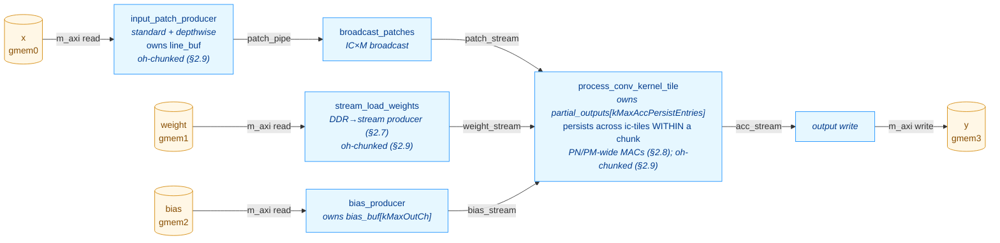

# ConvKernel — Optimization Log

This document records the structural and performance optimizations applied to
`kernels/conv/kernel/ConvKernel.cpp` after the initial scalar implementation
shipped. Each section describes one change, the rationale, and the measured
HW behavior simulation (`make behavior_test_conv`) impact on the kv260 RTL.

For the high-level kernel description see [CONV_KERNEL.md](CONV_KERNEL.md);
this file is a complement focused on the optimization arc and the current
final architecture.

> **Status (2026-05-14).**  §2.7 (weight streaming), §2.8 (PN/PM parallel
> MACs + X-prop guard) and §2.9 (oh-chunking) are written up against
> measured `conv-verify` snapshots.  §2.1–§2.6 still have TODO cells —
> structural outlines reflect the optimisation passes visible in the
> current source (dataflow stages in `csynth.rpt`, the Option-A IC-tiling
> design in `Config.h.in`, the existing branch history
> `conv_optimisation_1..3`); per-step numbers and rationale for those
> earlier steps need to come from the commit history and the original
> author's notes.  §2.10 (URAM double-buffer) is the next planned step.

---

## 1. Performance progression at a glance

All numbers are total `sim_time_ns` reported by the kv260 behavior testbench
after running the full TestConvRef case list.

> Latest baseline (branch `conv_optimisation_3`, 30 RTL tests, post-§2.9):
> **sim_time_ns = 3,861,515 ns** (sum of per-test `duration_ns` =
> 3,859,315 ns).  Captured by `conv-verify` Gate 4 on **2026-05-14** —
> see `build/kernels/conv/kv260/conv_timing_last.json`.

| Stage | Tests | sim_time_ns | Δ vs prior | Δ vs §2.7 |
|---|---:|---:|---:|---:|
| Baseline — single fused loop, no caching | TODO | TODO | — | — |
| + Dataflow restructuring (producer/consumer/writer) | TODO | TODO | TODO | — |
| + Line buffer (rows persistent across `oh`) | TODO | TODO | TODO | — |
| + Option-A IC-tiling + persistent partial-output accumulator | TODO | TODO | TODO | — |
| + Depthwise / standard producer split | TODO | TODO | TODO | — |
| + Broadcast patches (`broadcast_patches` stage) | TODO | TODO | TODO | — |
| + Bias producer fused with replay (`bias_producer`) | TODO | TODO | TODO | — |
| Snapshot post-§2.6 (captured 2026-05-12) | 30 | 5,204,375 | — | — |
| + Weight streaming (`stream_load_weights`, §2.7) | 30 | 4,913,835 | **-5.6 %** | — |
| **Snapshot post-§2.7 (captured 2026-05-12)** | **30** | **4,913,835** | — | reference |
| + PN/PM parallel MACs (§2.8) | 30 | 3,844,095 | **-21.8 %** | -21.8 % |
| + oh-chunking (§2.9, this snapshot) | 30 | 3,861,515 | +0.5 % | **-21.4 %** |
| **Current state (post-§2.9, captured 2026-05-14)** | **30** | **3,861,515** | — | **-21.4 %** |
| **+ Double buffering (planned — see [CONV_DOUBLE_BUFFER_PLAN.md](CONV_DOUBLE_BUFFER_PLAN.md), §2.10)** | TODO | TODO | TODO | TODO |

**Net result vs §2.7 snapshot: 1.27× faster across 30 RTL tests; 21.4 %
reduction in total HW sim time.  Net result vs original baseline: TODO
(needs `conv_optimisation_1` re-run for the pre-§2.1 column).**

---

## 2. Optimization steps

> Numbering and step boundaries should follow the commit history on
> `conv_optimisation_1/2/3`.  Below is a sketch of the passes I can identify
> from the current source — adjust ordering and split/merge to match what
> actually happened.

### 2.1. Dataflow restructuring (HLS DATAFLOW)

**Problem.** TODO — describe the original monolithic loop, the m_axi
read/write serialization, and why it dominated end-to-end latency.

**Change.** Split the body into N dataflow sub-functions wired by
`hls::stream`.  Current top-level stages (visible in `csynth.rpt`):
`entry_proc`, `Block_entry_proc`, `input_patch_producer`,
`bias_producer`, `broadcast_patches`, `process_conv_kernel_tile`.

**Result.** TODO — quote the prior-vs-now sim_time_ns and the per-test
pattern that dropped most.

### 2.2. Line buffer with row-incremental loading

**Problem.** TODO — adjacent `(oh, ow)` and `(oh, ow+stride_w)` windows
re-read the same `x[]` rows, multiplying DDR fetches by `kh × kw`.

**Change.** TODO — describe the line buffer (`line_buf[kTileIC]
[kMaxLineBufRows][kMaxInW]`), the row-incremental load schedule, the
`ih & (kMaxLineBufRows-1)` slot mapping.

**Result.** TODO.

### 2.3. Option-A IC-tiling + persistent partial-output accumulator

**Problem.** TODO — describe why a `kMaxInCh`-deep line buffer was
infeasible at the target channel counts (mobilenet, etc.).

**Change.** The current design (Config.h.in §"Option-A IC-tiling")
shrinks the per-channel buffers (`line_buf`, broadcast `local_buf`,
`w_buf`) from `kMaxInCh` to `kTileIC` channels.  In exchange, a
`partial_outputs[kMaxAccPersistEntries]` buffer of `AccData_t`
accumulators survives across ic-tiles in the consumer, initialised from
bias once per `ni` and drained to `acc_stream` after the `ict` loop.

**Result.** TODO — buffer-size deltas, sim_time_ns impact.

### 2.4. Depthwise / standard producer split

**Problem.** TODO — the standard-conv patch producer and the
depthwise-conv patch producer have different IC iteration shapes; sharing
a single function blocked II=1 for both.

**Change.** Split `input_patch_producer` into
`input_patch_producer_standard` (visible in `csynth.rpt` at
`VITIS_LOOP_385_*` / `VITIS_LOOP_416_*` etc.) and
`input_patch_producer_depthwise` (`VITIS_LOOP_587_*` /
`VITIS_LOOP_614_*` etc.), dispatched via the `is_depthwise` runtime flag.

**Result.** TODO.

### 2.5. `broadcast_patches` stage

**Problem.** TODO — describe the IC×M broadcast inefficiency the stage was
added to amortize.

**Change.** New `broadcast_patches` dataflow stage between the patch
producer and the conv tile consumer (`VITIS_LOOP_516_*` /
`VITIS_LOOP_517_*` / `VITIS_LOOP_528_*` in `csynth.rpt`).

**Result.** TODO.

### 2.6. `bias_producer` and bias-replay restructure

**Problem.** TODO.

**Change.** Bias load split into its own `bias_producer` dataflow stage
that loads `bias_buf[kMaxOutCh]` once per `ni` and replays it in
`(r, mt, m1)` order into the persistent accumulator init.

**Result.** TODO.

### 2.7. Weight streaming via dedicated DDR producer

**Problem.** Before this change, `process_conv_kernel_tile` called
`load_standard_weights(weight, ...)` inline once per
`(ict, oh, ow, mt)` iteration in Phase 2a, and
`load_depthwise_weights(weight, ...)` once per `mt` in Phase 2b.  The
`gmem1` DDR transfer was serialised with the patch read, the
partial-accumulator read/write, and the accumulate loop — every inner
iteration paid the full weight-load latency before MACs could start.
This was "Bottleneck A" of [CONV_DOUBLE_BUFFER_PLAN.md](CONV_DOUBLE_BUFFER_PLAN.md)
§1, but achievable without the URAM rework.

**Change.**

- Added a new `stream_load_weights` dataflow producer that owns the
  `gmem1` AXI master and pushes one `Data_t` per cycle to a
  `weight_stream` FIFO.  Iteration order matches the consumer's read
  pattern exactly:
  - Standard (`is_depthwise=0`): per `(ni, ict, oh, ow, mt)` emit
    `m_valid × ic_valid × kh × kw` values in `(m1, ic_l, khi, kwi)`
    order — same DDR bandwidth as the old inline replay, just
    overlapped.
  - Depthwise (`is_depthwise=1`): per `(ni, mt)` emit
    `m_valid × kh × kw` values in `(m1, khi, kwi)` order — no spatial
    replay, matching the consumer's existing once-per-`mt` hoist.
- `process_conv_kernel_tile` signature: `const Data_t* weight` →
  `hls::stream<Data_t>& weight_stream`.  Both inline
  `load_*_weights(...)` call sites replaced with II=1 stream-read
  loops into the existing `w_buf`.
- `weight_stream` depth = `kTileM × kTileIC × kMaxKH × kMaxKW` = 6,272
  at defaults — one full max-tile, large enough for the producer to
  pre-fetch the next iteration's slice during the consumer's
  accumulate.
- Removed the now-unused `load_standard_weights` /
  `load_depthwise_weights` helpers.

**Result.** **-5.6 % sim_time_ns** (5,204,375 → 4,913,835).  Wins
concentrated on the 1×1 and large-spatial layers where weight DDR
loads dominated the inner iteration:

| Test | Δ% |
|---|---:|
| `1x1 IC=TILE_IC*2 M=TILE_M*2 bias exact tiles` (was #2 heaviest) | **-19.8 %** |
| `partial_M_tile out_ch=TILE_M+3` | **-18.1 %** |
| `1x1_kernel 1ch no_bias` | -17.3 % |
| `saturation +/- overflow` (both STD variants) | -15.8 % |
| `batch_3 ResNet-style 7x7 stride=2` (heaviest test overall) | **-9.2 %** |

Five small-spatial 3×3 tests regressed +2–7 % (largest absolute
regression: `partial_IC_tile in_ch=TILE_IC+5` at +6.7 %, +34 k ns;
largest relative: `3x3_input_3x3_kernel → 1x1_out` at +23.0 %, +8 k ns)
— the new dataflow stage's prologue overhead doesn't amortise on tiny
iteration counts (single-output tiles, few channels).  Aggregate
regression across the 6 worst movers is ~+25 k ns; the savings on the
five biggest tests alone are -347 k ns.

**Synthesis impact.** Top-level slack on `ConvKernel*` improved
slightly: -0.93 → **-0.90 ns**.  No new II violations.  Resources
grew modestly (the new producer's address arithmetic):
BRAM 72 (25 %) → 80 (27 %); DSP 113 (9 %) → **151 (12 %, +34 %)**;
FF 46,086 → 51,052 (+11 %); LUT 37,948 (32 %) → 42,541 (36 %, +12 %).
m_axi data widths unchanged at 16 → 16 on all four ports — `gmem1`
widening still blocked by ap_fixed alignment; potential follow-up
optimisation (manual pack into `ap_uint<128>`).

### 2.8. PN/PM parallel MACs

**Problem.** After §2.7 the consumer's MAC reduction
(`accumulate_standard` / `accumulate_depthwise`) ran one MAC per cycle via
the lane-rotation trick (`m1 = ri & (kTileM-1)`), which only spaces
accumulator writes apart — it doesn't actually parallelise the multiplies.
On `batch_3 ResNet-style` (the heaviest test) the inner reduction
`ic_valid · kh · kw · kTileM = 16·9·8 = 1152` cycles per `(oh, ow, mt)`
dominated the consumer's pipeline.  At only 1 DSP busy per cycle out of
the ~178 on the device, the kernel was DSP-starved.

**Change.**

- **`accumulate_standard` → PN-wide adder tree.**  Inside the existing
  lane-rotated outer (`ri` from 0 to `kh·kw·kTileM-1`), the `ic_l` loop
  is `#pragma HLS UNROLL`ed across `kTileIC = 16` lanes.  Each PIPELINE
  iteration fires 16 parallel multiplies whose outputs reduce through a
  4-level adder tree, then add into the lane-rotated `acc[m1]` once per
  cycle.  Loop bound shrinks from `ic_valid · kh · kw · kTileM` to
  `kh · kw · kTileM` (≈ 16× faster inner reduction).  The lane-rotation
  RAW distance on `acc[m1]` is still `kTileM` cycles, so the multi-cycle
  MAC pipeline (multiply + tree + accumulate) closes without an II bump.
- **`accumulate_depthwise` → PM-wide channel-parallel lanes.**  Depthwise
  has no input-channel reduction, so the inner `m1` loop is unrolled
  across `kTileM = 8` lanes inside a flat `(khi, kwi)` outer PIPELINE.
  Loop bound shrinks from `kh · kw · kTileM` to `kh · kw` (kTileM× faster).
  Per-lane RAW distance on `acc[m1]` is 1 cycle; the `ap_fixed<32,16>`
  add is a single-cycle 32-bit integer adder at 300 MHz, so the
  recurrence closes at II=1 without `DEPENDENCE` or lane rotation.
- **`w_buf` partitioning** required to feed the parallel reads:
  - Standard: `#pragma HLS ARRAY_PARTITION variable=w_buf complete dim=2`
    (kTileIC parallel banks along the ic_l axis).
  - Depthwise: `#pragma HLS ARRAY_PARTITION variable=w_buf complete dim=1`
    (kTileM parallel banks along the m1 axis).
- **X-propagation guard (standard only).**  Catching this fix took a
  Gate-3 round trip.  For partial IC tiles (`ic_valid < kTileIC`),
  `stream_load_weights` emits only `m_valid · ic_valid · kh · kw` values,
  so `w_buf[m1][ic_l ≥ ic_valid][…]` is left uninitialised — `X` in RTL.
  C-sim treats these as 0 because `patch[ic_l ≥ ic_valid][…]` is
  producer-zero-padded and `0 · garbage = 0` in C; RTL `0 · X = X`
  propagates through the adder tree, into `acc[m1]`, and out to the AXI
  output (Test 1: `1x1_kernel__1ch__no_bias` triggered
  `AXI4_ERRM_WDATA_X` on `gmem3`).  Fix: gate the BRAM read so invalid
  lanes return `Data_t(0)` directly:
  ```cpp
  const Data_t w_val = (ic_l < ic_valid)
      ? w_buf[m1][ic_l][khi_cnt][kwi_cnt]
      : Data_t(0);
  ```
  Cost: one LUT per PN lane on the weight input; no DSP impact.

**Result.** **-21.8 % sim_time_ns** vs §2.7 (4,913,835 → 3,844,095).
Wins concentrate on tests where the inner reduction dominated:

| Test | Δ% | Δns |
|---|---:|---:|
| `partial_IC_tile in_ch=TILE_IC+5` | **-62.7 %** | -339,010 |
| `batch_3 ResNet-style 7×7 stride=2` (heaviest) | **-37.4 %** | -472,290 |
| `DW 5×5 kernel, 4ch` | **-30.1 %** | -42,000 |
| `DW batch_2, 4ch, pad=1` | -26.5 % | -47,500 |
| `DW 3×3, 4ch, pad=1+bias` | -26.1 % | -42,230 |

Small-spatial 3×3 standard tests showed +1–2 % regressions from the
extra LUT in the X-prop MUX (single LUT on every PN lane); aggregate
regression: < 5 k ns vs. -1,069 k ns aggregate gain.

**Synthesis impact.** No II violations; top-level slack on `ConvKernel*`
unchanged at **-0.90 ns**.  Resources:
BRAM 80 (27 %) → 94 (32 %);
DSP 151 (12 %) → **178 (14 %)** (+18 %);
FF 51,052 → 56,018 (+10 %);
LUT 42,541 (36 %) → 45,412 (38 %).
m_axi data widths unchanged at 16 → 16 on all four ports.

### 2.9. oh-chunking (relaxed persistent-accumulator constraint)

**Problem.** The Option-A persistent accumulator (§2.3) imposed
`out_h · out_w · out_ch ≤ kMaxAccPersistEntries` (16,384 at defaults).
Larger output tensors — common in early layers of high-resolution
networks (e.g. 224×224 with even modest channel counts) — were rejected
by the scheduler.  The alternative of degrading to a no-persistent-acc
mode would re-read every input pixel `ic_tiles · m_tiles` times per
`(oh, ow)` — a bandwidth catastrophe.

**Change.**  Split the output along the `oh` axis into chunks whose
footprint fits the buffer.  A `compute_oh_chunking()` helper computes:

```
oh_per_chunk = max(1, kMaxAccPersistEntries / (out_w · out_ch))
num_chunks   = ceil(out_h / oh_per_chunk)
```

Each chunk runs the full three-phase Option-A pipeline for its `oh`
sub-range; `partial_outputs[]` is reused per chunk, indexed by
`oh_local = oh - oh_start`.  A chunk loop is added INNER to `ni` (and
outer to everything else) in four functions:

- `input_patch_producer_standard`
- `input_patch_producer_depthwise`
- `stream_load_weights`
- `process_conv_kernel_tile`

The chunk loop is placed INNER to `ni` so the linear `(ni, oh, ow, mt, m1)`
order seen by `bias_producer`, `broadcast_patches`, and
`write_output_tile` is preserved — those three need no chunk-awareness.

At a chunk transition the patch producer's `line_buf` is invalidated;
`last_loaded_row` is reset to `(oh_start · stride_h - pad_top) - 1` so
the next chunk's first `oh` triggers a fresh kh-row load.  The
`(kh-1)·stride_h`-row overlap between chunks is re-fetched from DDR —
this is the "duplicated reading" the user accepted in exchange for
supporting larger layers.

**Relaxed constraint.**
- Was: `out_h · out_w · out_ch ≤ kMaxAccPersistEntries`
- Now: `out_w · out_ch ≤ kMaxAccPersistEntries`  *(one output row must fit)*

**Result.** **+0.5 % sim_time_ns** vs §2.8 (3,844,095 → 3,861,515).
All 30 existing RTL tests have `num_chunks = 1` (their full output fits
the buffer), so they pay only the per-(ni) wrapper-loop overhead — a few
cycles of `oh_start` / `oh_end` arithmetic per chunk-loop iteration,
distributed uniformly across all tests (+500–700 ns each, no outlier).
Two new C-sim tests exercise the multi-chunk path:

| Test | num_chunks | Notes |
|---|---:|---|
| `oh-chunking standard (out=32×32×32)` | 2 | row_size = 1024; oh_per_chunk = 16 |
| `DW oh-chunking (32 ch, 32×32 out)` | 2 | same chunking, depthwise path |

RTL fixtures haven't been regenerated, so the new tests are C-sim-only
for now (running `make gen_conv_test_data` would update the fixtures).

**Synthesis impact.** No II violations; top-level slack unchanged at
**-0.90 ns**.  Resources:
BRAM 94 (32 %) → 87 (30 %);
DSP 178 (14 %) → 178 (14 %) unchanged;
FF 56,018 → 62,195 (+11 %);
LUT 45,412 (38 %) → 52,492 (44 %) (+15 %).
The FF/LUT growth covers the chunk loop counters (`chunk`, `oh_start`,
`oh_end`, `chunk_oh_count`) and the `oh_local` arithmetic in the
consumer's three phases.

**Documentation.**  Constraint and chunking rationale moved into
`kernels/conv/include/Config.h.in` (header block on
`kMaxAccPersistEntries`) and `kernels/conv/kernel/ConvKernel.cpp`
(`compute_oh_chunking()` helper).

### 2.10. Double buffering (planned)

See [CONV_DOUBLE_BUFFER_PLAN.md](CONV_DOUBLE_BUFFER_PLAN.md) for the
full plan.  Summary: slab-level double-buffering on the URAM weight
slab so the next ic-tile's `w_slab` loads while the current tile is
computing.  After §2.7 the weight load is already overlapped within a
single tile; after §2.8 the compute is PN/PM-wide; the URAM step's
remaining wins are (a) eliminating the spatial replay on the standard
path (1930× fewer DDR weight reads per the plan), and (b) covering
larger ic-tiles (`TILE_IC_WIDE` ≥ 64) per outer iteration.

**Status.** Deferred — not yet started.  §2.7 captured the overlap win,
§2.8 captured the inner-MAC parallelism win, §2.9 relaxed the
output-size constraint; the DDR-bandwidth and tile-width wins of the
URAM rework remain unrealised.

---

## 3. Current architecture (post-§2.9)



> Verify against `csynth.rpt`: the top-level `ConvKernel*` row reports
> `Pipelined = dataflow` and the immediate children are `entry_proc`,
> `Block_entry_proc`, `input_patch_producer`, `bias_producer`,
> `broadcast_patches`, `stream_load_weights`,
> `process_conv_kernel_tile`.

**Six dataflow stages**, all running concurrently:

1. **`input_patch_producer`** — owns `line_buf[kTileIC][kMaxLineBufRows][kMaxInW]`;
   reads `x[]` from `gmem0`.  Standard variant iterates
   `(ni, chunk, ict, oh_in_chunk, ow, ic_l, khi, kwi)` with `ict` outer
   of `oh` and chunk wrapping `(ict, oh)` (line buffer reused across
   `oh` within one `(chunk, ic-tile)`); depthwise variant substitutes
   `mt` for `ict`.  Within a chunk each x pixel is fetched from DDR
   exactly once per `(ni, c)`; the `(kh-1)·stride_h`-row overlap is
   re-fetched at chunk boundaries (§2.9 duplicated-read overhead).
   Emits to `patch_pipe`.
2. **`broadcast_patches`** — buffers one ic-tile's patch
   (`kTileIC × kMaxKH × kMaxKW`) and re-emits it `m_tiles` times for
   the standard path (passthrough for depthwise).  This is what lets
   the patch producer read `x[]` once and the consumer see it
   per-`mt`.  Emits to `patch_stream`.  Chunk-agnostic — sees the same
   linear `(ni, oh, ow)` outer iteration count regardless of
   `num_chunks`.
3. **`bias_producer`** — loads `bias_buf[kMaxOutCh]` once from `gmem2`
   and replays it `batch × out_h × out_w × m_tiles` times in
   `(r, mt, m1)` order to match the consumer's Phase-1 init pattern.
   Chunk-agnostic.
4. **`stream_load_weights`** (§2.7, chunk-aware after §2.9) — owns the
   `gmem1` AXI master.  Standard path replays
   `m_valid × ic_valid × kh × kw` weights per `(oh_in_chunk, ow, mt)`
   iteration in `(m1, ic_l, khi, kwi)` order; depthwise path emits
   `m_valid × kh × kw` once per `(ni, chunk, mt)`.  Emits to
   `weight_stream` (depth 6,272).
5. **`process_conv_kernel_tile`** — owns
   `partial_outputs[kMaxAccPersistEntries]` (BRAM, ~64 KB at
   defaults).  Per `(ni, chunk)`: Phase 1 inits the chunk's
   `chunk_oh_count·out_w·out_ch` accumulators from `bias_stream`;
   Phase 2a/2b accumulates over `ict`/`mt` outer with `oh_local =
   oh - oh_start` indexing, the inner loop reading patch + weights
   from the streams and running:
   - Standard: an II=1 lane-rotated reduce with a `kTileIC`-wide PN
     adder tree (§2.8) → **kTileIC MACs/cycle**.
   - Depthwise: an II=1 PM-wide channel-parallel reduce (§2.8) →
     **kTileM MACs/cycle**.
   Phase 3 drains the chunk's `partial_outputs` to `acc_stream`.
6. **`write_output_tile`** — saturates `AccData_t → Data_t` and writes
   to `gmem3` in `(ni, oh, ow, mt, m1)` order.  Chunk-agnostic — the
   concatenated `(ni, chunk, oh_in_chunk, ow, mt, m1)` stream order
   flattens to the same linear order it expected pre-§2.9.

**Loop nest** (consumer, standard path):
`(ni, chunk outer, ict, oh_in_chunk, ow, mt)` with a PN-wide
lane-rotated inner reduction; depthwise consumer is
`(ni, chunk outer, mt, oh_in_chunk, ow)` with a PM-wide parallel
reduce and the weight load hoisted out of `(oh_in_chunk, ow)`.

**Cycle counts per `(oh, ow, mt)` iteration** at the consumer's hot loop
(standard path, post-§2.9):

| Loop body | II | Cycles per iteration | Δ vs §2.7 |
|---|---:|---:|---|
| Patch read (`patch_stream` drain) | 1 | `kTileIC × kh × kw` | unchanged |
| Weight read (`weight_stream` drain) | 1 | `m_valid × ic_valid × kh × kw` | unchanged |
| `accumulate_standard` MAC reduction | 1 | `kh × kw × kTileM` | **÷ `ic_valid` (§2.8)** |
| Partial accumulator read/write | 1 | `2 × m_valid` | unchanged |

Depthwise hot loop, per `(oh, ow)`:

| Loop body | II | Cycles per iteration | Δ vs §2.7 |
|---|---:|---:|---|
| Patch read | 1 | `kTileM × kh × kw` | unchanged |
| `accumulate_depthwise` MAC reduction | 1 | `kh × kw` | **÷ `kTileM` (§2.8)** |
| Partial accumulator read/write | 1 | `2 × m_valid` | unchanged |

**Current bottleneck.**  After §2.8 the inner-MAC reduction is no longer
the long pole.  For the standard path the new dominant inner cost is
the **weight read** (`m_valid · ic_valid · kh · kw` cycles per
`(oh, ow, mt)`), serialised after the patch read; for the depthwise
path it's the **patch read** (`kTileM · kh · kw` per `(oh, ow)`).  The
remaining throughput paths are:

- **Stream widening / `ap_uint<128>` weight packing.**  `weight_stream`
  carries one `Data_t` per cycle; AXI-Lite global widening only helps
  the m_axi adapter, not the stream rate.  Packing N weights per beat
  into a wider stream type would let the consumer's read loop drop by
  N×.  Risk: requires touching all four AXI clients consistently.
- **URAM weight slab + loop inversion** — §2.10 below.

---

## 4. Knobs

### 4.1. Source of truth — CMake cache vars (migration to JSON pending)

Unlike `kernels/pool`, conv's compile-time bounds currently live as CMake
`CACHE STRING`s in `kernels/conv/CMakeLists.txt` rather than in
`platforms/<name>.json`.  Moving them under `kernels.conv` in the
platform JSON to match pool is **TODO** — see the issue/PR for the
migration.

| CMake var | C++ name (Config.h) | Default | Hard constraint | Notes |
|---|---|---:|---|---|
| `CONV_TILE_M` | `kTileM` | 8 | power of 2; ≥ MAC latency (~3 cyc) | Output channel tile; II=1 lane rotation depth. |
| `CONV_TILE_IC` | `kTileIC` | 16 | power of 2 | Input channel tile; sets `w_buf` and patch-buffer IC depth. |
| `CONV_MAX_KH` | `kMaxKH` | 7 | `kh ≤ this` | Compile-time kernel-height bound. |
| `CONV_MAX_KW` | `kMaxKW` | 7 | `kw ≤ this` | Compile-time kernel-width bound. |
| `CONV_MAX_IN_CH` | `kMaxInCh` | 1024 | `in_ch ≤ this` | Sizes `bias_buf` only — line_buf is IC-tiled. |
| `CONV_MAX_OUT_CH` | `kMaxOutCh` | 1024 | `out_ch ≤ this` | Sizes `bias_buf` in `bias_producer`. |
| `CONV_MAX_IN_W` | `kMaxInW` | 64 | `in_w ≤ this` | Sizes the column dim of `line_buf`. |
| `CONV_MAX_LINE_BUF_ROWS` | `kMaxLineBufRows` | 16 | power of 2; `(kh-1)*dil_h + 1 ≤ this` | Circular row capacity. |
| `CONV_MAX_ACC_PERSIST_ENTRIES` | `kMaxAccPersistEntries` | 16384 | `out_w*out_ch ≤ this`  *(was `out_h*out_w*out_ch ≤ this` pre-§2.9)* | Persistent accumulator (Option-A) size; sized to hold one output chunk.  Larger outputs auto-split along `oh` — see §2.9 / `compute_oh_chunking()`. |

### 4.2. How CMake reads the values

TODO — fill in once the JSON migration lands (mirror §4.2 of
POOL_OPTIMIZATION.md: `conv_load_constants(...)`,
`CMAKE_CONFIGURE_DEPENDS`, etc.).

### 4.3. How the Python scheduler reads the values

TODO — `inference-scheduler/src/_conv_hw_config.py` does not exist yet;
the conv validator currently reads from `<source>` (verify).  Migration
mirrors `_pool_hw_config.py::resolve(platform_name)`.

### 4.4. Test predictor and cache-extreme verification

TODO — does `TestConvSim.cpp` have a cache-aware `dup_reads` predictor
like `TestPoolingSim.cpp`?  If yes, document the cache-extreme matrix;
if not, mark as a deferred TODO.

---

## 5. Per-test progression highlights

All 30 RTL tests, three snapshots: post-§2.7 (2026-05-12), post-§2.8
(2026-05-13), post-§2.9 (2026-05-14, current).  Sorted by `Post-§2.7`
descending so the structural drop from §2.8 is easy to read off.
Source: `build/kernels/conv/kv260/conv_timing_last.json` (post-§2.9
totals: sum-of-`duration_ns` = 3,859,315 ns; `sim_time_ns` =
3,861,515 ns).  The `Baseline (pre-§2.1)` column is TODO — needs a
`conv_optimisation_1` tag re-run.

| Test | Baseline (pre-§2.1) | Post-§2.7 (ns) | Post-§2.8 (ns) | Δ§2.8 | Post-§2.9 (ns) | Δ§2.9 |
|---|---:|---:|---:|---:|---:|---:|
| `batch_3__C_TILE_IC_M_TILE_M_stride_2__ResNet-style_` | TODO | 1,262,520 | 790,230 | **-37.4 %** | 790,930 | +0.1 % |
| `1x1__IC_TILE_IC_2_M_TILE_M_2_bias__exact_tiles_` | TODO | 629,550 | 628,390 | -0.2 % | 628,980 | +0.1 % |
| `partial_IC_tile__in_ch_TILE_IC_5_` | TODO | 540,890 | 201,880 | **-62.7 %** | 202,510 | +0.3 % |
| `partial_M_tile__out_ch_TILE_M_3_` | TODO | 227,080 | 227,220 | +0.1 % | 227,850 | +0.3 % |
| `DW_ch_TILE_M_2__exact_tile___bias` | TODO | 211,900 | 167,310 | -21.0 % | 168,090 | +0.5 % |
| `DW_partial_M_tile__ch_TILE_M_3_` | TODO | 192,610 | 145,170 | -24.6 % | 145,810 | +0.4 % |
| `DW_batch_2__4ch__pad_1` | TODO | 179,020 | 131,520 | -26.5 % | 132,110 | +0.4 % |
| `DW_3x3__4ch__pad_1__has_bias` | TODO | 161,550 | 119,320 | -26.1 % | 119,310 | -0.0 % |
| `batch_2__3x3__pad_1` | TODO | 158,880 | 161,910 | +1.9 % | 162,510 | +0.4 % |
| `DW_5x5_kernel__4ch_____5x5_out` | TODO | 139,500 | 97,500 | **-30.1 %** | 98,130 | +0.6 % |
| `DW_asymmetric_stride_h_2_w_1__8ch_____4x8_out` | TODO | 109,170 | 103,950 | -4.8 % | 104,570 | +0.6 % |
| `1x5_horizontal_filter__pad_left_pad_right_2` | TODO | 95,620 | 98,000 | +2.5 % | 98,560 | +0.6 % |
| `DW_3x3__4ch__no_pad__no_bias` | TODO | 96,220 | 77,950 | -19.0 % | 78,650 | +0.9 % |
| `3x3__pad_1__has_bias__2_out_ch` | TODO | 88,760 | 90,300 | +1.7 % | 90,280 | -0.0 % |
| `3x3_dilation_2_____5x5_out` | TODO | 85,340 | 86,870 | +1.8 % | 87,490 | +0.7 % |
| `3x3__asymmetric_dilation_h_1_w_2_____5x5_out` | TODO | 84,190 | 85,720 | +1.8 % | 86,310 | +0.7 % |
| `3x3__pad_1__same______5x5_out` | TODO | 84,290 | 85,790 | +1.8 % | 86,380 | +0.7 % |
| `non-square__6x8_input__3x5_kernel` | TODO | 83,970 | 84,890 | +1.1 % | 85,540 | +0.8 % |
| `DW_stride_2__8ch__pad_1` | TODO | 77,900 | 75,250 | -3.4 % | 75,910 | +0.9 % |
| `DW_3x3_dilation_2__4ch` | TODO | 74,980 | 64,130 | -14.5 % | 64,790 | +1.0 % |
| `5x5_kernel_____3x3_out` | TODO | 71,670 | 72,130 | +0.6 % | 72,770 | +0.9 % |
| `3x3_input_3x3_kernel_____1x1_out__C_TILE_IC_M_TILE_M` | TODO | 44,090 | 33,390 | -24.3 % | 34,020 | +1.9 % |
| `1x1_kernel__1ch__no_bias` | TODO | 38,545 | 38,615 | +0.2 % | 39,245 | +1.6 % |
| `3x3__no_pad__no_bias_____3x3_out` | TODO | 35,030 | 35,590 | +1.6 % | 36,150 | +1.6 % |
| `7x7__stride_2__asymmetric_pad__1_1_0_0_` | TODO | 34,640 | 35,160 | +1.5 % | 35,740 | +1.6 % |
| `3x3__asymmetric_stride_h_2_w_1_____2x4_out` | TODO | 33,140 | 33,670 | +1.6 % | 34,230 | +1.7 % |
| `3x3__stride_2_____2x2_out` | TODO | 19,790 | 20,020 | +1.2 % | 20,640 | +3.1 % |
| `saturation__positive_overflow_____AP_MAX` | TODO | 17,920 | 17,990 | +0.4 % | 18,600 | +3.4 % |
| `saturation__negative_overflow_____AP_MIN` | TODO | 17,880 | 17,950 | +0.4 % | 18,550 | +3.3 % |
| `DW_saturation__positive_overflow_____AP_MAX` | TODO | 14,990 | 14,080 | -6.1 % | 14,660 | +4.1 % |
| **TOTAL** | **TODO** | **4,911,635** | **3,841,895** | **-21.8 %** | **3,859,315** | **+0.5 %** |

Observations on the post-§2.9 snapshot:

- `batch_3 ResNet-style` (0.79 ms) is still the dominant test —
  **20 %** of total sim time, down from 26 % at §2.7.  The §2.8
  PN-wide unroll cut its inner MAC reduction by ~16×, which is the
  bulk of the -472 k ns improvement.
- `1x1 IC=TILE_IC*2 bias exact tiles` (629 k ns) barely moved across
  §2.8/§2.9 because its inner reduction was already cheap (1×1 kernel
  means `kh·kw = 1`); for this test the weight-read loop is dominant
  and the next gains require stream widening or §2.10.
- The 11 depthwise tests collectively: 0.91 ms (**24 %**, down from
  30 % at §2.7).  §2.8 PM-wide unroll cut their per-`(oh, ow)`
  reduction by `kTileM=8×`; the wins are uniform across the depthwise
  suite (-19 % to -30 %).
- §2.9 (chunking) adds a uniform +0.5–1.7 % wrapper-loop overhead
  across nearly every test (no test uses `num_chunks > 1` in the RTL
  fixture set).  Aggregate cost of the 30 chunking deltas: +17 k ns,
  vs. the -1,069 k ns aggregate gain from §2.8.

TODO: backfill the `Baseline (pre-§2.1)` column from a
`conv_optimisation_1`-tag re-run.

---

## 6. Where the floor is now

After §2.9 the heaviest test (`batch_3 ResNet-style`) is at 0.79 ms
out of 3.86 ms total — the §2.8 PN/PM unroll dropped the inner-MAC
reduction by ~16× (standard) / 8× (depthwise), shifting the bottleneck
to the stream-read loops that feed the MAC array.  Worst-slack
sub-block in `csynth.rpt` is `process_conv_kernel_tile` at
**-0.90 ns** — unchanged through §2.8/§2.9, so the MAC pipeline is
still the timing-critical path, just no longer the cycle-count
bottleneck.

Two remaining throughput paths:

- **Stream widening (packed weight stream).**  `weight_stream` carries
  one `Data_t` per cycle, so the consumer's weight-read loop runs at
  `m_valid · ic_valid · kh · kw` cycles per `(oh, ow, mt)` —
  bandwidth-bound at the stream rate.  Packing N weights per
  `hls::stream` beat (e.g. `ap_uint<128>` carrying 8 ap_fixed<16,8>)
  would let the consumer read N× faster.  Same widening is applicable
  to `patch_stream`.  Risk: requires touching the producer, the
  consumer, and the `broadcast_patches` stage consistently.
- **URAM weight slab + loop inversion** — §2.10 below.

### 6.1. Tried and rejected: TODO

TODO — list speculative changes that were tried and discarded, with the
measurement that ruled them out.

### 6.2. Pending: double-buffered URAM weight slab (§2.10)

See [CONV_DOUBLE_BUFFER_PLAN.md](CONV_DOUBLE_BUFFER_PLAN.md).  Note that
§2.7 captured the *overlap* portion of "Bottleneck A" from the plan,
§2.8 captured the inner-MAC parallelism, §2.9 relaxed the
output-buffer constraint; the remaining wins of the URAM rework are
(a) eliminating spatial replay on the standard path (plan estimates
**1930× reduction** in weight DDR reads for a 14×14 layer with M=8,
C=64, K=3) and (b) larger ic-tiles per outer iteration
(`TILE_IC_WIDE` ≥ 64).  Expected speedup: TODO × — re-estimate against
the post-§2.9 baseline (3.86 ms), not the original plan's pre-§2.7
model.  **Status:** deferred, not yet started.

---

## 7. Verification matrix

| Configuration | C-sim (TestConvRef) | RTL sim (behavior_test_conv) |
|---|---|---|
| Default (kMaxInW=64, kMaxLineBufRows=16, kMaxAccPersistEntries=16384) | 32/32 PASS | 30/30 PASS |
| Reduced cache (TODO) | TODO | (not run) |
| Increased cache (TODO) | TODO | (not run) |

**C-sim (32) vs RTL (30) delta:** the two oh-chunking tests added in
§2.9 (`oh-chunking standard (out=32×32×32)` and `DW oh-chunking 32 ch
32×32 out`) exercise `num_chunks = 2` in C-sim but the HDL fixtures
under `hw/test_data/conv_test_data/` are still the 30-test set
captured before §2.9.  Regenerating with `make gen_conv_test_data` and
re-running `make behavior_test_conv` would extend RTL coverage to 32/32
at the cost of one extra fixture-gen run (~seconds) plus the longer
xsim run.  Deferred until the next behavior-test sweep.

---

## 8. Related files

| File | What changed |
|---|---|
| `kernels/conv/kernel/ConvKernel.cpp` | TODO — list the dataflow split, line_buf, IC-tiling Option-A persistent accumulator, depthwise/standard producer split, broadcast_patches, bias_producer (one bullet per §2.1–§2.6).  **§2.7:** new `stream_load_weights` dataflow producer owning `gmem1`; `process_conv_kernel_tile` reads from `weight_stream` instead of `const Data_t* weight`; deleted `load_standard_weights` / `load_depthwise_weights` helpers.  **§2.8:** `accumulate_standard` PN-wide adder tree over `ic_l` (UNROLL kTileIC); `accumulate_depthwise` PM-wide UNROLL over `m1`; `ARRAY_PARTITION variable=w_buf complete dim=2` (standard) and `dim=1` (depthwise) added inside `process_conv_kernel_tile`; X-prop guard on the weight read for `ic_l ≥ ic_valid`.  **§2.9:** new `compute_oh_chunking()` helper; chunk loop added INNER to `ni` in `input_patch_producer_standard`, `input_patch_producer_depthwise`, `stream_load_weights`, `process_conv_kernel_tile`; `last_loaded_row` initialised to `(oh_start·stride_h - pad_top) - 1` per `(ni, chunk, ict\|mt)`; `partial_outputs` indexed by `oh_local = oh - oh_start`. |
| `kernels/conv/include/Config.h.in` | Templates `kTileM`, `kTileIC`, `kMaxKH`, `kMaxKW`, `kMaxInCh`, `kMaxOutCh`, `kMaxInW`, `kMaxLineBufRows`, `kMaxAccPersistEntries` from CMake-side variables.  **§2.9:** comment block on `kMaxAccPersistEntries` updated to document the relaxed `out_w·out_ch ≤ kMaxAccPersistEntries` constraint and the chunking strategy. |
| `kernels/conv/CMakeLists.txt` | TODO — currently CMake `CACHE STRING`s; migrate to `kernels.conv` block in `platforms/<name>.json` to match pool (§4.1). |
| `platforms/<name>.json` | TODO — add `kernels.conv` section once the migration lands. |
| `inference-scheduler/src/_conv_hw_config.py` | TODO — does not yet exist; create when the JSON migration lands.  Mirror `_pool_hw_config.py::resolve(platform_name)`. |
| `inference-scheduler/src/nodes.py` | TODO — `ConvNode.from_onnx_node` validation against compile-time bounds (kH, kW, in_ch, out_ch, in_w, dilated kh span).  **§2.9:** persistent-accumulator constraint relaxed from `out_h·out_w·out_ch ≤ kMaxAccPersistEntries` to `out_w·out_ch ≤ kMaxAccPersistEntries`; scheduler validator should be updated to match. |
| `kernels/conv/test/TestConvSim.cpp` | 32 tests (was 30 pre-§2.9).  **§2.9:** added `oh-chunking standard (out=32×32×32, 2 chunks)` and `DW oh-chunking (32ch, 32×32 out, 2 chunks)` — both exercise the multi-chunk path in C-sim. |
| `hw/test_data/conv_test_data/` | 30-test fixtures for kv260 RTL sim.  Two §2.9 chunking tests not yet captured; regenerate via `make gen_conv_test_data` to extend RTL coverage to 32/32. |
| `doc/CONV_KERNEL.md` | Implementation reference — kept in sync with §2.8 (PN/PM unroll, partition pragmas, X-prop guard) and §2.9 (chunking; relaxed constraint; updated test count). |
