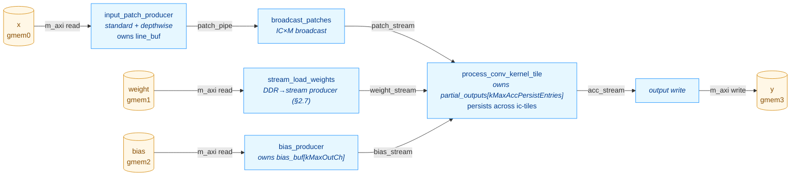

# ConvKernel — Optimization Log

This document records the structural and performance optimizations applied to
`kernels/conv/kernel/ConvKernel.cpp` after the initial scalar implementation
shipped. Each section describes one change, the rationale, and the measured
HW behavior simulation (`make behavior_test_conv`) impact on the kv260 RTL.

For the high-level kernel description see [CONV_KERNEL.md](CONV_KERNEL.md);
this file is a complement focused on the optimization arc and the current
final architecture.

> **Skeleton — fill in the TODOs.**  This file is a structural template that
> mirrors [POOL_OPTIMIZATION.md](POOL_OPTIMIZATION.md).  Section outlines
> reflect the optimisation passes visible in the current source (dataflow
> stages observable in `csynth.rpt`, the Option-A IC-tiling design in
> `Config.h.in`, the existing branch history `conv_optimisation_1..3`); per-step
> numbers and rationale need to come from the commit history and your notes.

---

## 1. Performance progression at a glance

All numbers are total `sim_time_ns` reported by the kv260 behavior testbench
after running the full TestConvRef case list.

> Latest baseline (branch `conv_optimisation_3`, 30 RTL tests, post-§2.7):
> **sim_time_ns = 4,913,835 ns** (sum of per-test `duration_ns` =
> 4,911,635 ns).  Captured by `conv-verify` Gate 4 on **2026-05-12** —
> see `build/kernels/conv/kv260/conv_timing_last.json`.

| Stage | Tests | sim_time_ns | Δ vs prior | Δ vs base |
|---|---:|---:|---:|---:|
| Baseline — single fused loop, no caching | TODO | TODO | — | — |
| + Dataflow restructuring (producer/consumer/writer) | TODO | TODO | TODO | TODO |
| + Line buffer (rows persistent across `oh`) | TODO | TODO | TODO | TODO |
| + Option-A IC-tiling + persistent partial-output accumulator | TODO | TODO | TODO | TODO |
| + Depthwise / standard producer split | TODO | TODO | TODO | TODO |
| + Broadcast patches (`broadcast_patches` stage) | TODO | TODO | TODO | TODO |
| + Bias producer fused with replay (`bias_producer`) | TODO | TODO | TODO | TODO |
| Snapshot post-§2.6 (captured 2026-05-12) | 30 | 5,204,375 | — | TODO |
| + Weight streaming (`stream_load_weights`, §2.7) | 30 | 4,913,835 | **-5.6%** | TODO |
| **Current state (post-§2.7, captured 2026-05-12)** | **30** | **4,913,835** | — | TODO |
| **+ Double buffering (planned — see [CONV_DOUBLE_BUFFER_PLAN.md](CONV_DOUBLE_BUFFER_PLAN.md))** | TODO | TODO | TODO | TODO |

**Net result on the <N>-test suite: TODO× faster than the baseline; TODO%
reduction in total HW sim time.**

---

## 2. Optimization steps

> Numbering and step boundaries should follow the commit history on
> `conv_optimisation_1/2/3`.  Below is a sketch of the passes I can identify
> from the current source — adjust ordering and split/merge to match what
> actually happened.

### 2.1. Dataflow restructuring (HLS DATAFLOW)

**Problem.** TODO — describe the original monolithic loop, the m_axi
read/write serialization, and why it dominated end-to-end latency.

**Change.** Split the body into N dataflow sub-functions wired by
`hls::stream`.  Current top-level stages (visible in `csynth.rpt`):
`entry_proc`, `Block_entry_proc`, `input_patch_producer`,
`bias_producer`, `broadcast_patches`, `process_conv_kernel_tile`.

**Result.** TODO — quote the prior-vs-now sim_time_ns and the per-test
pattern that dropped most.

### 2.2. Line buffer with row-incremental loading

**Problem.** TODO — adjacent `(oh, ow)` and `(oh, ow+stride_w)` windows
re-read the same `x[]` rows, multiplying DDR fetches by `kh × kw`.

**Change.** TODO — describe the line buffer (`line_buf[kTileIC]
[kMaxLineBufRows][kMaxInW]`), the row-incremental load schedule, the
`ih & (kMaxLineBufRows-1)` slot mapping.

**Result.** TODO.

### 2.3. Option-A IC-tiling + persistent partial-output accumulator

**Problem.** TODO — describe why a `kMaxInCh`-deep line buffer was
infeasible at the target channel counts (mobilenet, etc.).

**Change.** The current design (Config.h.in §"Option-A IC-tiling")
shrinks the per-channel buffers (`line_buf`, broadcast `local_buf`,
`w_buf`) from `kMaxInCh` to `kTileIC` channels.  In exchange, a
`partial_outputs[kMaxAccPersistEntries]` buffer of `AccData_t`
accumulators survives across ic-tiles in the consumer, initialised from
bias once per `ni` and drained to `acc_stream` after the `ict` loop.

**Result.** TODO — buffer-size deltas, sim_time_ns impact.

### 2.4. Depthwise / standard producer split

**Problem.** TODO — the standard-conv patch producer and the
depthwise-conv patch producer have different IC iteration shapes; sharing
a single function blocked II=1 for both.

**Change.** Split `input_patch_producer` into
`input_patch_producer_standard` (visible in `csynth.rpt` at
`VITIS_LOOP_385_*` / `VITIS_LOOP_416_*` etc.) and
`input_patch_producer_depthwise` (`VITIS_LOOP_587_*` /
`VITIS_LOOP_614_*` etc.), dispatched via the `is_depthwise` runtime flag.

**Result.** TODO.

### 2.5. `broadcast_patches` stage

**Problem.** TODO — describe the IC×M broadcast inefficiency the stage was
added to amortize.

**Change.** New `broadcast_patches` dataflow stage between the patch
producer and the conv tile consumer (`VITIS_LOOP_516_*` /
`VITIS_LOOP_517_*` / `VITIS_LOOP_528_*` in `csynth.rpt`).

**Result.** TODO.

### 2.6. `bias_producer` and bias-replay restructure

**Problem.** TODO.

**Change.** Bias load split into its own `bias_producer` dataflow stage
that loads `bias_buf[kMaxOutCh]` once per `ni` and replays it in
`(r, mt, m1)` order into the persistent accumulator init.

**Result.** TODO.

### 2.7. Weight streaming via dedicated DDR producer

**Problem.** Before this change, `process_conv_kernel_tile` called
`load_standard_weights(weight, ...)` inline once per
`(ict, oh, ow, mt)` iteration in Phase 2a, and
`load_depthwise_weights(weight, ...)` once per `mt` in Phase 2b.  The
`gmem1` DDR transfer was serialised with the patch read, the
partial-accumulator read/write, and the accumulate loop — every inner
iteration paid the full weight-load latency before MACs could start.
This was "Bottleneck A" of [CONV_DOUBLE_BUFFER_PLAN.md](CONV_DOUBLE_BUFFER_PLAN.md)
§1, but achievable without the URAM rework.

**Change.**

- Added a new `stream_load_weights` dataflow producer that owns the
  `gmem1` AXI master and pushes one `Data_t` per cycle to a
  `weight_stream` FIFO.  Iteration order matches the consumer's read
  pattern exactly:
  - Standard (`is_depthwise=0`): per `(ni, ict, oh, ow, mt)` emit
    `m_valid × ic_valid × kh × kw` values in `(m1, ic_l, khi, kwi)`
    order — same DDR bandwidth as the old inline replay, just
    overlapped.
  - Depthwise (`is_depthwise=1`): per `(ni, mt)` emit
    `m_valid × kh × kw` values in `(m1, khi, kwi)` order — no spatial
    replay, matching the consumer's existing once-per-`mt` hoist.
- `process_conv_kernel_tile` signature: `const Data_t* weight` →
  `hls::stream<Data_t>& weight_stream`.  Both inline
  `load_*_weights(...)` call sites replaced with II=1 stream-read
  loops into the existing `w_buf`.
- `weight_stream` depth = `kTileM × kTileIC × kMaxKH × kMaxKW` = 6,272
  at defaults — one full max-tile, large enough for the producer to
  pre-fetch the next iteration's slice during the consumer's
  accumulate.
- Removed the now-unused `load_standard_weights` /
  `load_depthwise_weights` helpers.

**Result.** **-5.6 % sim_time_ns** (5,204,375 → 4,913,835).  Wins
concentrated on the 1×1 and large-spatial layers where weight DDR
loads dominated the inner iteration:

| Test | Δ% |
|---|---:|
| `1x1 IC=TILE_IC*2 M=TILE_M*2 bias exact tiles` (was #2 heaviest) | **-19.8 %** |
| `partial_M_tile out_ch=TILE_M+3` | **-18.1 %** |
| `1x1_kernel 1ch no_bias` | -17.3 % |
| `saturation +/- overflow` (both STD variants) | -15.8 % |
| `batch_3 ResNet-style 7x7 stride=2` (heaviest test overall) | **-9.2 %** |

Five small-spatial 3×3 tests regressed +2–7 % (largest absolute
regression: `partial_IC_tile in_ch=TILE_IC+5` at +6.7 %, +34 k ns;
largest relative: `3x3_input_3x3_kernel → 1x1_out` at +23.0 %, +8 k ns)
— the new dataflow stage's prologue overhead doesn't amortise on tiny
iteration counts (single-output tiles, few channels).  Aggregate
regression across the 6 worst movers is ~+25 k ns; the savings on the
five biggest tests alone are -347 k ns.

**Synthesis impact.** Top-level slack on `ConvKernel*` improved
slightly: -0.93 → **-0.90 ns**.  No new II violations.  Resources
grew modestly (the new producer's address arithmetic):
BRAM 72 (25 %) → 80 (27 %); DSP 113 (9 %) → **151 (12 %, +34 %)**;
FF 46,086 → 51,052 (+11 %); LUT 37,948 (32 %) → 42,541 (36 %, +12 %).
m_axi data widths unchanged at 16 → 16 on all four ports — `gmem1`
widening still blocked by ap_fixed alignment; potential follow-up
optimisation (manual pack into `ap_uint<128>`).

### 2.8. Double buffering (planned)

See [CONV_DOUBLE_BUFFER_PLAN.md](CONV_DOUBLE_BUFFER_PLAN.md) for the
full plan.  Summary: slab-level double-buffering on the URAM weight
slab so the next ic-tile's `w_slab` loads while the current tile is
computing.  After §2.7 the weight load is already overlapped within a
single tile; the URAM step's remaining wins are (a) eliminating the
spatial replay on the standard path (1930× fewer DDR weight reads per
the plan), and (b) covering larger ic-tiles (`TILE_IC_WIDE` ≥ 64) per
outer iteration.

**Status.** Deferred — not yet started.  §2.7 captured the overlap win;
the DDR-bandwidth and tile-width wins of the URAM rework remain
unrealised.

---

## 3. Current architecture (post-§2.7)

> Verify against `csynth.rpt`: the top-level `ConvKernel*` row reports
> `Pipelined = dataflow` and the immediate children are `entry_proc`,
> `Block_entry_proc`, `input_patch_producer`, `bias_producer`,
> `broadcast_patches`, `stream_load_weights`,
> `process_conv_kernel_tile`.

**Six dataflow stages**, all running concurrently:

1. **`input_patch_producer`** — owns `line_buf[kTileIC][kMaxLineBufRows][kMaxInW]`;
   reads `x[]` from `gmem0`.  Standard variant iterates
   `(ni, ict, oh, ow, ic_l, khi, kwi)` with `ict` outer of `oh` (line
   buffer reused across `oh` within one ic-tile); depthwise variant
   substitutes `mt` for `ict`.  Each x pixel is fetched from DDR
   exactly once per `(ni, c)`.  Emits to `patch_pipe`.
2. **`broadcast_patches`** — buffers one ic-tile's patch
   (`kTileIC × kMaxKH × kMaxKW`) and re-emits it `m_tiles` times for
   the standard path (passthrough for depthwise).  This is what lets
   the patch producer read `x[]` once and the consumer see it
   per-`mt`.  Emits to `patch_stream`.
3. **`bias_producer`** — loads `bias_buf[kMaxOutCh]` once from `gmem2`
   and replays it `batch × out_h × out_w × m_tiles` times in
   `(r, mt, m1)` order to match the consumer's Phase-1 init pattern.
4. **`stream_load_weights`** (§2.7) — owns the `gmem1` AXI master.
   Standard path replays `m_valid × ic_valid × kh × kw` weights per
   `(oh, ow, mt)` iteration in `(m1, ic_l, khi, kwi)` order; depthwise
   path emits `m_valid × kh × kw` once per `(ni, mt)`.  Emits to
   `weight_stream` (depth 6,272).
5. **`process_conv_kernel_tile`** — owns
   `partial_outputs[kMaxAccPersistEntries]` (BRAM, ~64 KB at
   defaults).  Per `ni`: Phase 1 inits the accumulator from
   `bias_stream`; Phase 2a/2b accumulates over `ict`/`mt` outer, with
   the inner loop reading `kTileIC × kh × kw` patch values + the matching
   weight tile from `weight_stream` and running an II=1 lane-rotated
   reduce over `acc[kTileM]`; Phase 3 drains to `acc_stream`.
6. **`write_output_tile`** — saturates `AccData_t → Data_t` and writes
   to `gmem3` in `(ni, oh, ow, mt, m1)` order.

**Loop nest** (consumer, standard path):
`(ni, ict outer, oh, ow, mt)` with the lane-rotated inner reduction;
depthwise consumer is `(ni, mt outer, oh, ow)` and hoists the weight
load out of `(oh, ow)`.

**Cycle counts per `(oh, ow, mt)` iteration** at the consumer's hot loop
(standard path, post-§2.7):

| Loop body | II | Cycles per iteration |
|---|---:|---:|
| Patch read (`patch_stream` drain) | 1 | `kTileIC × kh × kw` |
| Weight read (`weight_stream` drain) | 1 | `m_valid × ic_valid × kh × kw` |
| `accumulate_standard` MAC reduction | 1 | `ic_valid × kh × kw × kTileM` |
| Partial accumulator read/write | 1 | `2 × m_valid` |

**Current bottleneck.** The MAC reduction (1 MAC/cycle, lane-rotated)
dominates at `ic_valid × kh × kw × kTileM` cycles per `(oh, ow, mt)`.
After §2.7 the weight load is now fully overlapped with this loop, so
the next throughput jump requires either (a) fully-parallel MACs
(`kTileM` MACs/cycle), or (b) the URAM/loop-inversion rework in
[CONV_DOUBLE_BUFFER_PLAN.md](CONV_DOUBLE_BUFFER_PLAN.md) (§2.8).

---

## 4. Knobs

### 4.1. Source of truth — CMake cache vars (migration to JSON pending)

Unlike `kernels/pool`, conv's compile-time bounds currently live as CMake
`CACHE STRING`s in `kernels/conv/CMakeLists.txt` rather than in
`platforms/<name>.json`.  Moving them under `kernels.conv` in the
platform JSON to match pool is **TODO** — see the issue/PR for the
migration.

| CMake var | C++ name (Config.h) | Default | Hard constraint | Notes |
|---|---|---:|---|---|
| `CONV_TILE_M` | `kTileM` | 8 | power of 2; ≥ MAC latency (~3 cyc) | Output channel tile; II=1 lane rotation depth. |
| `CONV_TILE_IC` | `kTileIC` | 16 | power of 2 | Input channel tile; sets `w_buf` and patch-buffer IC depth. |
| `CONV_MAX_KH` | `kMaxKH` | 7 | `kh ≤ this` | Compile-time kernel-height bound. |
| `CONV_MAX_KW` | `kMaxKW` | 7 | `kw ≤ this` | Compile-time kernel-width bound. |
| `CONV_MAX_IN_CH` | `kMaxInCh` | 1024 | `in_ch ≤ this` | Sizes `bias_buf` only — line_buf is IC-tiled. |
| `CONV_MAX_OUT_CH` | `kMaxOutCh` | 1024 | `out_ch ≤ this` | Sizes `bias_buf` in `bias_producer`. |
| `CONV_MAX_IN_W` | `kMaxInW` | 64 | `in_w ≤ this` | Sizes the column dim of `line_buf`. |
| `CONV_MAX_LINE_BUF_ROWS` | `kMaxLineBufRows` | 16 | power of 2; `(kh-1)*dil_h + 1 ≤ this` | Circular row capacity. |
| `CONV_MAX_ACC_PERSIST_ENTRIES` | `kMaxAccPersistEntries` | 16384 | `out_h*out_w*out_ch ≤ this` | Persistent accumulator (Option-A) size. |

### 4.2. How CMake reads the values

TODO — fill in once the JSON migration lands (mirror §4.2 of
POOL_OPTIMIZATION.md: `conv_load_constants(...)`,
`CMAKE_CONFIGURE_DEPENDS`, etc.).

### 4.3. How the Python scheduler reads the values

TODO — `inference-scheduler/src/_conv_hw_config.py` does not exist yet;
the conv validator currently reads from `<source>` (verify).  Migration
mirrors `_pool_hw_config.py::resolve(platform_name)`.

### 4.4. Test predictor and cache-extreme verification

TODO — does `TestConvSim.cpp` have a cache-aware `dup_reads` predictor
like `TestPoolingSim.cpp`?  If yes, document the cache-extreme matrix;
if not, mark as a deferred TODO.

---

## 5. Per-test progression highlights

All 30 tests, snapshot pre-§2.7 vs post-§2.7 (both captured
2026-05-12).  Sorted by `Post-§2.7` descending.  Source:
`build/kernels/conv/kv260/conv_timing_last.json` (post-§2.7 totals:
sum-of-`duration_ns` = 4,911,635 ns; `sim_time_ns` = 4,913,835 ns).
The `Baseline (pre-§2.1)` column is TODO — needs a `conv_optimisation_1`
tag re-run.

| Test | Baseline (pre-§2.1) | Pre-§2.7 (ns) | Post-§2.7 (ns) | Δ§2.7 |
|---|---:|---:|---:|---:|
| `batch_3__C_TILE_IC_M_TILE_M_stride_2__ResNet-style_` | TODO | 1,391,110 | 1,262,520 | **-9.2 %** |
| `1x1__IC_TILE_IC_2_M_TILE_M_2_bias__exact_tiles_` | TODO | 784,660 | 629,550 | **-19.8 %** |
| `partial_IC_tile__in_ch_TILE_IC_5_` | TODO | 506,930 | 540,890 | **+6.7 %** |
| `partial_M_tile__out_ch_TILE_M_3_` | TODO | 277,350 | 227,080 | **-18.1 %** |
| `DW_ch_TILE_M_2__exact_tile___bias` | TODO | 220,570 | 211,900 | -3.9 % |
| `DW_partial_M_tile__ch_TILE_M_3_` | TODO | 198,560 | 192,610 | -3.0 % |
| `DW_batch_2__4ch__pad_1` | TODO | 183,400 | 179,020 | -2.4 % |
| `DW_3x3__4ch__pad_1__has_bias` | TODO | 163,770 | 161,550 | -1.4 % |
| `batch_2__3x3__pad_1` | TODO | 152,900 | 158,880 | +3.9 % |
| `DW_5x5_kernel__4ch_____5x5_out` | TODO | 139,510 | 139,500 | -0.0 % |
| `DW_asymmetric_stride_h_2_w_1__8ch_____4x8_out` | TODO | 109,200 | 109,170 | -0.0 % |
| `DW_3x3__4ch__no_pad__no_bias` | TODO | 96,210 | 96,220 | +0.0 % |
| `1x5_horizontal_filter__pad_left_pad_right_2` | TODO | 90,370 | 95,620 | +5.8 % |
| `3x3__pad_1__has_bias__2_out_ch` | TODO | 83,580 | 88,760 | +6.2 % |
| `3x3_dilation_2_____5x5_out` | TODO | 82,310 | 85,340 | +3.7 % |
| `3x3__pad_1__same______5x5_out` | TODO | 81,230 | 84,290 | +3.8 % |
| `3x3__asymmetric_dilation_h_1_w_2_____5x5_out` | TODO | 81,180 | 84,190 | +3.7 % |
| `non-square__6x8_input__3x5_kernel` | TODO | 78,650 | 83,970 | +6.8 % |
| `DW_stride_2__8ch__pad_1` | TODO | 77,810 | 77,900 | +0.1 % |
| `DW_3x3_dilation_2__4ch` | TODO | 74,890 | 74,980 | +0.1 % |
| `5x5_kernel_____3x3_out` | TODO | 69,110 | 71,670 | +3.7 % |
| `3x3_input_3x3_kernel_____1x1_out__C_TILE_IC_M_TILE_M` | TODO | 35,840 | 44,090 | **+23.0 %** |
| `1x1_kernel__1ch__no_bias` | TODO | 46,615 | 38,545 | -17.3 % |
| `3x3__no_pad__no_bias_____3x3_out` | TODO | 34,000 | 35,030 | +3.0 % |
| `7x7__stride_2__asymmetric_pad__1_1_0_0_` | TODO | 33,500 | 34,640 | +3.4 % |
| `3x3__asymmetric_stride_h_2_w_1_____2x4_out` | TODO | 31,450 | 33,140 | +5.4 % |
| `3x3__stride_2_____2x2_out` | TODO | 19,360 | 19,790 | +2.2 % |
| `saturation__positive_overflow_____AP_MAX` | TODO | 21,280 | 17,920 | -15.8 % |
| `saturation__negative_overflow_____AP_MIN` | TODO | 21,240 | 17,880 | -15.8 % |
| `DW_saturation__positive_overflow_____AP_MAX` | TODO | 15,590 | 14,990 | -3.8 % |
| **TOTAL** | **TODO** | **5,202,175** | **4,911,635** | **-5.6 %** |

Observations on the post-§2.7 snapshot:

- `batch_3 ResNet-style` (1.26 ms) is still the dominant test —
  **26 %** of total sim time.  The top two tests together
  (`batch_3 ResNet-style` + `1x1 IC=TILE_IC*2 bias exact tiles`,
  1.89 ms) account for **39 %** — both still benefit most from
  weight-overlap; remaining headroom is in fully parallel MACs
  (§2.8 candidate) and DDR-bandwidth elimination.
- The 11 depthwise tests collectively: 1.46 ms (**30 %**) — barely
  moved by §2.7 since depthwise already loaded weights once per `mt`;
  expect §2.8 to help these the least.
- 21 of 30 tests improved or stayed flat (≤ 1 % regression); 9
  regressed by 2–23 %.  The regressions are concentrated in
  small-spatial 3×3 cases where the new producer's prologue overhead
  doesn't amortise.  Aggregate cost of the 9 regressions: +25.5 k ns;
  aggregate gain of the 21 improvements: -316 k ns.

TODO: backfill the `Baseline (pre-§2.1)` column from a
`conv_optimisation_1`-tag re-run.

---

## 6. Where the floor is now

After §2.7 the heaviest test (`batch_3 ResNet-style`) is at 1.26 ms /
out of 4.91 ms total.  Worst-slack sub-block in `csynth.rpt` is
`process_conv_kernel_tile` at **-0.90 ns** — same as the top-level,
so the MAC pipeline is timing-critical.  Two remaining throughput
paths:

- **Fully parallel MACs.**  `accumulate_standard` currently runs one
  MAC/cycle via lane rotation (`m1 = ri & (kTileM-1)`); the inner
  reduction takes `ic_valid × kh × kw × kTileM` cycles per
  `(oh, ow, mt)`.  Partitioning `w_buf` complete on `dim=1` (per-m1
  banks) and unrolling the `m1` lane gives `kTileM` MACs/cycle —
  potentially ~8× on compute-bound layers.  Risk: timing already
  tight at `-0.90 ns`, and the partition factor may push LUT routing.
- **URAM weight slab + loop inversion** — §2.8 below.

### 6.1. Tried and rejected: TODO

TODO — list speculative changes that were tried and discarded, with the
measurement that ruled them out.

### 6.2. Pending: double-buffered URAM weight slab (§2.8)

See [CONV_DOUBLE_BUFFER_PLAN.md](CONV_DOUBLE_BUFFER_PLAN.md).  Note that
§2.7 captured the *overlap* portion of "Bottleneck A" from the plan;
the remaining wins are (a) eliminating spatial replay on the standard
path (plan estimates **1930× reduction** in weight DDR reads for a
14×14 layer with M=8, C=64, K=3) and (b) larger ic-tiles per outer
iteration (`TILE_IC_WIDE` ≥ 64).  Expected speedup: TODO × — re-estimate
against the post-§2.7 baseline (4.91 ms), not the original plan's
pre-§2.7 model.  **Status:** deferred, not yet started.

---

## 7. Verification matrix

| Configuration | C-sim (TestConvRef) | RTL sim (behavior_test_conv) |
|---|---|---|
| Default (kMaxInW=64, kMaxLineBufRows=16, kMaxAccPersistEntries=16384) | 32/32 PASS | 30/30 PASS |
| Reduced cache (TODO) | TODO | (not run) |
| Increased cache (TODO) | TODO | (not run) |

C-sim count (32) vs RTL count (30): TODO — explain the delta (saturation
sub-tests not run on RTL, depthwise variants, etc.).

---

## 8. Related files

| File | What changed |
|---|---|
| `kernels/conv/kernel/ConvKernel.cpp` | TODO — list the dataflow split, line_buf, IC-tiling Option-A persistent accumulator, depthwise/standard producer split, broadcast_patches, bias_producer (one bullet per §2.1–§2.6).  §2.7: new `stream_load_weights` dataflow producer owning `gmem1`; `process_conv_kernel_tile` reads from `weight_stream` instead of `const Data_t* weight`; deleted `load_standard_weights` / `load_depthwise_weights` helpers. |
| `kernels/conv/include/Config.h.in` | Templates `kTileM`, `kTileIC`, `kMaxKH`, `kMaxKW`, `kMaxInCh`, `kMaxOutCh`, `kMaxInW`, `kMaxLineBufRows`, `kMaxAccPersistEntries` from CMake-side variables. |
| `kernels/conv/CMakeLists.txt` | TODO — currently CMake `CACHE STRING`s; migrate to `kernels.conv` block in `platforms/<name>.json` to match pool (§4.1). |
| `platforms/<name>.json` | TODO — add `kernels.conv` section once the migration lands. |
| `inference-scheduler/src/_conv_hw_config.py` | TODO — does not yet exist; create when the JSON migration lands.  Mirror `_pool_hw_config.py::resolve(platform_name)`. |
| `inference-scheduler/src/nodes.py` | TODO — `ConvNode.from_onnx_node` validation against compile-time bounds (kH, kW, in_ch, out_ch, in_w, dilated kh span, persistent-accumulator size). |
| `kernels/conv/test/TestConvSim.cpp` | TODO — 32-test list, dump-data fixture-regen mode. |
| `hw/test_data/conv_test_data/` | TODO — 30-test fixtures for kv260 RTL sim. |
