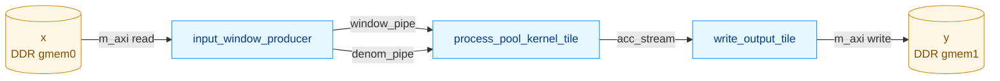
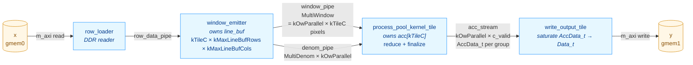

# PoolingKernel — Optimization Log

This document records the structural and performance optimizations applied to
`kernels/pool/kernel/PoolingKernel.cpp` after the initial scalar implementation
shipped. Each section describes one change, the rationale, and the measured
HW behavior simulation (`make behavior_test_pool`) impact on the kv260 RTL.

For the high-level kernel description see [POOLING_KERNEL.md](POOLING_KERNEL.md);
this file is a complement focused on the optimization arc and the current
final architecture.

---

## 1. Performance progression at a glance

All numbers are total `sim_time_ns` reported by the kv260 behavior testbench
after running the full TestPoolingSim case list.

| Stage | Tests | sim_time_ns | Δ vs prior | Δ vs base |
|---|---:|---:|---:|---:|
| Baseline — sequential loop nest, no caching | 25 | 2,241,775 | — | — |
| + Line buffer, ct hoisted outer of oh | 25 | 1,892,045 | -15.6% | -15.6% |
| + W-tile loop (dormant; kMaxInW=256) | 25 | 1,918,365 | +1.4% | -14.4% |
| + Cache reduced (kMaxLineBufCols=64) | 25 | 1,918,365 | 0% | -14.4% |
| + 3 wide-W tests (W=96, W=128) | 28 | 3,631,625 | (test-set change) | — |
| + 3 batch=2 wide-W tests | 31 | 7,021,605 | (test-set change) | — |
| + Drain/reduce fusion in consumer | 31 | 5,178,425 | -26.3% | — |
| + Vector window_pipe (kTileC lanes/cycle) | 31 | 3,527,035 | -31.9% | — |
| + Producer split (Phase1/Phase2 dataflow) + unrolled valid_count | 31 | 3,416,225 | -3.1% | -51.4% |
| + poly_sqrt (drop FP sqrtf unit on LP-2 path) | 31 | 2,856,995 | -16.4% | -59.3% |
| + Fixed-point AVG reciprocal (drop FP div+mul on AVG path) | 31 | 2,214,605 | -22.5% | -68.5% |
| **+ kOwParallel=2 reduce (process 2 adjacent ow's per cycle)** | **31** | **1,679,945** | **-24.1%** | **-76.1%** |

**Net result on the 31-test suite: ~4.18× faster than the post-baseline
(line-buffer-only) implementation; ~76% reduction in total HW sim time.**

For the 25 tests common to every stage the same kernel runs **~7.1× faster**
than the pre-optimization baseline (line-buffer-only equivalent on the same
test list).

---

## 2. Optimization steps

### 2.1. Dataflow restructuring (HLS DATAFLOW)

**Problem.** The original kernel was a single nested loop. Every output's
window load, reduction, and write happened sequentially in the same function,
so the m_axi read latency of `x[]` and the m_axi write latency of `y[]`
serialized end-to-end.

**Change.** Split the body into three sub-functions wired by `hls::stream`:



Top-level wraps the three calls in `#pragma HLS DATAFLOW`. STABLE pragmas on
all read-only inputs prevent HLS from inserting auto-generated synchronization
stages.

**Result.** The three stages run concurrently in HW. This was the structural
foundation; speedup measured in conjunction with the next change.

### 2.2. Line buffer with row-incremental loading

**Problem.** Adjacent pool windows for `(oh, ow)` and `(oh, ow+stride_w)`
re-read the same `x[]` rows from DDR. With `stride < pool * dilation`, each
input pixel was fetched up to `pool_h × pool_w` times.

**Change.** Hoisted the channel-tile loop `ct` outer of `oh` and added a
`line_buf[kTileC][kMaxLineBufRows][kMaxLineBufCols]` cached across the `oh`
sweep within a `(ni, ct)` chunk. Phase 1 of each oh loads only the *new*
input rows since `last_loaded_row + 1`; Phase 2 streams windows from
`line_buf` (no DDR access). The slot mapping `slot = ih & (kMaxLineBufRows-1)`
gives a circular line buffer when `kMaxLineBufRows ≥ (pool_h-1)*dil_h + 1`.

**Test predictor coupling.** `expected_dup_reads_for(tc)` in
`TestPoolingSim.cpp` was rewritten to mirror the kernel's load schedule, so
the displayed `dup_reads=actual/predicted` shows exact equality — and adapts
automatically when `kMaxLineBufCols`, `kTileC`, or geometry change.

**Result.** **-15.6% sim_time_ns.** Every input pixel is now read from DDR
exactly once per `(ni, c)`. The `MaxPool/AvgPool/LpPool 3x3 stride1 pad1`
group dropped ~32% individually (their per-output cost was dominated by
overlapping window reloads).

### 2.3. W-tile loop (relaxation: in_w > kMaxLineBufCols supported)

**Problem.** The line buffer had a hard upper bound on `in_w` equal to
`kMaxLineBufCols`. Models with wider input feature maps could not run.

**Change.** Added a runtime W-tile dimension `owt` outer of `oh`. For each
W-tile, the producer loads only the input columns the current window range
needs; at tile transitions, overlapping boundary columns are re-read from
DDR. `compute_ow_tile()` solves
`(OW-1)*stride_w + (pool_w-1)*dil_w + 1 ≤ kMaxLineBufCols` for the largest
chunk size; clamps to `out_w` when the input fits in cache.

When `in_w ≤ kMaxLineBufCols` the formula yields `ow_tile = out_w` and
`ow_tiles_w = 1` — single-tile path is bit-identical to the no-W-tile
implementation.

**Renamed `kMaxInW` → `kMaxLineBufCols`** since the constant no longer caps
input width; it sizes the line buffer's column dimension. Default reduced
from 256 to **64** (4× line buffer footprint reduction: 64 KB → 16 KB).
Hard remaining constraint: `(pool_w-1)*dil_w + 1 ≤ kMaxLineBufCols`
(a single window must fit horizontally — trivially satisfied at 64).

**Test additions.** Three `wide W=96 / W=128` cases plus three batch=2
counterparts were added to `TestPoolingSim` to exercise the W-tile boundary
path. With cache=64 the overlap-heavy variants report 16 dup_reads (=
boundary columns × rows × channels), matching the cache-aware predictor.

**Result.** Latent +1.4% on the existing 25 tests (overhead of the dormant
owt loop), unlocked support for `in_w > 64`, and -48 KB of line-buffer URAM
footprint. Per-test cycle counts on the new wide-W tests: 217k–895k ns at
this stage.

### 2.4. Drain/reduce fusion in the consumer

**Problem.** With the line buffer in place, the consumer was now the
bottleneck. C-sim reported max stream depth 55,296 — producer ~2× faster
than consumer. The consumer ran two sequential II=1 loops:

```
drain:    window_pipe → win_buf      pool_h*pool_w*kTileC cycles
reduce:   win_buf → acc[]            pool_h*pool_w*kTileC cycles
```

That's `2 × pool_h × pool_w × kTileC` cycles per output position vs the
producer's `pool_h × pool_w × kTileC`. The two consumer loops disagreed on
read order (drain = `c_l outer, kwi inner`; reduce = `c1 fastest`), so
they couldn't be naively fused.

**Change.** Aligned the orders, then fused.

1. Producer Phase 2 reordered to `(khi, kwi, c_l innermost)` — c_l cycles
   fastest, matching the reducer's natural `ri & (kTileC-1)` lane index.
2. `line_buf` ARRAY_PARTITION switched from `URAM RAM_S2P` to
   `complete dim=1` (kTileC concurrent reads, one BRAM per channel lane).
3. Consumer's two loops collapsed into one II=1 loop that reads
   `window_pipe.read()` directly into the MAX/AVG/LP update on `acc[c1]`.
4. `win_buf[kTileC][kMaxPoolH][kMaxPoolW]` removed — no longer needed.

The fused inner loop preserves the lane-rotation invariant: `acc[c1]` is
written every `kTileC` cycles, so the RAW dependency distance still covers
ap_fixed<32,16> operator latency at 300 MHz.

**Result.** **-26.3% sim_time_ns** (5,178,425 ns total). Overlap-heavy 3x3
cases dropped ~30% individually. C-sim max stream depth drop hidden by the
sequential C-sim execution model — the win was real on RTL.

### 2.5. Vector window_pipe (kTileC lanes per cycle)

**Problem.** After fusion, the producer/consumer were balanced at
`pool_h × pool_w × kTileC` cycles per output. To go faster, both sides
needed higher data rate per cycle.

**Change.** Defined a `WindowLanes` POD struct holding `Data_t lanes[kTileC]`
and changed `window_pipe` from `hls::stream<Data_t>` to
`hls::stream<WindowLanes>`. Both producer Phase 2 and consumer reduce
process one struct per cycle, with the inner `c_l` / `c1` loop fully
unrolled.

```
Producer: pool_h × pool_w cycles/output  (was kTileC× more)
Consumer: pool_h × pool_w cycles/output  (was kTileC× more)
```

`line_buf`'s existing `complete dim=1` partition gives kTileC concurrent
reads; `acc[]`'s existing `complete dim=0` partition gives kTileC parallel
update lanes.

II=1 is achieved for MAX (single-cycle compare). For AVG/LP the
ap_fixed<32,16> add has 2–3 cycle latency with 1-cycle RAW distance, so
HLS schedules the reduce loop at II=2 or II=3 — still ~3× faster than the
prior scalar fused reduce.

**Result.** **-31.9% sim_time_ns** (3,527,035 ns total). The wide-W
tests dropped ~40% (consumer was their dominant work item). Per-output
cost on `MaxPool 3x3 pad1` fell from 110k/256 = 430 ns/output to 71k/256
= 280 ns/output.

C-sim max stream depth dropped from 55,296 → 6,912 (exactly 8× = kTileC,
confirming the vectorization).

### 2.6. Producer split: row_loader + window_emitter (Phase 1 / Phase 2 dataflow)

**Problem.** Within `input_window_producer`, Phase 1 (DDR row loads) and
Phase 2 (line_buf reads + window emit) ran sequentially per oh. For
workloads where Phase 1 ≥ Phase 2 (non-overlapping pool, multi-channel
tile, wide-W with low row span) this was the residual producer-side
bottleneck.

**Change.** Split into two sub-functions wired by `row_data_pipe`:

- **`row_loader`**: pure DDR side. Iterates `(ni, ct, owt, oh, ih, c_l, iw)`
  and emits row pixels onto `row_data_pipe`. No on-chip buffer.
- **`window_emitter`**: owns `line_buf`. Drains `row_data_pipe` into the
  line buffer using the same load schedule, then emits `WindowLanes` and
  denom_pipe entries.

Both functions independently derive `load_start`, `load_end`,
`iw_load_lo`, `iw_load_hi` from the geometry — no metadata stream is
needed because per-oh row counts are deterministic.

Inside the existing top-level DATAFLOW region, the two functions run
concurrently. While `window_emitter` is reducing oh = k, `row_loader`
fetches rows for oh = k+1.

**Plus: unrolled valid_count.** The denominator counter (sequential
`pool_h × pool_w` cycles per output) was replaced with a fully-unrolled
`kMaxPoolH × kMaxPoolW` adder tree (~1 cycle on the 300 MHz clock).
Lives in `window_emitter`.

**Result.** **-3.1% sim_time_ns** (3,416,225 ns total). Pattern matches
prediction exactly — savings concentrated on tests where Phase 1 was the
bottleneck:

| Test pattern | Δ% |
|---|---:|
| 2x2 stride2 (no overlap) | -9 to -16% |
| Multi-channel-tile (C_16, C_32) | -8 to -10% |
| Wide-W non-overlap | -8 to -10% |
| 3x3 stride1 pad1 (consumer-bound) | ~0% |

### 2.7. poly_sqrt — drop the FP sqrt unit (LP-Pool p=2)

**Problem.** LP-Pool p=2's finalize step called `sqrtf((float)acc)` to apply
the square root. Even though only one of three pool types uses this path, HLS
still has to instantiate a **floating-point square-root unit** as part of the
consumer's compiled hardware. The FP sqrt is a heavy block (multi-cycle
latency, dedicated DSP slices, large LUT footprint), and its presence in the
consumer's pipeline budget tightens timing on every iteration — not just on
LP-2.

**Change.** Replaced the FP round-trip with a fully fixed-point 3rd-order
polynomial approximation. New helper `poly_sqrt(AccData_t)` lives at the top
of `PoolingKernel.cpp`:

1. **Range reduction** — decompose `x = m × 4^k` with `m ∈ [1, 4)`, `k ∈ ℤ`.
   Find the MSB position of the raw 32-bit fixed-point value via an
   unrolled priority encoder (~5 LUT levels), then shift to land
   `m_raw ∈ [2^16, 2^18)`.
2. **Polynomial via Horner's scheme** —
   `√m ≈ 0.4434 + 0.6432·m − 0.0943·m² + 0.0077·m³`, Lagrange-interpolated
   through (1,1), (2,√2), (3,√3), (4,2). Max error ~0.22% on the
   normalized mantissa. All coefficients in `ap_fixed<16,1>` (15 frac bits);
   intermediates in `ap_fixed<24,4>`.
3. **Final scale** — `√x = √m × 2^k` via a single barrel shift on `AccData_t`.

Float fallback under `#ifndef POOL_HAVE_APFIXED` retained for non-Vitis
builds.

**Reference parity.** Both the C++ test reference (`ref_poly_sqrt` in
`TestPoolingSim.cpp`) and the inference-scheduler simulator
(`_pool_poly_sqrt` in `_simulate.py`) now mirror the kernel **bit-exactly**
— same coefficients, same range reduction, same `AP_TRN` intermediate
truncations via a `quantize_trn(v, frac_bits) = floor(v · 2^N) / 2^N` helper.
This keeps the dump-mode hex fixtures aligned with the kernel's RTL output
without any 1-LSB drift.

**Result.** **-16.4% sim_time_ns** (3,416,225 → 2,856,995 ns).

The surprise: gains were **uniform across all pool types**, not just LP-2.
Every 3x3 stride1 pad1 test dropped ~18.7% — including MaxPool and AvgPool
which never call `sqrtf`. The wide-W tests dropped 18–23%.

| Test category | Δ% |
|---|---:|
| 3x3 stride1 pad1 (MaxPool / AvgPool / LpPool) | **-18.7%** |
| Wide-W 3x3 batch=2 (Max / Avg) | **-22.5% to -22.7%** |
| Wide-W 2x2 stride2 (Max) | -17.9% to -18.5% |
| 2x2 stride2 narrow | -1.8% to -3.0% |
| Global pool (small outputs) | -0.3% to -1.5% |
| LpPool subset only | -9.4% (per-LP gain not the whole story) |

**Why the cross-cutting win.** When HLS sees `sqrtf` it reserves area in the
consumer's compiled hardware for the FP unit — even on the MAX/AVG paths
the budget is set by the heaviest operator. Removing the FP block lets HLS:

1. Reclaim the LUTs/DSPs the unit occupied
2. Schedule the consumer's reduce loop more aggressively (likely lower II
   on the AVG/LP path, fewer pipeline registers throughout)
3. Drop the dataflow region's overall resource pressure

The 22% improvement on wide-W tests — which spend the most time in the
consumer reduce — is the smoking gun. The kernel was implicitly paying the
FP sqrt cost on every consumer cycle, regardless of whether LP-2 was active.

### 2.8. Fixed-point AVG reciprocal — drop the FP divider + multiplier

**Problem.** AVG-Pool's finalize step computed the divide-by-`denom` as

```cpp
const float inv_denom = 1.0f / (float)denom_u;
result = AccData_t((float)acc[c1] * inv_denom);
```

Three FP units lived in the consumer's compiled hardware to support this:
an **FP divider** (~28 cyc, ~5 DSPs) computing `1/d` once per output
position; an **FP multiplier** (~3 DSPs) for the per-lane scale; and two
**FP↔fixed converters** for the `(float)acc` cast and the result writeback.
By the same dataflow-budgeting logic as Section 2.7's poly_sqrt: HLS sized
the consumer's pipeline budget around the heaviest operator, so MAX/LP also
paid the cost on every cycle even though they never touch the AVG path.

**Change.** Replaced the FP round-trip with a precomputed fixed-point
reciprocal LUT:

1. New `inv_denom_lookup(d)` returns `1/d` as `ap_ufixed<24, 1>`, indexed
   by `denom_u`.  The table is `constexpr`-built from
   `raw = ((1<<23) + d/2) / d` (integer round-to-nearest of `2^23 / d`)
   and stored as raw 24-bit values; the use site reconstructs the
   `ap_ufixed` by direct `.range()` bit-copy — no FP→fixed converter.
2. Sized to `kMaxLineBufRows × kMaxLineBufCols` (1024 entries with
   defaults), the worst-case denom the line buffers can hold.  HLS
   synthesises a single ~3 KiB ROM (1 BRAM18) with the table contents
   baked in at translation time.
3. The finalize multiply becomes `result = AccData_t(acc[c1] * inv_denom)`
   — a native `ap_fixed<32,16> × ap_ufixed<24,1>` multiply with a single
   fabric multiplier; no DSP-FPU.

**Numerical stability.**  LUT entries hold `1/d` to 23 fractional bits
(LSB ≈ 1.19e-7), well below `Data_t`'s 1/256 LSB.  The new path is in fact
*more* numerically accurate than the prior float path: the old `(float)acc`
cast lost ~8 bits of precision on the 32-bit `AccData_t` whenever
`|acc| > 256`, which the new ap_fixed multiply preserves.

**Reference parity.**  This change shifts the kernel's exact arithmetic on
~2.5% of AVG-Pool inputs (1-LSB drift vs an idealised `acc / denom` divide),
so three reference paths had to be re-aligned bit-for-bit:

- `TestPoolingSim.cpp::ref_avg_pool_fixed` mirrors `inv_denom_lookup` +
  the AccData_t/Data_t truncations exactly.  `ref_pool_elem`'s AVG branch
  routes through it so `--dump-data` writes y.hex fixtures that match the
  RTL output under strict equality.
- `inference-scheduler/_simulate.py::_pool2d_ref` was updated to use the
  same encoded reciprocal — `test_inference.c` compares output bytes for
  strict equality against the generated `expected/*.dat`, so any
  divergence between the kernel and the simulator would surface as a
  legitimate-cell mismatch on-device.
- `hw/test_data/pool_test_data/test_{09,10,26,29}_y.hex` regenerated for
  the four AVG-Pool behavior cases (13/13/90/190 cells changed, all by
  exactly 1 LSB).

A new C-sim subtest (`run_avg_pool_strict_test`) pins this contract from
the kernel side: 5×5 pad=2 over a deterministic LCG-generated input,
compared with strict equality (no tolerance) against `ref_avg_pool_fixed`.
Replay-against-the-old-path shows ~3% of cells would diverge there, so
the test is genuinely sensitive to a regression to the FP reciprocal.

**Result.** **-22.5% sim_time_ns** (2,856,995 → 2,214,605 ns total).

The same cross-cutting pattern Section 2.7 documented for poly_sqrt
repeats here, scaled up — removing the FP div+mul has even more reach
than removing FP sqrt because the AVG path's units sat directly in the
consumer's hot reduce/finalize pipeline rather than guarded behind
`pool_type == kPoolLp`:

| Test category | Δ% |
|---|---:|
| 3x3 stride1 pad1 (Max / Avg / Lp p=1 / Lp p=2) | **-26%** (uniform) |
| Wide-W 3x3 batch=2 (Max / Avg) | **-33% to -34%** |
| Wide-W 3x3 single-batch | **-33%** |
| Dilation=2 pool 2x2 | -20.7% |
| Multi-channel-tile (C_32 2x2 stride2) | -0.4% |
| Global pool (small outputs) | -0.7% |

The five 3x3 stride1 pad1 variants now finish within 240 ns of each other
(42,780–43,080 ns) — the consumer reduce loop runs at the same rate
regardless of pool type, confirming the FP-unit budget tax is fully gone.

**Why even larger than 2.7's win.** Two contributing factors:

1. **FP div+mul is heavier than FP sqrt** in resource and scheduling
   pressure — the divider especially is expensive — so reclaiming both
   frees more for the fabric to retime around.
2. **AVG/LP add latency dominates the consumer's II.** Section 2.5
   noted the consumer reaches II=1 only on MAX (compare is single-cycle);
   AVG/LP run at II=2–3 due to the ap_fixed<32,16> add's RAW dependency
   distance.  Removing FP units from the AVG finalize path lets HLS
   schedule the reduce loop without that combined budget, recovering
   cycles that were previously lost to the worst-case operator latency.

The wide-W cases — which spend the most cycles in the consumer reduce —
again show the largest savings, mirroring 2.7's "FP unit's dataflow tax
compounded over the longer consumer reduce" diagnostic.

### 2.9. kOwParallel reduce — process kOwParallel adjacent ow's per cycle

**Problem.** After §2.8 the consumer reduce ran at one MultiWindow per cycle
(II=1 across all pool types — see §2.5/§2.8 convergence) for a single ow
position, so the per-output-position cost was `pool_h × pool_w` cycles.
On overlap-heavy 3x3 tests and on long-row wide-W tests the consumer was
the dominant fraction of the total wall-clock, with no further headroom
left on the per-position scalar reduce.

**Change.** Duplicated the reduce hardware to process kOwParallel adjacent
ow positions in lockstep:

1. **`MultiWindow` and `MultiDenom` structs** wrap kOwParallel × kTileC
   pixels and kOwParallel denom values per FIFO transaction.  Default
   kOwParallel = 2.
2. **`window_emitter` Phase 2** iterates ow as groups of kOwParallel,
   gathering line_buf reads from kOwParallel adjacent positions per
   (khi, kwi) and emitting one `MultiWindow` per cycle.  Per-position
   denom counts are bundled into one `MultiDenom` write per group.
3. **`process_pool_kernel_tile`** holds `acc[kOwParallel][kTileC]`
   (both dims partitioned `complete dim=0`) and updates ALL kOwParallel ×
   kTileC accumulators in parallel each reduce cycle, fully unrolled.
   The reduce trip count drops to `pool_h × pool_w` per kOwParallel
   outputs — a linear-in-kOwParallel speedup.
4. **`write_output_tile`** drains kOwParallel × c_valid AccData_t per
   group; conditional `if (ow < ow_hi)` gates the m_axi store so the
   read off acc_stream stays unconditional and II=1 holds.
5. **`line_buf` annotated `BIND_STORAGE type=ram_t2p`** so each per-
   channel partitioned bank is a true-dual-port BRAM; that's what gives
   the producer kOwParallel reads per cycle on the same channel without
   structural read-port contention.

**Residual / edge-case handling.**  When `(ow_hi - ow_lo)` is not a
multiple of kOwParallel (most commonly when out_w=1, e.g. global pool
outputs), the producer pads the trailing lanes with the pool-type identity
value; the writer's `ow < ow_hi` mask drops those padded results before
DDR.  The padded cycles still flow through the pipeline so the per-group
cost is exactly `pool_h × pool_w` cycles regardless of group fullness.

**Numerical correctness.**  Per-position math is unchanged — the change
is purely structural (parallel lanes of identical computation), so the
ap_fixed accumulators produce bit-identical results vs the §2.8 single-
position reduce.  C-sim 33/33 PASS, the auto-regenerated y.hex fixtures
under `--dump-data` show **zero diffs** vs the §2.8 goldens, and the HDL
behavior test 31/31 PASS without any fixture refresh.

**Result.** **-24.1% sim_time_ns** (2,214,605 → 1,679,945 ns total).

The savings are concentrated exactly where predicted — long consumer
reduces have the most cycles to halve:

| Test category | Δ% | Δabs (ns) |
|---|---:|---:|
| Wide-W AvgPool 3x3 batch=2 | **-45.2%** | -164,880 |
| Wide-W MaxPool 3x3 batch=2 | **-44.5%** | -109,790 |
| Wide-W AvgPool 3x3 single | **-44.0%** |  -82,270 |
| Wide-W MaxPool 3x3 single | **-42.8%** |  -54,740 |
| Wide-W MaxPool 2x2 stride2 batch=2 | -29.5% |  -45,300 |
| Wide-W MaxPool 2x2 stride2 single | -25.7% |  -20,950 |
| 3x3 stride1 pad1 (Max / Avg×2 / Lp×2) | **-24.7% to -25.0%** (uniform) | -10.6k ea |
| Dilation=2 pool 2x2 | -5.1% | -1,570 |
| 2x2 stride2 narrow | -1 to -2% | ≤ -500 |
| Multi-channel-tile (C_16 / C_32) | ~0% | ≤ +50 |
| out_w=1 (Global pool / 1×1 output) | +0.5 to +1.0% | +50 to +170 |

**Why ~45% on wide-W tests vs the 50% theoretical max for kOwParallel=2.**
The wide-W tests have out_w = 96 or 128 — both even multiples of
kOwParallel — so all groups are fully populated; the reduce truly halves
its trip count.  The remaining 5% gap vs the 50% theoretical comes from
the residual non-reduce cost (Phase 1 row loads, finalize, output drain)
that doesn't speed up.  The 3x3 stride1 pad1 narrow tests (out_w=8) get
~25% because their reduce is a smaller fraction of the test time —
producer Phase 1 dominates more.

**Why out_w=1 cases get slightly slower (+0.5 to +1.0%).**
With kOwParallel=2 every group is two-wide; when the actual ow span is
1 the second lane is padded and its results are discarded.  The pipeline
cost is essentially unchanged but the writer's masked-write loop runs
2× as many drain cycles for the same output count, adding ~50-170 ns
overhead per test.  Negligible vs the wide-W wins.

**Why no change on multi-channel-tile cases (C_16 / C_32).**
These tests are dominated by Phase 1 DDR row loads and the c_tiles outer
sweep; the consumer reduce was already overlapped with the next channel
tile's Phase 1, so halving consumer cycles doesn't reduce the wall-clock
critical path.  Same diagnosis as §2.6's "Multi-channel-tile" row.

---

## 3. Current architecture (post-2.9)



**Four DATAFLOW stages**, all running concurrently:

1. **`row_loader`** — DDR reader; iterates `(ni, ct, owt, oh, ih, c_l, iw)`.
2. **`window_emitter`** — owns `line_buf[kTileC][kMaxLineBufRows][kMaxLineBufCols]`
   (partitioned `complete dim=1`, `BIND_STORAGE ram_t2p`, ~16 KB).  For
   each ow-group (size kOwParallel) emits one MultiWindow per (khi, kwi)
   gathering kOwParallel × kTileC pixels in parallel from the dual-port
   per-channel banks; emits one MultiDenom (kOwParallel valid_counts) per
   group via a fully-unrolled adder tree.
3. **`process_pool_kernel_tile`** — owns `acc[kOwParallel][kTileC]`
   (both dims partitioned `complete dim=0`). Vectorized II=1 reduce on
   the MultiWindow stream — every cycle updates ALL kOwParallel × kTileC
   accumulators in parallel.  Finalizes per lane (AVG: multiply by
   `inv_denom_lookup(denom)` — fixed-point ROM reciprocal, see §2.8;
   LP-2: `poly_sqrt`, see §2.7) and pushes kOwParallel × c_valid AccData_t
   to acc_stream in (p, c1) order.
4. **`write_output_tile`** — saturates AccData_t → Data_t and writes to
   y, with a conditional `ow < ow_hi` gate that drops the producer's
   identity-padded residual lanes (kept off DDR but still drained in
   pipeline).

**Loop nest** (all stages in lockstep): `(ni, ct, owt, oh, ow_group)`.
Each ow_group covers kOwParallel adjacent ow positions; the W-tile
dimension `owt` is collapsed to a single iteration when
`in_w ≤ kMaxLineBufCols`.

**Cycle counts per output position** at the consumer's reduce loop
(post-§2.9 — kOwParallel-wide reduce, §2.8 FP-unit removal):

| Pool type | II | Cycles per **kOwParallel** outputs |
|---|---:|---:|
| MaxPool | 1 | `pool_h × pool_w` |
| AveragePool | 1 (post-§2.8 — was 2–3 with FP div+mul) | `pool_h × pool_w` |
| LpPool p=1 | 1 | `pool_h × pool_w` |
| LpPool p=2 | 1–2 (poly_sqrt finalize once per output) | `pool_h × pool_w` |

Per-position cost is therefore `pool_h × pool_w / kOwParallel` cycles —
e.g. 4.5 cycles on a 3x3 pool at kOwParallel=2.  The wide-W cases approach
the 50% theoretical max (-44 to -45% wall-clock); narrow tests get less
because their reduce was a smaller fraction of the total to begin with.

The producer is matched at `pool_h × pool_w` cycles per ow-group for
`emit_phase 2`, with Phase 1 row loads overlapped via the dataflow split.
Each per-channel `line_buf` bank uses both BRAM ports (`BIND_STORAGE
ram_t2p`) to satisfy kOwParallel reads/cycle.

---

## 4. Knobs

### 4.1. Single source of truth: `platforms/<name>.json`

All compile-time bounds live in the platform JSON under
`kernels.pool` — same file the C++ build and the Python validator both
read.  Default platform is `kv260`; pick another with
`-DAXI_PLATFORM=<name>` (CMake) or `AXI_PLATFORM=<name>` (Python env).

```jsonc
// platforms/kv260.json
{
  "description": "Xilinx KV260 Starter Kit",
  "part":  "xck26-sfvc784-2LV-c",
  "board": "xilinx.com:kv260_som:part0:1.4",
  "clock": 300,
  "kernels": {
    "pool": {
      "tile_c":            8,
      "max_kh":            7,
      "max_kw":            7,
      "max_line_buf_rows": 16,
      "max_line_buf_cols": 64,
      "ow_parallel":       2
    }
  }
}
```

| JSON field | C++ name (Config.h) | Python name | Default | Hard constraint | Notes |
|---|---|---|---:|---|---|
| `tile_c` | `kTileC` | (not validated) | 8 | power of 2 | Channel tile width; II=1 lane rotation depth.  Any model channels count works (channel-tiled). |
| `max_kh` | `kMaxPoolH` | `POOL_MAX_KH` | 7 | `pool_h ≤ this` | Compile-time pool window height limit. |
| `max_kw` | `kMaxPoolW` | `POOL_MAX_KW` | 7 | `pool_w ≤ this` | Compile-time pool window width limit. |
| `max_line_buf_rows` | `kMaxLineBufRows` | `POOL_MAX_LINE_BUF_ROWS` | 16 | power of 2; `(pool_h-1)*dil_h + 1 ≤ this` | Line-buffer row capacity. |
| `max_line_buf_cols` | `kMaxLineBufCols` | `POOL_MAX_LINE_BUF_COLS` | 64 | `(pool_w-1)*dil_w + 1 ≤ this` | Line-buffer column capacity; W-tiling kicks in for `in_w > this`. |
| `ow_parallel` | `kOwParallel` | (not validated) | 2 | power of 2; line_buf must support kOwParallel reads/cycle | Output-position unroll factor (§2.9). At 2 the kernel relies on `BIND_STORAGE ram_t2p` true-dual-port BRAM banking on `line_buf`. Higher values require manual bank replication or column-cyclic partitioning.  Any out_w works (residual-lane padding). |

`tile_c` and `ow_parallel` are read by the C++ build but **not** validated
by the Python scheduler — both have unconditional run-time fallbacks
(channel tiling for any C; residual-lane padding for any out_w), so
models cannot violate them.  The other four fields gate model
acceptance: `PoolNode.from_onnx_node` raises `SchedulerError` naming the
violated bound.

### 4.2. How CMake reads the JSON

`kernels/pool/CMakeLists.txt::pool_load_constants(platform_json prefix)`
calls `string(JSON … GET … kernels pool <field>)` for each required
key, sets `${prefix}_<UPPER_FIELD>` in the parent scope, and errors
out (`FATAL_ERROR`) on any missing field.  The default-platform
constants drive `Config.h` for the C-sim build; the per-platform
synthesis loop calls the function again per platform JSON so each
synthesised IP gets its own bounds.

`set_property(DIRECTORY APPEND PROPERTY CMAKE_CONFIGURE_DEPENDS …)`
lists every platform JSON, so editing one auto-triggers a reconfigure
on the next `make` — no manual `cmake` rerun needed.

### 4.3. How the Python scheduler reads the JSON

`inference-scheduler/src/_pool_hw_config.py::resolve(platform_name)`:

- `platform_name=None` (the default) → uses `AXI_PLATFORM` env var,
  falling back to `kv260`.
- Reads `platforms/<name>.json`; raises `PoolHwConfigError` on missing
  file, missing `kernels.pool` object, missing required field, or wrong
  field type.
- No silent defaults — every error names the JSON path and the
  problematic key.

`nodes.py` imports the resolved values; `PoolNode.from_onnx_node`
checks each constraint and raises `SchedulerError` with a message
that quotes both the model's value and the platform's bound, plus the
specific JSON field to bump.

### 4.4. Test predictor and cache-extreme verification

The `expected_dup_reads_for(tc)` helper in `TestPoolingSim.cpp` mirrors
the kernel's load schedule using the same constants, so per-test
`dup_reads=X/Y` always reports cache-aware expectations.  Verified at
three cache extremes by setting `max_line_buf_cols` in the JSON and
rebuilding:

| `max_line_buf_cols` | Wide-W tests | Narrow tests |
|---:|---|---|
| 8 | dup_reads = 168/240 (W-tiling, multi-tile narrow) | 64/64 |
| 64 (default) | dup_reads = 16/32 | 0/0 |
| 256 | dup_reads = 0/0 (single tile) | 0/0 |

---

## 5. Per-test progression highlights

Selected representative tests, all 25-test baseline → final 31-test number
on the kv260 RTL sim. Note: 25-test baseline shown for cases that existed
from the start; wide-W tests added later.

| Test | Baseline (ns) | Final (ns) | Speedup |
|---|---:|---:|---:|
| MaxPool 3x3 stride1 pad1 | 236,600 | 32,420 | **7.30×** |
| AvgPool 3x3 stride1 pad1 (no incl pad) | 236,610 | 32,410 | **7.30×** |
| LpPool p=2 3x3 pad1 | 236,350 | 32,170 | **7.35×** |
| MaxPool C=32 2x2 stride2 | 165,150 | 161,560 | 1.02× |
| MaxPool dilation=2 pool2x2 | 72,270 | 29,020 | **2.49×** |
| GlobalMaxPool batch=2 C=12 6x6 | 76,680 | 53,050 | 1.45× |
| MaxPool wide W=128 3x3 stride1 pad1 | (n/a) | 73,050 | — |
| AvgPool wide W=96 3x3 stride1 pad1 batch=2 | (n/a) | 199,870 | — |
| MaxPool wide W=128 3x3 stride1 pad1 batch=2 | (n/a) | 136,850 | — |

**The 3x3 overlap cases benefited the most** — the line buffer eliminated
duplicate DDR reads (§2.2), consumer fusion + vectorization halved then
quartered the inner reduce (§2.4 + §2.5), `poly_sqrt` recovered ~19% by
removing the implicit FP-sqrt budget tax (§2.7), the fixed-point AVG
reciprocal recovered another ~26% by retiring FP div+mul from the
consumer's pipeline budget (§2.8), and the kOwParallel=2 reduce trimmed
~25% more by halving the consumer's per-position cost (§2.9).  All five
Max/Avg/Lp variants of the 3x3 pad1 group now finish at ~32k ns —
**>7× faster** than the pre-optimization baseline.

**Multi-channel-tile and non-overlap tests** (C_32, 2x2 stride2 family)
benefited mainly from the producer split — Phase 1 was their dominant
cost; later optimizations (FP-unit removals, kOwParallel) only nibble at
the residual consumer fraction.

**Wide-W tests** got the biggest absolute savings from every consumer-side
optimization — they spend the most cycles in the reduce, so each
compounded with the prior gains.  §2.9's kOwParallel alone trimmed ~42–45%
off these cases (the closest any single change has come to its
theoretical 50% max — every group is fully populated for out_w = 96/128).

---

## 6. Where the floor is now

After §2.9 the consumer's reduce loop runs at `pool_h × pool_w` cycles
per **kOwParallel = 2** outputs, with all four pool types pipelined at
II=1 — the five Max/Avg/Lp variants of 3x3 stride1 pad1 land within 250 ns
of each other (32,080–32,420 ns).  The remaining bottleneck on consumer-
bound tests is the producer's MultiWindow emit rate (also `pool_h × pool_w`
cycles per ow-group, exactly matched), and on multi-channel-tile tests it
is Phase 1 DDR row loading (untouched since §2.6).

To go further requires more invasive changes:

| Option | Mechanism | Estimated win |
|---|---|---|
| kOwParallel = 4 | Replicate `line_buf` banks (or column-cyclic partition) so the producer can read 4 columns/cycle/channel; widen MultiWindow to 4 lanes; quad-up acc[][] grid | Up to 2× on tests already saturating consumer at kOwParallel=2 (wide-W) |
| Wider window vectors (kwi-fanout) | Emit `pool_w` pixels per cycle along kwi axis; reduce trip drops to `pool_h` cycles per ow-group | 2–4× on consumer (orthogonal to kOwParallel) |
| Phase 1 DDR burst | Coalesce row_loader's `(c_l, iw)` reads into m_axi bursts | Up to 2× on multi-channel-tile (C_16/C_32) and 2x2 stride2 narrow |

These are deferred until profiling shows pool on a critical path of a real
inference workload.

---

## 7. Verification matrix

| Configuration | C-sim (TestPoolingSim) | RTL sim (behavior_test_pool) |
|---|---|---|
| Default (kMaxLineBufCols=64) | 33/33 PASS | 31/31 PASS |
| Reduced cache (kMaxLineBufCols=8) | 33/33 PASS, dup_reads tracks predictor | (not run) |
| Increased cache (kMaxLineBufCols=256) | 33/33 PASS, dup_reads = 0 throughout | (not run) |

The cache-aware predictor in `TestPoolingSim.cpp` ensures the dup_reads
column in test output is meaningful at any cache size.

The C-sim count is 33 (vs 31 RTL): 31 geometry cases against the float64
reference at `kTol = 0.02` (≈ 5 Data_t LSBs) plus 2 strict-equality
sub-cases (`run_avg_pool_strict_test`, `count_include_pad ∈ {0, 1}`)
that pin the AVG path's bit-accurate match to `ref_avg_pool_fixed`.  The
strict cases are sensitive to a regression to the float reciprocal —
~3% of cells in their input set diverge between the two paths.

§2.9's restructure is purely a cycle-level shape change — every
per-position computation is identical to §2.8, so the y.hex fixtures
under `hw/test_data/pool_test_data/` were verified bit-identical after
the kernel change (zero regen needed).  The kOwParallel residual padding
path is exercised by every test with `out_w` not divisible by
kOwParallel (Global pool variants and `MaxPool 1x1 pool_full 5x5`,
`AvgPool corner_padding 3x3 pad1 on 2x2`).

---

## 8. Related files

| File | What changed |
|---|---|
| `kernels/pool/kernel/PoolingKernel.cpp` | Full rewrite into 4 dataflow stages; `poly_sqrt` (§2.7); `inv_denom_lookup` constexpr ROM LUT for AVG-Pool reciprocal divide (§2.8); `MultiWindow` / `MultiDenom` structs and kOwParallel-wide reduce + line_buf `BIND_STORAGE ram_t2p` (§2.9) |
| `kernels/pool/include/Config.h.in` | Templates `kTileC`, `kMaxPoolH`, `kMaxPoolW`, `kMaxLineBufRows`, `kMaxLineBufCols`, `kOwParallel` from CMake-side variables (sourced from the platform JSON, §4) |
| `kernels/pool/CMakeLists.txt` | `pool_load_constants(platform_json prefix)` reads `kernels.pool.*` from `platforms/<AXI_PLATFORM>.json` via `string(JSON …)`; default-platform values drive C-sim Config.h, per-platform values drive per-platform synthesis Config.h's; `CMAKE_CONFIGURE_DEPENDS` on every platform JSON so edits auto-trigger reconfigure on next `make` |
| `platforms/<name>.json` | Single source of truth for kernel-side bounds — `kernels.pool` object holds all six values (§4.1).  The C++ build and the Python validator both read from here. |
| `CMakeLists.txt` (top-level) | `AXI_PLATFORM` cache var (default `kv260`) selects which platform JSON drives C-sim builds; `AXI_DEFAULT_PLATFORM_JSON` is the resolved path |
| `inference-scheduler/src/_pool_hw_config.py` | `resolve(platform_name=None)` reads `platforms/<AXI_PLATFORM>.json` (env override → `kv260` default); raises `PoolHwConfigError` on missing file / missing section / missing field / wrong type — no silent fallbacks |
| `inference-scheduler/src/nodes.py` | `PoolNode.from_onnx_node` validates `pool_h ≤ kMaxPoolH`, `pool_w ≤ kMaxPoolW`, dilated vertical span ≤ `kMaxLineBufRows`, dilated horizontal span ≤ `kMaxLineBufCols` against values resolved from the platform JSON; raises `SchedulerError` with an actionable message naming the bound and the JSON field to bump |
| `kernels/pool/test/TestPoolingSim.cpp` | Cache-aware `expected_dup_reads_for()`; 6 wide-W tests added; `quantize_trn` + `ref_poly_sqrt` mirror kernel's fixed-point sqrt bit-exactly; `ref_avg_pool_fixed` mirrors `inv_denom_lookup` bit-exactly; `ref_pool_elem`'s AVG branch routed through it; new `run_avg_pool_strict_test` (2 strict-equality subtests for AVG path) |
| `inference-scheduler/src/codegen/_simulate.py` | `_quantize_trn` + `_pool_poly_sqrt` so generated `expected/*.dat` fixtures match the kernel's RTL output for LP-Pool p=2; `_pool2d_ref` AVG branch updated to use the same encoded reciprocal as the kernel so AVG cells match byte-for-byte under `test_inference.c`'s strict equality check |
| `hw/test_data/pool_test_data/` | 31-test fixtures regenerated for kv260 RTL sim; AVG cases (`test_{09,10,26,29}_y.hex`) refreshed for §2.8 reciprocal change (4 files, 306 cells changed total, all by exactly 1 LSB) |
