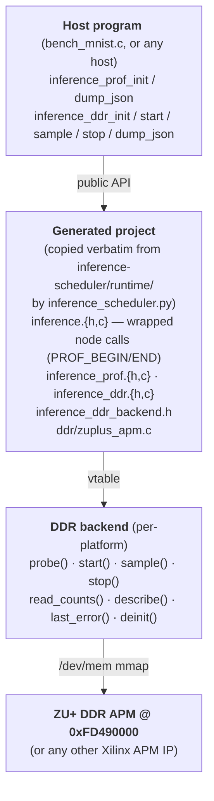

# Profiler — Technical Reference

The profiler is a small C runtime, copied into every project produced by
`inference-scheduler`, that collects two complementary measurements while
the inference loop runs on the KV260:

- **Per-layer wall-clock timing** — count, total, mean, min, max for each
  scheduled ONNX node (`inference_prof`).
- **Whole-run DDR bandwidth** — read and write byte totals from a Xilinx
  AXI Performance Monitor on the Zynq UltraScale+ DDR controller path
  (`inference_ddr`).

It is **opt-in at compile time** via a single CMake option and degrades
to zero-cost no-ops when off.  The two modules can be linked
independently into any host application that uses the generated
`inference` library — they are not specific to the MNIST demo.

> Companion docs:
> [`INFERENCE_SCHEDULER.md`](INFERENCE_SCHEDULER.md) (codegen),
> [`REMOTE_TESTING.md`](REMOTE_TESTING.md) (correctness/perf harnesses).

---

## Architecture



Three pieces:

1. **`inference_prof`** — flat-API per-layer aggregator (`init/reset/begin/end/dump_json/deinit`).  Codegen wraps every kernel-backed node call with `INFERENCE_PROF_BEGIN(idx)` / `INFERENCE_PROF_END(idx)`.  Counters are aggregate-only (count / total_ns / min_ns / max_ns) — no sample reservoir, ~32 B per layer.
2. **`inference_ddr`** — dispatcher that walks a vtable registry of platform backends (`probe → start → sample* → stop → read_counts → dump_json`).  The first backend whose `probe()` succeeds wins; one env var skips probing.
3. **Codegen integration** — emits a `static const char *const inference_layer_names[N]` table next to the kernel-driver instances, plus `inference_num_layers()` / `inference_layer_names_ptr()` accessors.  Layer names use `onnx_node.name` when present, falling back to `op_type_index`; collisions are resolved by suffixing every collider with `_index`.

---

## Build integration

Profiling is gated on a single CMake option emitted by `_cmake.py` into
every generated project:

```cmake
option(INFERENCE_PROFILING "Compile in per-layer wall-clock profiling …" OFF)

if(INFERENCE_PROFILING)
    file(GLOB _INFERENCE_DDR_BACKENDS CONFIGURE_DEPENDS
         "${CMAKE_CURRENT_SOURCE_DIR}/src/ddr/*.c")
    target_sources(inference PRIVATE
        src/inference_prof.c
        src/inference_ddr.c
        ${_INFERENCE_DDR_BACKENDS})
    target_compile_definitions(inference PUBLIC INFERENCE_PROFILING=1)
endif()
```

When OFF (the default), `INFERENCE_PROFILING` is undefined, the profiler
.c files are not compiled, and the `INFERENCE_PROF_BEGIN/END` macros
expand to `((void)0)` — zero call-site cost.

The compile definition is **PUBLIC** so consumers that link the
`inference` library (e.g. `bench_mnist`) inherit `-DINFERENCE_PROFILING=1`
and can gate their own `#if INFERENCE_PROFILING` blocks.

To enable from the command line:

```bash
cmake -S . -B build -DINFERENCE_TARGET=LINUX -DINFERENCE_PROFILING=ON
```

---

## Public API

All declarations live in `include/inference_prof.h` and
`include/inference_ddr.h` in the generated project.

### Per-layer profiler

```c
int  inference_prof_init(unsigned n_layers, const char *const *names);
void inference_prof_reset(void);
void inference_prof_begin(unsigned layer_idx);
void inference_prof_end  (unsigned layer_idx);
void inference_prof_dump_json(FILE *f);
void inference_prof_deinit(void);

#define INFERENCE_PROF_BEGIN(i)  inference_prof_begin((i))   /* if profiling */
#define INFERENCE_PROF_END(i)    inference_prof_end((i))     /* else no-ops */
```

The `names` array is **borrowed**, not copied — must outlive the
profiler.  In the generated project, the codegen-emitted
`inference_layer_names[]` array is `static const`, so passing
`inference_layer_names_ptr()` always satisfies that contract.

`begin/end` pairs are **strictly nested** — no overlap, no thread safety.
Defensive guards inside `end()` discard stray calls whose `layer_idx`
doesn't match the most recent `begin()`.

Codegen emits the `_BEGIN/_END` wrap automatically; host code never
calls them directly.

### DDR bandwidth

```c
int  inference_ddr_init(void);
void inference_ddr_start(void);
void inference_ddr_sample(void);   /* call once per inference; safe no-op if not needed */
void inference_ddr_stop(void);
void inference_ddr_dump_json(FILE *f);
void inference_ddr_deinit(void);
```

`init()` walks the backend registry, prints exactly one stderr warning
on failure, and returns non-zero.  Subsequent calls become no-ops, and
`dump_json()` emits `{"available":false,"reason":"…"}` so the host
records the diagnostic.

`sample()` exists to fold 32-bit hardware counter deltas into 64-bit
software accumulators before the hardware wraps.  Calling it once per
inference (≈21 ms for MNIST convnet) is sufficient for any reasonable
DDR bandwidth.  Backends with native 64-bit counters expose a no-op
`sample()` and can be ignored.

### Codegen accessors

```c
unsigned             inference_num_layers(void);
const char *const   *inference_layer_names_ptr(void);
#define INFERENCE_NUM_LAYERS  N    /* baked into inference.h */
```

Always emitted, even when profiling is disabled — host code that wants
to know the layer count for other reasons can use them unconditionally.

---

## Backend system

### Vtable

`runtime/inference_ddr_backend.h` (internal — copied into the generated
project's `src/`, not `include/`):

```c
typedef struct ddr_backend {
    const char *name;                /* matches INFERENCE_DDR_BACKEND when forced */
    int   (*probe)(void);            /* 0 = available */
    int   (*start)(void);
    int   (*sample)(void);           /* may be NULL */
    int   (*stop)(void);
    int   (*read_counts)(uint64_t *r_bytes, uint64_t *w_bytes);
    void  (*describe)(FILE *f);      /* appends backend-specific JSON fields */
    const char *(*last_error)(void); /* used on probe failure */
    void  (*deinit)(void);
} ddr_backend_t;
```

### Selection policy

1. `INFERENCE_DDR_BACKEND=<name>` forces a specific backend.
2. `INFERENCE_DDR_BACKEND=disabled` skips probing entirely with no warning.
3. Otherwise: the dispatcher walks `BACKENDS[]` in `inference_ddr.c` in
   declaration order and uses the first backend whose `probe()` returns 0.

### Adding a backend

1. Drop `runtime/ddr/<name>.c` exporting `const ddr_backend_t inference_ddr_backend_<name>` with all eight function pointers populated.
2. Add `extern const … inference_ddr_backend_<name>;` plus a registry entry to `BACKENDS[]` in `runtime/inference_ddr.c`.
3. Add the file to `runtime_files` in `inference_scheduler.py` so it gets copied into the generated project.

The CMake glob in `_cmake.py` picks up any new `src/ddr/*.c` automatically; no other edits needed.

---

## ZU+ APM backend (`zuplus_apm`)

The current backend uses one of the four built-in AXI Performance
Monitors in Zynq UltraScale+ MPSoC, accessed via `/dev/mem` mmap because
the KV260 cormorant overlay does not expose the APMs as UIO devices.

### APM blocks on ZU+

| Base addr     | Block      | Watches                       | Slots |
|---------------|------------|-------------------------------|-------|
| `0xFD0B0000`  | FPD APM    | FPD inner switch              | 8     |
| `0xFD490000`  | DDR APM    | DDRC AXI slave ports          | 6 ★   |
| `0xFFA00000`  | LPD APM    | LPD interconnect              | 8     |
| `0xFFA10000`  | OCM APM    | OCM interconnect              | varies |

★ default — sits on the FPGA→DDR path regardless of CCI state.

### Register layout (Xilinx PG037)

| Offset | Register             | Purpose                                |
|--------|----------------------|----------------------------------------|
| `0x000` / `0x004` | GCC_HIGH / GCC_LOW | 64-bit Global Clock Counter          |
| `0x044` | MSR0                 | Metric selectors for counters 0–3 (32 bits) |
| `0x048` | MSR1                 | Metric selectors for counters 4–7 (32 bits) |
| `0x04C` | MSR2                 | Metric selectors for counters 8–9 ([15:0] only) |
| `0x100..0x190` | MC0..MC9       | 32-bit Metric Counters (0x10 stride) |
| `0x300` | CTL                  | Bit 0 = MCNTR_ENABLE; bit 1 = MCNTR_RESET |

Each metric selector slot holds a 13-bit field — 5-bit metric in bits
[4:0], 3-bit slot in [7:5].  Four entries per 32-bit register.

### Programming sequence

```c
for (i = 0; i < n_slots; i++) {
    set_metric(slot[i], XAPM_METRIC_READ_BYTE_COUNT,  2*i);
    set_metric(slot[i], XAPM_METRIC_WRITE_BYTE_COUNT, 2*i + 1);
}
ctl = readreg(CTL);
writereg(CTL, ctl |  MCNTR_RESET);
writereg(CTL, ctl & ~MCNTR_RESET);
writereg(CTL, ctl |  MCNTR_ENABLE);
/* … run inference, calling sample() periodically … */
writereg(CTL, ctl & ~MCNTR_ENABLE);
```

### Slot capacity

The DDR APM has 6 slots (one per DDRC AXI port) but only 10 metric
counters.  With 2 metrics per slot (read + write byte count), **at most
5 slots can be monitored simultaneously**.  Requesting more triggers a
stderr warning at probe time listing the dropped slots.

### Probe self-test

`probe()` performs a writeback test on MSR0 (always full 32-bit on any
APM with ≥4 counters per PG037) immediately after `mmap`.  A failed
writeback indicates a clock-gated or absent block — the dispatcher
records the diagnostic and falls through to the next backend.  False
positives are unlikely: MSR1/MSR2 may have reserved upper bits when the
APM is synthesized with fewer counters, but MSR0 is fully implemented.

### Run-time configuration

| Env var                    | Default       | Description                       |
|----------------------------|---------------|-----------------------------------|
| `INFERENCE_DDR_APM_BASE`   | `0xFD490000`  | Physical base of the APM block    |
| `INFERENCE_DDR_APM_SLOTS`  | `0`           | Comma-separated slot list (≤5)    |
| `INFERENCE_DDR_BACKEND`    | (auto)        | `zuplus_apm` or `disabled`        |

Hardware reads narrow 32-bit byte counters.  `inference_ddr_sample()`
must be called often enough that the per-slot delta never exceeds 4 GiB
between calls — once per inference is more than enough on KV260.

---

## Output format

Both modules append a single JSON line to stdout, prefixed with a known
marker so host parsers can pick them out of mixed output.

### `LAYERS_JSON`

```
LAYERS_JSON: {"layers":[
  {"i":0,"name":"Convolution28","calls":10000,
   "mean_us":6071.75,"min_us":6069.16,"max_us":6156.23,
   "total_us":60717500.00},
  …
]}
```

| Field         | Type       | Notes                                      |
|---------------|------------|--------------------------------------------|
| `i`           | unsigned   | Layer index, identical to `sn.index`       |
| `name`        | string     | From `_layer_display_names()` (codegen)    |
| `calls`       | uint64     | Number of `begin/end` pairs recorded       |
| `mean_us`     | double     | `total_us / calls`, 0 if `calls == 0`      |
| `min_us`      | double     | First sample correctly drops `UINT64_MAX`  |
| `max_us`      | double     |                                            |
| `total_us`    | double     |                                            |

### `DDR_JSON`

Available case (zuplus_apm):

```
DDR_JSON: {
  "available": true,
  "backend":   "zuplus_apm",
  "read_bytes":  14831289856,
  "write_bytes": 17301504,
  "duration_ns": 213000000000,
  "read_gbs":    0.0696,
  "write_gbs":   0.0001,
  "base_addr":   "0xfd490000",
  "ctl_writeback": "0x00000001",
  "slots": [
    {"slot": 0, "read_bytes": 14831289856, "write_bytes": 17301504,
     "mc_read_at_stop": 1234567, "mc_write_at_stop": 4321},
    {"slot": 1, "read_bytes": 0, "write_bytes": 0,
     "mc_read_at_stop": 0, "mc_write_at_stop": 0},
    …
  ]
}
```

Unavailable case:

```
DDR_JSON: {"available":false,"reason":"backend 'zuplus_apm' probe failed: …"}
```

| Field             | Type    | Notes                                          |
|-------------------|---------|------------------------------------------------|
| `available`       | bool    | `false` ⇒ everything below is omitted          |
| `backend`         | string  | Active backend name                            |
| `read_bytes`      | uint64  | Sum across all watched slots                   |
| `write_bytes`     | uint64  | Sum across all watched slots                   |
| `duration_ns`     | uint64  | Wall-clock between `start()` and `stop()`      |
| `read_gbs`        | double  | `read_bytes / duration_ns × 1e9`               |
| `write_gbs`       | double  | `write_bytes / duration_ns × 1e9`              |
| `slots[]`         | array   | Per-slot breakdown (zuplus_apm-specific)       |
| `slots[].slot`    | unsigned| DDRC port index                                |
| `slots[].mc_read_at_stop` / `mc_write_at_stop` | uint32 | Raw 32-bit counter snapshot |

The `ctl_writeback` field is the value of the APM `CTL` register read
back immediately after `MCNTR_ENABLE` was set.  A value of `0x00000000`
when the user requested ENABLE indicates a partially live block (e.g.
clocks gated on the controller side but the AXI register interface
still answers reads).

---

## Demo integration (MNIST)

```
demo/mnist/
├── mnist_config.json         run.profile_layers + run.env
├── run_demo.py               --profile-layers flag (forwards to deploy)
├── scripts/deploy_and_run.py prepends `env K=V` to bench command;
│                              parses LAYERS_JSON / DDR_JSON into
│                              build/results.json
└── src/bench_mnist.c         #if INFERENCE_PROFILING blocks for
                               init / sample-per-iter / stop / dump
```

### Enabling

```jsonc
"run": {
    "iters":          0,
    "warmup":         50,
    "profile_layers": true,
    "env": {
        "INFERENCE_DDR_APM_SLOTS": "0,1,2,3,4"
    }
}
```

`profile_layers: true` adds `-DINFERENCE_PROFILING=ON` to the remote
cmake invocation.  `run.env` is forwarded as
`env KEY1=VAL1 KEY2=VAL2 ./bench_mnist …` after sudo, so values reach
the binary's environment regardless of sudoers `env_keep` config.

### Or via CLI

```bash
python3 run_demo.py --profile-layers
```

Forwards to `deploy_and_run.py --profile-layers`, which in turn
overrides `cfg.run.profile_layers` to true for that run.

### Reporting

Per-model summary printed to stderr:

```
accuracy = 98.92%   mean = 21.290 ms   throughput = 47.0 img/s
per-layer (top 5 by mean):
  [  3] Convolution110            calls=10000  mean= 14037.12us  …
  …
ddr (zuplus_apm @0xfd490000): total read=0.07 GB/s (13.81 GiB)  …
  per-slot:
    slot 0: read=0.07 GB/s (13.81 GiB)  write=0.00 GB/s (15.9 MiB)
    slot 1: idle
    …
```

Full per-layer and per-slot data is also written to
`build/results.json` under `metrics.layer_stats` and `metrics.ddr_stats`
for downstream analysis.

---

## Layer name resolution

`CodeGenerator._layer_display_names()` (in `inference-scheduler/src/codegen/_core.py`) produces one stable name per scheduled node:

1. Use `onnx_node.name` when non-empty.
2. Fall back to `f"{op_type}_{index}"` when empty.
3. After both passes, find duplicates; suffix every collider with `_<index>`.

Empty input + collision examples:

| ONNX names         | Output                |
|--------------------|-----------------------|
| `["alpha","beta"]` | `["alpha","beta"]`    |
| `["",""]`          | `["Relu_0","Relu_1"]` |
| `["dup","dup"]`    | `["dup_0","dup_1"]`   |
| `["","tail"]`      | `["Relu_0","tail"]`   |

The result feeds the static `inference_layer_names[]` array; the C side
escapes the strings on emit (handles `"`, `\`, `\n`, `\r`, `\t`, control
chars via `\uXXXX`).

---

## Troubleshooting

### `DDR_JSON: {"available":false,"reason":"open(/dev/mem) failed: Permission denied …"}`

`bench_mnist` not running as root.  Either `sudo`-launch (the demo's
`deploy_and_run.py` already does this when `run.use_sudo: true`) or grant
`CAP_SYS_RAWIO` to the binary.

### `register writeback test failed at 0x… (MSR0 wrote 0xa5a5a5a5, read 0x…)`

The selected APM block is clock- or power-gated, OR the address is not
an APM at all.  On a stock KV260 image the four built-in APMs at
`0xFD0B0000`, `0xFD490000`, `0xFFA00000`, `0xFFA10000` should all be
live.  Confirm the address from
`/proc/device-tree/axi/perf-monitor@*/reg`.

### Counters all zero, but writeback test passed

The APM is alive, but the watched slot(s) don't carry FPGA traffic.
Iterate slots — DDR APM has 6 of them, mapped one-per-DDRC-port:

```bash
for s in 0 1 2 3 4 5; do
  printf "=== slot=%d ===\n" $s
  sudo INFERENCE_DDR_APM_SLOTS=$s ./bench_mnist 200 50 2>&1 | grep DDR_JSON
done
```

The slot with non-zero `mc_read_at_stop`/`mc_write_at_stop` is your FPGA
master's DDRC port.

### `inference_ddr: warning — APM has 10 metric counters; …  Dropping slot(s): 5.`

You requested more than 5 slots in `INFERENCE_DDR_APM_SLOTS`.  Run
again with a 5-slot subset to cover the remaining one — the hardware
counter budget is fixed.

### Layer call count off by one from `iters`

Until 2026-05-06 the bench loop reset profiler counters at the warmup
boundary, which discarded one call per layer.  Now `inference_prof`
counts every kernel invocation and `calls == iters` for every layer.
If you see `calls == iters - 1`, you're on an old bench_mnist.c.

---

## Implementation notes

### Counter overflow

Xilinx APM metric counters are 32 bits, byte-counted.  At ZU+ DDR
bandwidth (~4–8 GB/s), the counter wraps every ~0.5–1 second.
`inference_ddr_sample()` reads each counter, computes the unsigned
32-bit delta against the previous sample, and adds it to a 64-bit
accumulator.  Calling sample() once per inference (≈21 ms for MNIST) is
two orders of magnitude faster than wrap.

### Aggregate-only profiling

`inference_prof` keeps `count + total_ns + min_ns + max_ns` per layer —
≈32 bytes per layer plus a borrowed name pointer.  No sample reservoir
means no percentiles, but RAM cost is constant regardless of run length.
Mean is computed from `total_ns / calls` at dump time.

### Layer-call window

`inference_prof` counters cover **every** kernel call, warmup included
(`calls == iters`).  Latency stats in `bench_mnist` (`mean_ms` /
`p50_ms` / `p99_ms`) still drop the warmup window so they reflect
steady-state behaviour.  The asymmetry is intentional — see comments in
`bench_mnist.c`.

### DDR window

`inference_ddr` counters cover the entire bench loop (warmup included)
to stay aligned with `inference_prof`.  The duration field reflects the
full window so per-second rates are correct.  Bandwidth measured this
way includes any cold-start cache misses; for steady-state-only
measurement, move `inference_ddr_start/stop` to bracket the timed
window only.

---

## File map

```
inference-scheduler/runtime/
├── inference_prof.h          public API — per-layer profiler
├── inference_prof.c          aggregator implementation
├── inference_ddr.h           public API — DDR backend dispatcher
├── inference_ddr.c           dispatcher (registry walk, JSON, clock)
├── inference_ddr_backend.h   internal vtable definition
├── ddr/
│   └── zuplus_apm.c          ZU+ AXI Performance Monitor backend
└── test/
    ├── test_inference_prof.c   per-layer unit-test driver (8 scenarios)
    └── test_inference_ddr.c    DDR failure-path unit-test driver (6 scenarios)

inference-scheduler/test/
├── test_profiling.py        codegen wrap + name-resolution tests (12)
├── test_runtime_prof.py     per-layer unit tests via subprocess  (8)
└── test_runtime_ddr.py      DDR failure-path unit tests          (6)

inference-scheduler/src/codegen/
├── _core.py                 _layer_display_names() lives here
├── _header.py               INFERENCE_NUM_LAYERS + accessors decls
├── _source.py               static names table + PROF_BEGIN/END wrap
└── _cmake.py                INFERENCE_PROFILING option + glob

demo/mnist/
├── src/bench_mnist.c        host integration
├── scripts/deploy_and_run.py LAYERS_JSON/DDR_JSON parsing + reporting
├── mnist_config.json.example run.env documentation
└── run_demo.py              --profile-layers flag
```

---

## Adding a new platform — worked example

To add a Versal NoC DDRMC backend (vaitrace-style):

1. **`runtime/ddr/versal_ddrmc.c`** — implement the eight vtable
   functions.  Probe by checking for the NoC NMU device tree node;
   `start/sample/stop` poke the NSU registers per
   `vaitraceTools/mem_perf/noc/ddrmc/noc_ddrmc.cpp` (the vaitrace
   reference implementation).
2. **`runtime/inference_ddr.c`** — add
   `extern const ddr_backend_t inference_ddr_backend_versal_ddrmc;` and
   place it in `BACKENDS[]` in priority order (most-specific first).
3. **`inference-scheduler/inference_scheduler.py`** — add
   `("ddr/versal_ddrmc.c", "src/ddr/versal_ddrmc.c")` to
   `runtime_files`.
4. **Tests** — extend `runtime/test/test_inference_ddr.c` with a
   `versal_ddrmc_disabled_via_env` scenario; the existing failure-path
   tests already cover the dispatcher.

The CMake glob picks the new file up automatically; no other edits.
