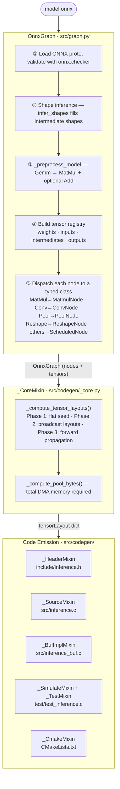
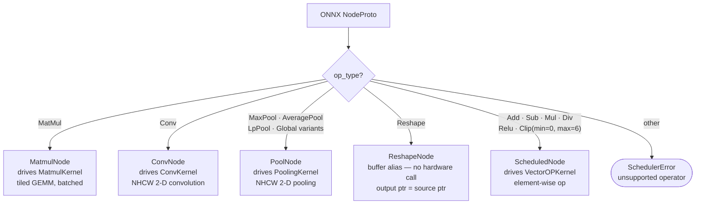
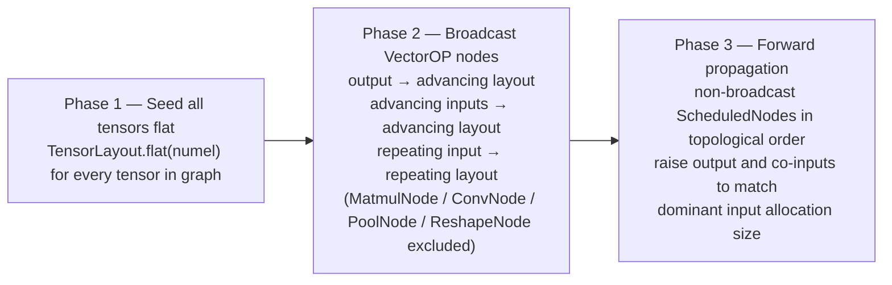
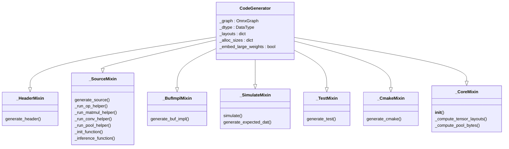
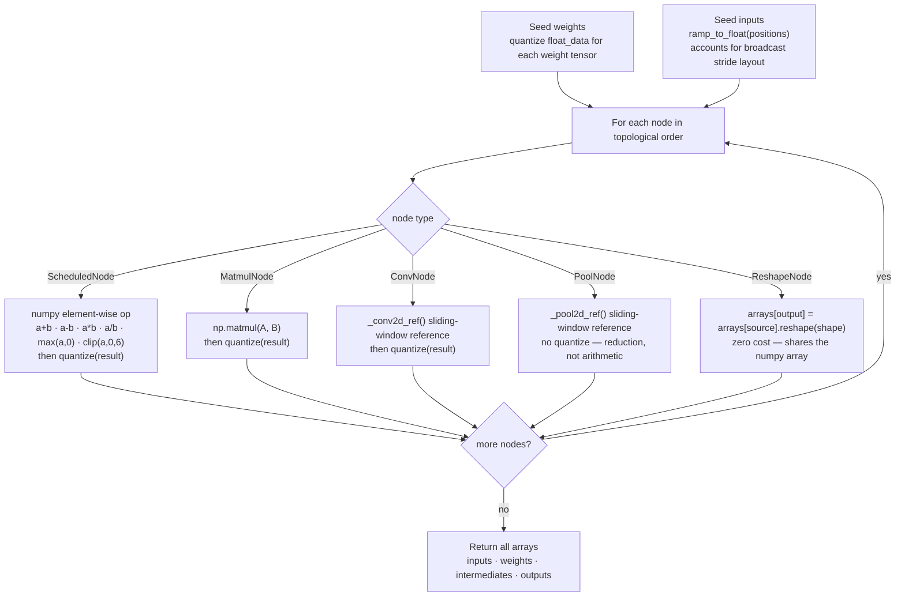
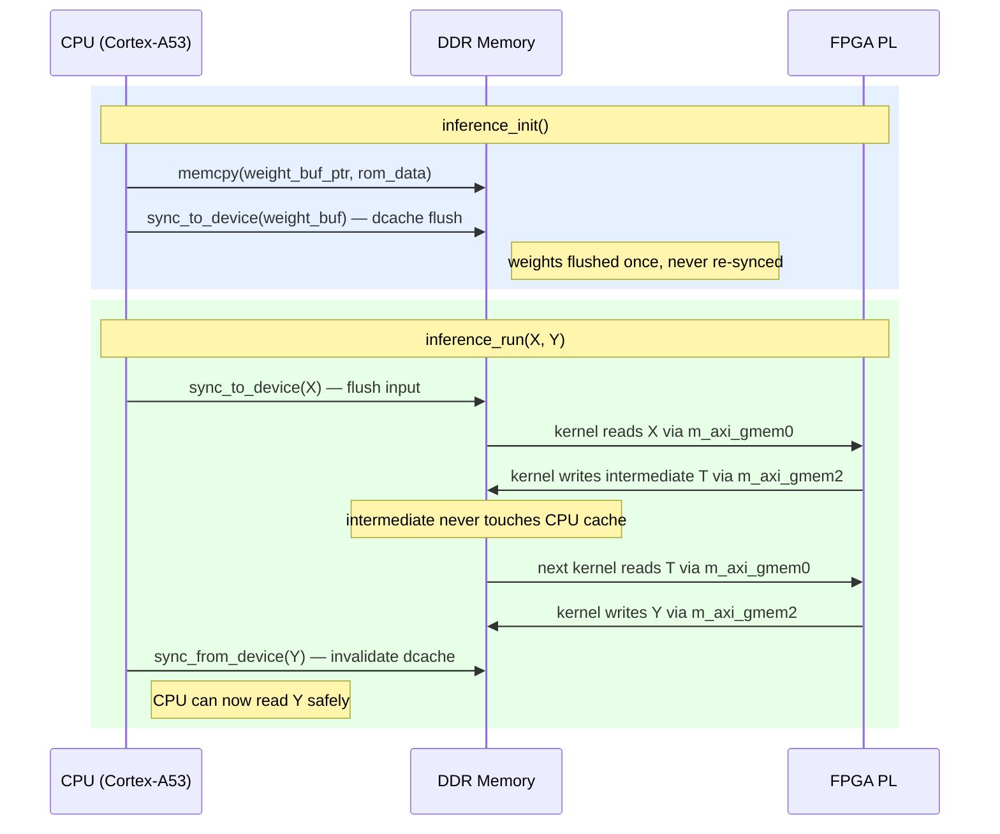

# Inference Scheduler — Internal Architecture

This document describes how the scheduler works internally: how it processes the
ONNX graph, how it reasons about shapes and broadcasting, how it generates C code,
and how to extend it.

---

## Table of Contents

1. [High-Level Pipeline](#1-high-level-pipeline)
2. [Source Layout](#2-source-layout)
3. [Step 1 — ONNX Graph Parsing (OnnxGraph)](#3-step-1--onnx-graph-parsing-onnxgraph)
4. [Step 2 — Tensor Classification (TensorInfo)](#4-step-2--tensor-classification-tensorinfo)
5. [Step 3 — Op Mapping (ScheduledNode)](#5-step-3--op-mapping-schedulednode)
6. [Broadcasting Algorithm](#6-broadcasting-algorithm)
7. [Step 4 — Allocation Sizing and TensorLayout (_CoreMixin)](#7-step-4--allocation-sizing-and-tensorlayout-_coremixin)
8. [Step 5 — Code Generation (CodeGenerator)](#8-step-5--code-generation-codegenerator)
9. [DataType Abstraction](#9-datatype-abstraction)
10. [Fixed-Point Simulation (_SimulateMixin)](#10-fixed-point-simulation-_simulatemixin)
11. [Cache Coherency Model](#11-cache-coherency-model)
12. [Extending the System](#12-extending-the-system)

---

## 1. High-Level Pipeline



The pipeline has three stages:

1. **OnnxGraph** parses the model file into a typed Python representation. It
   validates the structure, runs ONNX shape inference to fill in intermediate
   tensor shapes, rewrites `Gemm` nodes into `MatMul + Add`, and dispatches
   each graph node to the appropriate typed class (`ScheduledNode`,
   `MatmulNode`, `ConvNode`, `PoolNode`, or `ReshapeNode`).

2. **_CoreMixin** computes a `TensorLayout` for every tensor in the graph.
   Layouts capture how much DMA memory each tensor actually needs — they may
   be larger than the logical element count when broadcasting alignment gaps
   are required. It also totals the pool size needed for a single contiguous
   DMA allocation.

3. **Code Emission** mixins walk the graph and layouts to produce all output
   files: the public C header, the inference source, the platform-specific
   buffer implementation, the on-device test harness, and the CMakeLists.txt.
   Each mixin is independent; all share state through `self` (see
   [Section 8](#8-step-5--code-generation-codegenerator)).

---

## 2. Source Layout

```
inference_scheduler.py   CLI entry point (argparse + file I/O)
src/
  dtype.py               DataType ABC + ApFixed, Float32 implementations
  layout.py              TensorLayout frozen dataclass — DMA buffer geometry (numel, alloc, n_chunks, chunk, stride)
  tensor.py              TensorInfo dataclass — metadata + C code emitters
  nodes.py               Node classes — op mapping, validation, C call emitters:
                           ScheduledNode (VectorOPKernel: Add/Sub/Mul/Div/Relu/Clip)
                           MatmulNode    (MatmulKernel: MatMul)
                           ConvNode      (ConvKernel: Conv)
                           PoolNode      (PoolingKernel: MaxPool/AveragePool/LpPool/Global*)
                           ReshapeNode   (buffer alias — no hardware call)
  graph.py               OnnxGraph — ONNX loading, shape inference, Gemm preprocessing, node dispatch
  codegen/
    __init__.py          CodeGenerator class (assembles all mixins via MRO)
    _core.py             _CoreMixin: __init__, tensor layouts, pool size, helpers
    _header.py           _HeaderMixin: generate_header()
    _source.py           _SourceMixin: generate_source()
    _buf_impl.py         _BufImplMixin: generate_buf_impl(), generate_setup_script()
    _simulate.py         _SimulateMixin: fixed-point simulation, expected GT arrays
    _test.py             _TestMixin: generate_test()
    _cmake.py            _CmakeMixin: generate_cmake()
    _banners.py          _banner(), _file_banner() — section header helpers
```

---

## 3. Step 1 — ONNX Graph Parsing (OnnxGraph)

`OnnxGraph` in `src/graph.py` wraps the ONNX protobuf loading and produces a
clean, typed view of the computation graph.

### Loading and Shape Inference

```python
model = onnx.load(model_path)
onnx.checker.check_model(model)              # validate structural correctness
model = shape_inference.infer_shapes(model)  # fill in intermediate shapes
model = OnnxGraph._preprocess_model(model)   # decompose Gemm → MatMul + Add
```

The shape inference step is critical. Without it, intermediate tensors (the
outputs of each ONNX node that feed into the next) have no shape information.
After `infer_shapes`, every tensor's shape is available in `model.graph.value_info`.

### Gemm Preprocessing (`_preprocess_model`)

Before the tensor registry is built, `_preprocess_model()` rewrites every
`Gemm` node into equivalent lower-level ops that the scheduler already handles:

- `Gemm(A, B, C)` → `MatMul(A, B) → tmp` + `Add(tmp, C) → Y`
- `Gemm(A, B)` (no bias) → `MatMul(A, B) → Y`

Supported constraints: `alpha=1`, `beta=1`, `transA=0`, `transB=0`. Any
deviation raises `SchedulerError`. The new intermediate tensor `tmp` (for the
bias case) is inserted into `graph.value_info` so the subsequent tensor registry
pass can assign it a proper shape.

This design keeps `MatmulNode` and `ScheduledNode` unaware of `Gemm` — the
decomposition is purely a graph-rewriting pass.

### Tensor Registry

The scheduler builds a flat dictionary `{name → TensorInfo}` covering all four
categories of tensor in the ONNX graph:

| Category | Source in ONNX proto | Role |
|----------|---------------------|------|
| **Weights** | `graph.initializer` | Constant values (model parameters); have `data != None` |
| **Inputs** | `graph.input` minus initializers | Caller-supplied at runtime; have `data == None` |
| **Intermediates** | `graph.value_info` | Produced by one node, consumed by the next; scratch buffers |
| **Outputs** | `graph.output` | Final results written to caller-supplied buffers |

> **Why "minus initializers"?** Older ONNX opsets sometimes list constant weights
> in both `graph.input` and `graph.initializer`. The scheduler skips duplicates:
> any name already in the initializer set is not treated as a true graph input.

---

## 4. Step 2 — Tensor Classification (TensorInfo)

`TensorInfo` in `src/tensor.py` is a simple dataclass:

```python
@dataclass
class TensorInfo:
    onnx_name: str          # original ONNX tensor name
    shape:     List[int]    # e.g. [1, 64, 32, 32]
    dtype:     str          # ONNX dtype string, e.g. 'float32'
    data:      np.ndarray   # None for non-constant tensors
```

Key derived properties:

- **`numel`**: total number of elements (`product(shape)`)
- **`c_name`**: C identifier derived from `onnx_name` — non-alphanumeric characters
  are replaced with underscores, leading digits get a `t_` prefix
- **`is_weight`**: `data is not None`
- **`is_large_weight`**: `is_weight and numel > LARGE_WEIGHT_THRESHOLD (4096)`

### Code Emission Methods

`TensorInfo` knows how to produce the C declarations for its data:

| Method | When used | Output |
|--------|-----------|--------|
| `emit_weight_decl(dtype)` | Small weight tensor | `static const uint16_t _rom_bias[N] = {...};` + DMA pointer |
| `emit_weight_decl_strided(outer, stride, dtype)` | Weight used alongside a strided buffer | Same but with alignment padding between blocks |
| `emit_large_weight_ptr_decl()` | Large weight tensor | Just the DMA pointer; data loaded from `.dat` at runtime |
| `emit_buffer_decl()` | Intermediate tensor | `static inference_buf_t *name = NULL;` |

---

## 5. Step 3 — Op Mapping (ScheduledNode)

`ScheduledNode` in `src/nodes.py` wraps one ONNX `NodeProto` and converts it
to one or more VectorOPKernel invocations.

### Op Mapping Table

`ScheduledNode` handles only the six element-wise ops that map directly to
VectorOPKernel opcodes. The table binds each ONNX operator name to a hardware
opcode integer and an arity:

```python
_ONNX_OP_MAP = {
    "Add":  (OP_ADD,   arity=2),
    "Sub":  (OP_SUB,   arity=2),
    "Mul":  (OP_MUL,   arity=2),
    "Div":  (OP_DIV,   arity=2),
    "Relu": (OP_RELU,  arity=1),
    "Clip": (OP_RELU6, arity=1),   # validated for (min=0, max=6)
}
```

`arity=2` means the kernel reads two input arrays (`gmem0` and `gmem1`).
`arity=1` means the kernel reads only one input (`gmem0`); `gmem1` is left
unprogrammed and no AXI transaction is issued on that port. All other ONNX ops
(`MatMul`, `Conv`, pooling variants, `Reshape`) are handled by dedicated node
classes and never reach `_ONNX_OP_MAP`.

### Node Dispatch



Dispatch happens in `OnnxGraph.__init__()` as it iterates over the nodes in the
ONNX graph in topological order. Each node's `op_type` string selects one of
five paths:

- **MatmulNode** — wraps a single `MatMul` node. Handles batched matmul and
  tiles large matrices across multiple kernel calls.
- **ConvNode** — wraps a single `Conv` node, including optional fused bias.
  Only `groups=1` 2-D NCHW convolution is supported.
- **PoolNode** — wraps `MaxPool`, `AveragePool`, `LpPool`, and their `Global*`
  variants. The pooling type is encoded as an integer opcode in the kernel's
  AXI-Lite register.
- **ReshapeNode** — produces no hardware call at all. It records an alias
  (`output_ptr = source_ptr`) that is emitted during `inference_init()`.
- **ScheduledNode** — used for all six element-wise VectorOPKernel ops listed
  in the Op Mapping Table above.

Any `op_type` not in this set raises a `SchedulerError` immediately, so models
containing unsupported ops are rejected at parse time rather than producing
silently incorrect code.

### Clip Validation

The ONNX `Clip` operator has configurable `min` and `max` bounds. The hardware
only implements `RELU6 = clip(x, 0, 6)`. The scheduler validates the bounds:

- **ONNX opset < 11**: bounds stored as attributes `min` and `max`
- **ONNX opset ≥ 11**: bounds stored as constant input tensors at indices 1 and 2

If either `min ≠ 0` or `max ≠ 6`, a `SchedulerError` is raised.

### ScheduledNode Fields

```python
@dataclass
class ScheduledNode:
    onnx_node:          onnx.NodeProto
    op_code:            int            # OP_ADD … OP_RELU6
    arity:              int            # 1 = unary, 2 = binary
    inputs:             List[TensorInfo]
    output:             TensorInfo
    index:              int            # sequential position in graph
    align_elems:        int            # ALIGN_BYTES / bytes_per_elem

    # Set by validate():
    outer_count:        int   # > 1 = broadcasting; loop iteration count
    chunk_size:         int   # data elements per kernel call
    aligned_chunk_size: int   # chunk_size rounded up to align_elems
    a_advances:         bool  # True if input A strides through the output
    b_advances:         bool  # True if input B strides through the output
```

### Code Emission

`emit_call()` produces the C kernel invocation:

**Non-broadcast case** (`outer_count == 1`):
```c
    run_op(X, bias, Y, 256u, VECTOROP_ADD);
```

**Broadcast case** (`outer_count > 1`):
```c
    for (unsigned _i = 0u; _i < 4u; _i++) {
        run_op_at(X, _i * INFERENCE_Y_CHUNK_STRIDE,
                  bias, 0u,
                  Y,  _i * INFERENCE_Y_CHUNK_STRIDE,
                  INFERENCE_Y_CHUNK, VECTOROP_ADD);
    }
```

Here `bias` does not advance (`b_advances = False`) — it repeats at offset 0
every iteration (a single-row bias added to each of 4 output rows). `X` and `Y`
both advance — they each hold 4 chunks strided by `CHUNK_STRIDE`.

### MatmulNode

MatMul operations are handled by a separate `MatmulNode` class (also in
`src/nodes.py`) that drives the `MatmulKernel` IP. Key fields: `n`, `k`, `m`
(matrix dimensions), `outer_count`, `b_batch_stride`. `emit_call(layouts)`
checks `TensorLayout.gap` on A and Y to choose between:

- Natural form: `run_matmul(a, b, c, n, k, m, batch, a_stride, b_stride, c_stride)`
- Row-strided form: when A or Y has alignment gaps — decomposes into `batch=N, n=1` to walk each row independently

### ConvNode

`ConvNode` drives `ConvKernel` for 2-D NCHW convolution. Key fields: `batch`,
`in_channels`, `out_channels`, `in_h/w`, `out_h/w`, `kernel_h/w`,
`stride_h/w`, `pad_top/left`, `dil_h/w`, `has_bias`. `emit_call()` emits a
`run_conv(x, w, bias_or_null, y, ...)` call with 17+ register-level parameters.
`has_bias` is determined at `from_onnx_node()` time: a Conv node with three
inputs has a bias tensor fused into the same kernel dispatch.

ConvNode is excluded from Phase 2/3 layout propagation — it writes a flat
NCHW output buffer with `n_chunks = 1`.

### PoolNode

`PoolNode` drives `PoolingKernel` for 2-D NCHW pooling. Supported ONNX op
types: `MaxPool`, `AveragePool`, `LpPool` (p=1 or 2), and the `Global*`
variants. Key fields: `pool_type` (0=MAX, 1=AVG, 2=LP), `lp_order`,
`count_include_pad`, full spatial geometry (same fields as ConvNode).
`emit_call()` emits a `run_pool(x, y, ...)` call with 19 register-level
parameters.

PoolNode is excluded from Phase 2/3 layout propagation — it writes a flat
NCHW output buffer with `n_chunks = 1`.

### ReshapeNode

`ReshapeNode` is a zero-cost buffer alias. It has no `kernel_name` (empty
string, not in `KERNEL_REGISTRY`), and `emit_call()` returns an empty string
— no hardware call is emitted.

Key mechanics:
- `from_onnx_node()` validates that source and output `numel` match.
- The compatibility shims (`outer_count=1`, `chunk_size=0`, `arity=1`) allow
  ReshapeNode to coexist with code paths that iterate over all node types.
- In `inference_init()`, reshape output buffers that are intermediate tensors
  (not graph inputs/outputs) are pointer-assigned from the source buffer:
  `Z = X;  /* reshape alias */`
- In `inference_deinit()`, they are NULLed without `inference_buf_free()`:
  `Z = NULL;  /* reshape alias — not owned */`
- `_reshape_aliases` in `_CoreMixin` maps `{output_onnx_name → source_c_name}`
  for use by `_SourceMixin` during init/deinit code generation.

---

## 6. Broadcasting Algorithm

This is the most algorithmically complex part of the scheduler.

### When Does Broadcasting Apply?

A binary ONNX op (Add, Sub, Mul, Div) broadcasts when one input has fewer
elements than the output. The canonical example is adding a per-channel bias
to a batch of feature maps:

```
X shape:    [4, 32, 64]   → 8192 elements (batch of 4, 32 rows, 64 cols)
bias shape: [1, 1, 64]    →   64 elements (one 64-element row, repeated)
Y shape:    [4, 32, 64]   → 8192 elements
```

ONNX multidirectional broadcasting would compute `Y[b,r,c] = X[b,r,c] + bias[0,0,c]`.

### The Trailing-Contiguous Constraint

VectorOPKernel processes a flat 1-D array per call. It cannot do arbitrary
striding or gather/scatter. To map ONNX broadcasting to sequential flat calls,
the scheduler requires that broadcast dimensions form a **contiguous leading block**
after right-aligning the shapes.

**Right-alignment**: a shorter shape is left-padded with 1s to match the output rank.

```
output: [4, 32, 64]
bias:   [1,  1, 64]   ← right-aligned, broadcast dims are {0, 1}, matching dim is {2}
```

The rule: all broadcast (size-1) dims must come before all matching dims. No
matching dim may appear before a broadcast dim in the aligned shape.

**Valid examples:**

| Input shape | Output shape | Outer count | Chunk | Notes |
|-------------|-------------|-------------|-------|-------|
| `[64]` | `[4, 32, 64]` | 128 | 64 | Leading 128 dims broadcast |
| `[1, 64]` | `[4, 32, 64]` | 128 | 64 | Same after right-align |
| `[1, 1, 64]` | `[4, 32, 64]` | 128 | 64 | Explicit 1s |
| `[32, 64]` | `[4, 32, 64]` | 4 | 2048 | Outer dim broadcasts |
| `[4, 32, 64]` | `[4, 32, 64]` | 1 | 8192 | No broadcast (exact match) |

**Invalid examples (rejected with SchedulerError):**

| Input shape | Output shape | Problem |
|-------------|-------------|---------|
| `[4, 1, 64]` | `[4, 32, 64]` | Broadcast dim (1) appears between two matching dims (4, 64) |
| `[3, 64]` | `[4, 32, 64]` | `3 ≠ 32` and `3 ≠ 1` — neither matching nor broadcast |
| both inputs smaller | any | Only one input may broadcast per op |

### Computing Broadcast Parameters

Given a valid broadcast, `_broadcast_info()` computes:

```python
outer_count = output.numel // t.numel   # how many times to repeat t
chunk_size  = t.numel                   # elements per kernel call
aligned_chunk_size = ceil_to(chunk_size, align_elems)
                     # round up to 16-byte alignment boundary
```

For `bias [64]` → `output [4, 32, 64]`:
```
outer_count        = 8192 // 64  = 128
chunk_size         = 64
aligned_chunk_size = 64          (64 is already a multiple of 8 for ap_fixed<16,8>)
```

For `bias [6]` → `output [4, 32, 6]` with ap_fixed<16,8> (align_elems=8):
```
outer_count        = 768 // 6  = 128
chunk_size         = 6
aligned_chunk_size = 8          (next multiple of 8 above 6)
gap_elements       = 2          (slots 6 and 7 are zero-padded)
```

### Physical Memory Layout

When `aligned_chunk_size > chunk_size`, the DMA buffer has gap elements between
data blocks:

```
Buffer for bias [6], allocated as 128 × 8 = 1024 elements:

offset 0:  [ data[0] data[1] data[2] data[3] data[4] data[5]  0  0 ]  ← block 0
offset 8:  [ data[0] data[1] data[2] data[3] data[4] data[5]  0  0 ]  ← block 1
offset 16: [ data[0] data[1] data[2] data[3] data[4] data[5]  0  0 ]  ← block 2
...
```

Each block starts at a 16-byte-aligned physical address. The kernel is told
`size = 6` so it reads only the 6 data elements and ignores the 2 gap slots.

The Python `_simulate.py` and `_test.py` modules both use the same strided layout
when filling inputs and comparing expected outputs, ensuring CPU-side simulation
and on-device execution produce identical memory patterns.

### Two Inputs That Both Stride

In a non-broadcast binary op where the output buffer was padded by an earlier
broadcast node, both inputs may appear to "stride" even though neither is
technically broadcasting. The scheduler handles this in `_compute_tensor_layouts()`:
sizes are propagated forward through the topological node order, and all co-inputs
of a non-broadcast node are raised to the same padded alloc size.

---

## 7. Step 4 — Allocation Sizing and TensorLayout (_CoreMixin)

### TensorLayout

`TensorLayout` in `src/layout.py` is a frozen dataclass describing a tensor's DMA buffer geometry:

| Field | Meaning |
|-------|---------|
| `numel` | Logical element count (`product(shape)`) |
| `alloc` | Actual DMA buffer size in elements (`>= numel`) |
| `n_chunks` | Number of data blocks in the buffer (`1` for flat/repeating, `outer_count` for advancing) |
| `chunk` | Data elements per block (`numel // n_chunks`) |
| `stride` | Buffer elements between block starts (`>= chunk`; `stride - chunk` = gap) |

Derived properties: `is_strided = stride > chunk`, `gap = stride - chunk`.

Factory methods: `flat(numel)`, `advancing(numel, n_chunks, stride)`, `repeating(numel, alloc)`.

### The Algorithm: `_compute_tensor_layouts()`

Returns `{onnx_name: TensorLayout}`. Three phases:



**Phase 1 — Seed all tensors as flat**: every tensor starts with `TensorLayout.flat(numel)`.

**Phase 2 — Broadcast VectorOP nodes** (`outer_count > 1`, MatmulNode /
ConvNode / PoolNode / ReshapeNode excluded):
- Output → `advancing(numel, outer_count, aligned_chunk_size)`
- Advancing inputs (stride through the output) → same advancing layout
- Repeating input (bias at offset 0 each iteration) → `repeating(numel, aligned_chunk_size)`

A `_should_update_advancing()` guard ensures the flat→advancing transition fires even when `stride == chunk` (no gap), which would leave `alloc == numel` and fool a naive `alloc > cur.alloc` check.

**Phase 3 — Non-broadcast, non-hardware-specific propagation** (topological order):
For each ScheduledNode that is not a broadcast node, find the dominant input
(highest alloc with n_chunks > 1). If any input alloc exceeds the output alloc,
raise the output (inheriting dominant stride/n_chunks). Then raise every
co-input below the output alloc to match.

MatmulNode, ConvNode, PoolNode, and ReshapeNode are all excluded from Phase 3:
- MatmulNode reads A and Y with per-row strides derived from `TensorLayout.gap`
  at emit time, not via alloc propagation.
- ConvNode and PoolNode always produce flat NCHW outputs (`n_chunks = 1`), so
  there is nothing to propagate.
- ReshapeNode aliases its input buffer — the input's layout is already correct.

**Why propagate into non-broadcast nodes?** Gap slots in advancing buffers contain zeros (DMA memory is zeroed at allocation, ROM arrays pad gaps with zero). Passing `size = alloc` to run_op() processes data + gaps in one call; the gap slots produce correct zero outputs (Relu(0)=0, Add(x,0)=x, etc.) without needing per-chunk loops.

### Pool Size Calculation

`_compute_pool_bytes()` sums `align64(alloc × bytes_per_elem)` over all tensors,
then rounds up to a 4 KiB page boundary. This is the minimum contiguous DMA
region needed and is exposed as `INFERENCE_BUF_POOL_SIZE_BYTES`.

---

## 8. Step 5 — Code Generation (CodeGenerator)

`CodeGenerator` is assembled from several mixins using Python's MRO:

```python
class CodeGenerator(
    _HeaderMixin, _SourceMixin, _BufImplMixin,
    _SimulateMixin, _TestMixin, _CmakeMixin,
    _CoreMixin,           # __init__ must be last
):
    pass
```



All mixins share state through `self`:
- `self._graph` — the `OnnxGraph` instance
- `self._dtype` — the active `DataType` (default: `AP_FIXED_16_8`)
- `self._layouts` — `{onnx_name: TensorLayout}` computed by `_CoreMixin.__init__`
- `self._alloc_sizes` — derived thin view: `{k: v.alloc for k, v in self._layouts.items()}`
- `self._embed_large_weights`, `self._embed_large_expected` — CLI flags

### _SourceMixin — inference.c

The source file is assembled from sections:

```
_file_banner()                     ← auto-generated header with model info
_source_includes()                 ← #include "inference.h", per-kernel driver headers, string.h
_source_op_defines()               ← #define VECTOROP_ADD 0u …
_weight_arrays()                   ← ROM arrays + DMA pointers for each weight
_buffer_declarations()             ← comments for I/O, DMA pointers for intermediates
_kernel_instance()                 ← static XVectoropkernel s_kernel; static XMatmulkernel s_matmulkernel; …
_run_op_helper()                   ← static void run_op(…) and/or run_op_at(…)    [VectorOP nodes]
_run_matmul_helper()               ← static void run_matmul(…)                     [MatMul nodes]
_run_conv_helper()                 ← static void run_conv(…)                       [Conv nodes]
_run_pool_helper()                 ← static void run_pool(…)                       [Pool nodes]
[_load_weight_helper()]            ← only when large weights exist
_init_function()                   ← inference_init() + inference_deinit()
_inference_function()              ← inference_run()
```

Each `run_*()` helper is only emitted when the model contains at least one node
of the corresponding type; it encapsulates all AXI-Lite register writes and the
poll loop for its kernel.

### _SourceMixin — run_op() and run_op_at()

`run_op()` is emitted when any node uses a single flat kernel call
(`outer_count == 1`). `run_op_at()` is emitted when any node broadcasts
(`outer_count > 1`). Both may be emitted in the same file if the graph
contains a mix of regular and broadcast ops.

```c
/* run_op(): whole-buffer dispatch */
static void run_op(inference_buf_t *a, inference_buf_t *b,
                   inference_buf_t *c, unsigned size, unsigned op)
{
    XVectoropkernel_Set_a(&s_kernel, inference_buf_phys(a));
    XVectoropkernel_Set_b(&s_kernel, b ? inference_buf_phys(b) : (u64)0);
    XVectoropkernel_Set_c(&s_kernel, inference_buf_phys(c));
    XVectoropkernel_Set_size(&s_kernel, size);
    XVectoropkernel_Set_op(&s_kernel, op);
    XVectoropkernel_Start(&s_kernel);
    while (!XVectoropkernel_IsDone(&s_kernel)) {}
}

/* run_op_at(): offset-based dispatch for broadcasting loops */
static void run_op_at(inference_buf_t *a, unsigned a_off,
                      inference_buf_t *b, unsigned b_off,
                      inference_buf_t *c, unsigned c_off,
                      unsigned size, unsigned op)
{
    XVectoropkernel_Set_a(&s_kernel,
        inference_buf_phys(a) + (uint64_t)a_off * INFERENCE_BYTES_PER_ELEM);
    /* … same for b and c … */
    XVectoropkernel_Start(&s_kernel);
    while (!XVectoropkernel_IsDone(&s_kernel)) {}
}
```

Notice that `run_op()` passes **physical addresses** to the kernel registers.
The kernel's AXI master ports use these physical addresses to read/write DDR
directly. The CPU never sees these transfers — it only writes to the AXI-Lite
control registers and polls the done flag.

### _SourceMixin — run_matmul() and run_matmul_at()

Emitted when the graph contains `MatmulNode` operations.

`run_matmul(a, b, c, n, k, m, batch, a_stride, b_stride, c_stride)` — programs the `XMatmulkernel` AXI-Lite registers and polls for completion. Row strides are in elements; zero means batch=1 (no striding).

`run_matmul_at(a, a_off, b, b_off, c, c_off, ...)` — offset-based variant for the outer-loop decomposition when one operand has a leading dimension absent from the other.

When a MatMul's A or Y buffer has alignment gaps (`TensorLayout.gap > 0`), `MatmulNode.emit_call()` uses the row-strided decomposition: `batch = N, n = 1`. This walks each row independently and skips the gap slots between rows.

---

## 9. DataType Abstraction

`DataType` in `src/dtype.py` is an abstract base class that encapsulates
everything type-specific. Adding a new element type requires only subclassing
it; no changes to `nodes.py`, `graph.py`, or any codegen mixin are needed.

```python
class DataType(ABC):
    @property
    def bytes_per_elem(self) -> int: ...     # 2 for ap_fixed<16,8>, 4 for float32
    @property
    def align_elems(self) -> int: ...        # ALIGN_BYTES // bytes_per_elem
    @property
    def c_type(self) -> str: ...             # "uint16_t" or "float"
    @property
    def c_array_type(self) -> str: ...       # type for static ROM arrays
    @property
    def np_storage(self) -> np.dtype: ...    # numpy dtype matching raw DMA storage

    def quantize(self, x: np.ndarray) -> np.ndarray: ...     # float64 → float64 (rounded)
    def ramp_to_float(self, positions) -> np.ndarray: ...    # C test ramp → float64
    def float_to_storage(self, x) -> np.ndarray: ...         # float64 → raw storage dtype
    def encode_weight(self, data) -> List[str]: ...          # float array → C literal list
    def dat_bytes(self, data) -> bytes: ...                  # float array → binary .dat
    def c_display(self, ptr, idx) -> str: ...                # C printf display expression
    def c_fill_rhs(self, pos_expr) -> str: ...               # C ramp-fill RHS expression
    def format_literal(self, storage_val) -> str: ...        # single value → C literal
```

### ap_fixed<16,8> (default)

`ApFixed(W=16, I=8)` — 16-bit signed two's-complement, 8 integer bits, 8 fractional bits.

| Property | Value |
|----------|-------|
| Representable range | −128 to +127.99609375 |
| Quantization step | 1/256 ≈ 0.00390625 |
| Scale factor | 256 |
| Encoding of 1.0 | `0x0100` |
| Encoding of 0.5 | `0x0080` |
| Encoding of −1.0 | `0xFF00` (two's complement) |
| bytes_per_elem | 2 |
| align_elems | 8 (16 bytes / 2 bytes per elem) |

Quantization: `encoded = round(clip(x, -128, 127.996) * 256)` stored as `int16_t`.

### float32

`Float32()` — IEEE 754 single precision.

| Property | Value |
|----------|-------|
| bytes_per_elem | 4 |
| align_elems | 4 (16 bytes / 4 bytes per elem) |
| Quantization | Round-trip through `float32` (matches hardware float precision) |

### Ramp Fill Correspondence

The C test harness fills input buffers with:
```c
p[i] = (Data_t)(i & 0xFFFFu);
```

For `ap_fixed<16,8>` this creates the sequence:
```
p[0] = 0x0000  → 0.0
p[1] = 0x0001  → 1/256 ≈ 0.0039
p[2] = 0x0002  → 2/256 ≈ 0.0078
...
p[256] = 0x0100  → 1.0
p[384] = 0x0180  → 1.5
```

The Python `ramp_to_float(positions)` method replicates this exactly:
```python
uint_vals = (positions & 0xFFFF).astype(np.uint16)
int_vals  = uint_vals.view(np.int16)        # reinterpret as signed
return int_vals.astype(np.float64) / 256.0  # decode fixed-point
```

This bit-exact correspondence between the C ramp fill and the Python simulation
is how the scheduler guarantees that the embedded GT arrays in `test_inference.c`
always match what the hardware will produce.

---

## 10. Fixed-Point Simulation (_SimulateMixin)

The simulation in `src/codegen/_simulate.py` forward-passes the ONNX graph using
numpy, quantizing intermediate results at each node boundary to mimic the
hardware's element-wise saturate-and-round behavior.

### Simulation Flow



Simulation begins by seeding two sets of values:

- **Weights** are read from the ONNX initializers and passed through `quantize()`
  so they already reflect the precision loss of the fixed-point encoding.
- **Inputs** are generated by `ramp_to_float()`, which reproduces the same
  integer ramp that the on-device C test fills into the input buffers. For
  broadcast-strided inputs the ramp accounts for the gap slots in the DMA
  layout, so the in-memory pattern matches exactly.

The graph is then walked in topological order. Each node type has its own
evaluation path:

- **ScheduledNode** — runs the matching numpy scalar op (`+`, `-`, `*`, `/`,
  `maximum`, `clip`) over flat arrays, then calls `quantize()` to snap the
  result to the representable fixed-point grid. This mirrors the hardware's
  `saturate_cast<Data_t>` after every element-wise operation.
- **MatmulNode** — calls `np.matmul`. Result is quantized because the hardware
  accumulates in a fixed-point type.
- **ConvNode** — calls the `_conv2d_ref()` sliding-window reference
  implementation, then quantizes.
- **PoolNode** — calls `_pool2d_ref()`. Pooling is a reduction (min/max/avg),
  not an arithmetic operation, so the result is **not** quantized again — the
  output precision is determined by the input precision.
- **ReshapeNode** — zero-cost numpy view (`reshape`). No data is copied; the
  output array shares memory with its source.

After all nodes have been processed, the full dict of arrays (inputs, weights,
intermediates, and outputs) is returned so that callers can extract ground-truth
expected values for any tensor in the graph.

### Quantization at Each Step

The hardware VectorOPKernel applies `saturate_cast<Data_t>` after every
element-wise operation. In `ap_fixed<16,8>` arithmetic:

```
add(0x7F00, 0x0100) = 0x8000  (128 + 0.5... but wait, 128 overflows)
→ saturate to max: 0x7FFF  (127.996)
```

The Python `quantize()` method mirrors this exactly:
```python
def quantize(self, x):
    clipped = np.clip(x.astype(np.float64), self._min_val, self._max_val)
    return np.round(clipped * self._scale) / self._scale
```

### Expected Storage Layout

After simulation, the expected output for each tensor is converted from logical
float64 values back into the raw DMA-buffer layout via `_expected_storage()`:

- **Non-broadcast tensors**: contiguous encoding, `dtype.float_to_storage(flat)`
- **Broadcast tensors**: strided layout with zero gaps — same structure as the
  weight ROM arrays and the C test ramp fill

The encoded storage array is then either:
- Embedded as a C array literal (`_emit_expected_c()`) for small tensors
- Written to `expected/<name>.dat` and loaded at runtime for large tensors

---

## 11. Cache Coherency Model

The KV260 has a Cortex-A53 CPU with L1/L2 data caches and a Xilinx FPGA PL
(Programmable Logic) fabric. They share DDR but **the PL is not cache-coherent
with the CPU caches** — the CPU's view of memory may be stale if the PL has
written to DDR, and vice versa.

Two operations maintain coherency:

| Function | Direction | When | Implementation |
|----------|-----------|------|----------------|
| `sync_to_device(buf)` | CPU cache → DDR | Before PL reads | Linux: `xclSyncBO(TO_DEVICE)` / Bare-metal: `Xil_DCacheFlushRange` |
| `sync_from_device(buf)` | DDR → CPU cache | After PL writes | Linux: `xclSyncBO(FROM_DEVICE)` / Bare-metal: `Xil_DCacheInvalidateRange` |



The diagram shows the complete data-movement lifecycle for a two-phase run
(init + one inference call):

**Blue block — `inference_init()`**: The CPU copies weight data from the ROM
array into a DMA buffer, then flushes the CPU cache to DDR with
`sync_to_device()`. After this flush the weights are coherent in DDR and the
FPGA PL can read them at any time. This happens **once per session**; weights
are read-only after init, so no further sync is ever needed for them.

**Green block — `inference_run(X, Y)`**: The sequence illustrates a two-kernel
chain (e.g. VectorOP → VectorOP):

1. The CPU flushes the input buffer `X` to DDR so the first kernel sees
   up-to-date data.
2. The first kernel reads `X` from DDR via its `m_axi_gmem0` port and writes
   the intermediate result `T` to DDR via `m_axi_gmem2`. The CPU cache is
   never involved — this is a direct PL↔DDR transfer.
3. The second kernel reads `T` from DDR and writes the final output `Y` to DDR,
   again without touching the CPU cache.
4. The CPU calls `sync_from_device(Y)` to invalidate its stale cache lines for
   `Y`, so the next CPU read of `Y` fetches the value the kernel just wrote.

The key insight: **intermediate buffers (`T`) require no sync at all**. Since
the CPU never writes or reads `T` during `inference_run()`, there are no stale
cache lines to flush or invalidate for it. Only the graph boundaries — user
inputs flushed at the top, user outputs invalidated at the bottom — require
explicit coherency management.

### Sync Policy in Generated Code

The scheduler places sync calls at the minimal required boundaries:

```
inference_init():
  for each weight tensor:
    memcpy(virtual_ptr, rom_data, ...)   ← CPU writes weight data
    sync_to_device(weight_buf)           ← flush once; weights never change

inference_run(X1, X2, Yadd, Yrelu):
  sync_to_device(X1)       ← flush all graph inputs
  sync_to_device(X2)
  [all kernel calls]
  sync_from_device(Yadd)   ← invalidate all graph outputs
  sync_from_device(Yrelu)
```

`inference_run()` accepts all graph inputs followed by all graph outputs. Models with multiple inputs flush each one; models with multiple outputs invalidate each one.

**Internal buffers (intermediates) are never synced.** After the first kernel
writes an intermediate result to DDR, the next kernel reads it from DDR directly
via its AXI master port — the CPU cache is never involved in this data path.
Syncing intermediates would be wasteful and is architecturally unnecessary.

**Weights are synced once at init.** They are read-only after initialization, so
there is no need to flush them before every `inference_run()` call.

**`run_op()` and `run_op_at()` perform no sync.** They are pure dispatch helpers:
write registers, start, poll. The comment at the top of `run_op()` in the
generated code explicitly states this contract so callers know what to expect
if they ever call `run_op` manually.

---

## 12. Extending the System

### Adding a New ONNX Operator

The VectorOPKernel hardware currently supports 6 opcodes (0–5). If the hardware
is extended with a new opcode, add the mapping in `src/nodes.py`:

```python
OP_ABS  = 6   # hypothetical new op
OP_NAMES[OP_ABS] = "VECTOROP_ABS"
_ONNX_OP_MAP["Abs"] = (OP_ABS, 1)   # arity=1 (unary)
```

No other files need to change for a unary op. For a binary op, the broadcasting
logic in `_broadcast_info()` already handles the general case.

### Adding a New Hardware Kernel

Use ConvNode or PoolNode as a template. The pattern requires changes in exactly
five places:

1. **`src/nodes.py`** — add a new dataclass (e.g. `FooNode`) with:
   - `kernel_name: ClassVar[str] = "FooKernel"` — must match an entry in `KERNEL_REGISTRY`
   - `from_onnx_node(cls, node, tensors, index, align_elems)` — validates op type, extracts geometry
   - `emit_call(self, layouts)` — emits `run_foo(...)` with all register parameters
   - `emit_comment(self)` — human-readable comment for `inference_run()` body
   - Compatibility shims: `outer_count=1`, `chunk_size=0`, `aligned_chunk_size=0`, `arity=1`

2. **`src/kernels.py`** — add a `KernelDesc` entry to `KERNEL_REGISTRY`:
   ```python
   "FooKernel": KernelDesc(
       name="FooKernel",
       driver_prefix="xfookernel",
       c_type="XFookernel",
       uio_default="FooKernel_0",
       axi_base=0xA004_0000,
       ...
   )
   ```

3. **`src/graph.py`** — add a dispatch branch in `OnnxGraph.__init__()`:
   ```python
   elif node.op_type in FOO_OP_TYPES:
       sn = FooNode.from_onnx_node(node, self._tensors, idx, align_elems)
   ```

4. **`src/codegen/_core.py`** — add `FooNode` to **all five** `isinstance` guards:
   - Phase 2 exclusion (`outer_count > 1` seeding)
   - Phase 3 exclusion (alloc propagation)
   - `_broadcast_io_map()` Pass 1 exclusion
   - `_broadcast_io_map()` Pass 2 exclusion
   - Post-validation check (if node has `outer_count > 1`, raise error)
   - Also add `_has_foo_nodes` property and update `_active_kernels`

5. **`src/codegen/_source.py`** — add a `_run_foo_helper()` method and call it
   in `generate_source()`; add `FooNode` to `isinstance` guards in
   `_init_function()` (intermediate buffer alloc section) if needed.

6. **`src/codegen/_simulate.py`** — add a `FooNode` branch in `_forward_pass()`
   using a numpy reference implementation.

7. **`src/codegen/_banners.py`** — add `FooNode` to the `ops_used` comprehension
   and the `has_foo` flag for the kernel line in the file banner.

### Adding a New Data Type

Subclass `DataType` in `src/dtype.py`:

```python
class Int8(DataType):
    @property
    def name(self) -> str:      return "int8"
    @property
    def bytes_per_elem(self):   return 1
    @property
    def c_type(self):           return "int8_t"
    @property
    def c_array_type(self):     return "int8_t"
    @property
    def np_storage(self):       return np.int8

    def quantize(self, x):
        return np.clip(np.round(x), -128, 127).astype(np.float64)

    def ramp_to_float(self, positions):
        return (positions & 0xFF).astype(np.int8).astype(np.float64)

    def float_to_storage(self, x):
        return np.clip(np.round(x), -128, 127).astype(np.int8)

    def dat_bytes(self, data):
        return self.float_to_storage(data.flatten().astype(np.float64)).tobytes()

    def c_display(self, ptr, idx):
        return f"(double){ptr}[{idx}]"

    def c_fill_rhs(self, pos_expr):
        return f"(Data_t)({pos_expr} & 0xFFu)"

INT8: DataType = Int8()
```

Then pass it to `OnnxGraph` and `CodeGenerator`:

```python
from src.dtype import INT8
g  = OnnxGraph("model.onnx", dtype=INT8)
cg = CodeGenerator(g, "model.onnx", dtype=INT8)
```

The rest of the scheduler adapts automatically: `bytes_per_elem` controls
buffer sizing, `align_elems` controls alignment, and the C code emitters use
`c_type` for the `Data_t` typedef.

### Adding a New Generated File

Add a new mixin in `src/codegen/`:

```python
# src/codegen/_myfile.py
class _MyFileMixin:
    def generate_myfile(self) -> str:
        # self._graph, self._dtype, self._alloc_sizes all available
        return "/* auto-generated */\n"
```

Add it to `CodeGenerator` in `src/codegen/__init__.py`:

```python
from ._myfile import _MyFileMixin

class CodeGenerator(_HeaderMixin, _SourceMixin, ..., _MyFileMixin, _CoreMixin):
    pass
```

Call it in `inference_scheduler.py`:

```python
myfile = gen.generate_myfile()
_write(os.path.join(out_dir, "src", "myfile.c"), myfile)
```

### Handling a New ONNX Opset

If a future ONNX opset changes the encoding of a supported op (as happened with
`Clip` between opset 10 and 11), update `_get_clip_bounds()` or the relevant
extraction logic in `ScheduledNode.validate()`. All other files remain unchanged.
