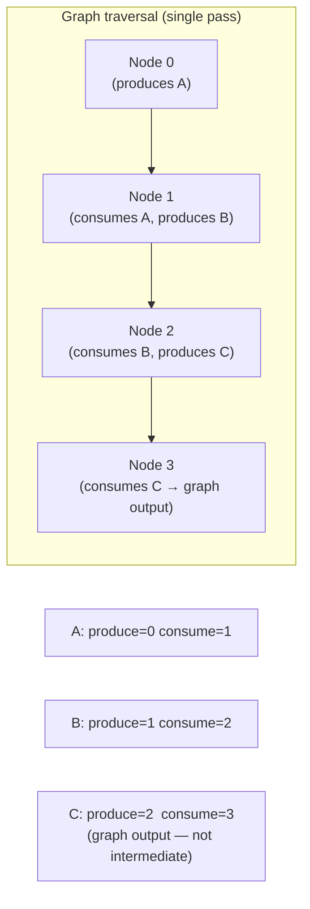
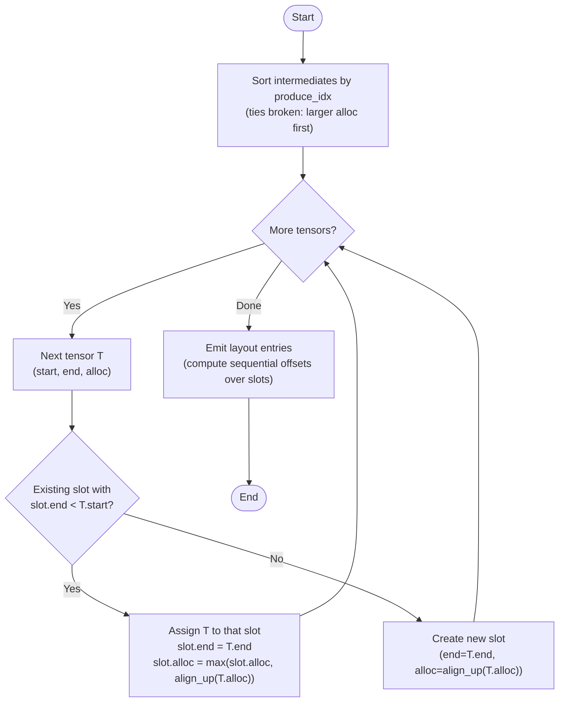

# Intermediate Buffer Reuse — Live-Interval Optimisation

The inference scheduler allocates a single contiguous DMA pool for all weights
and intermediate activation tensors.  Before this optimisation every intermediate
tensor occupied its own permanent slot in that pool.  The live-interval pass
analyses when each tensor is first written and last read, then uses **greedy
interval-graph colouring** to pack non-overlapping tensors into the same slot —
reducing the pool without any change to the generated kernel calls.

---

## Table of Contents

1. [Background](#1-background)
2. [Tensor Lifetime Categories](#2-tensor-lifetime-categories)
3. [Live Interval Analysis](#3-live-interval-analysis)
4. [Greedy Interval Colouring](#4-greedy-interval-colouring)
5. [Worked Example — gemm\_chain](#5-worked-example--gemm_chain)
6. [Pool Layout Before and After](#6-pool-layout-before-and-after)
7. [Alignment Rules](#7-alignment-rules)
8. [Implementation Reference](#8-implementation-reference)
9. [Correctness Properties and Tests](#9-correctness-properties-and-tests)
10. [Real-World Example — MobileNetV1](#10-real-world-example--mobilenetv1)

---

## 1. Background

The scheduler emits a single `inference_buf_alloc(N)` call that allocates the
entire DMA pool upfront.  Every weight and intermediate tensor is carved out of
this pool via `inference_buf_init_view()` — a zero-copy view that sets a base
pointer and element count without any additional allocation.

```
 Physical DDR
 ┌────────────┬────────────┬────────────┬─────────────────────────┐
 │  W1        │  B1        │  W2 …      │  intermediate tensors … │
 └────────────┴────────────┴────────────┴─────────────────────────┘
 ▲                                      ▲
 pool base                              weights end / intermediates start
```

Before the live-interval pass, each intermediate was placed sequentially
regardless of whether its slot was still in use.  This wastes memory proportional
to the depth of the inference graph: a linear chain of *n* layers allocates *n*
intermediate slots even though at most two need to coexist.

---

## 2. Tensor Lifetime Categories

Not all tensors are candidates for reuse:

| Category | Lifetime | Reuse eligible? |
|----------|----------|-----------------|
| **Weight** (`is_weight=True`) | Entire `inference_init()` → `inference_deinit()` | No — always live |
| **Graph input / output** | Passed in by the caller per `inference_run()` call | No — not in pool |
| **Reshape alias** | Points to the same memory as its source | No — no backing storage |
| **Intermediate** | Produced by one node, consumed by one or more later nodes | **Yes** |

Only intermediates are candidates.  Reshape aliases are already zero-cost (they
alias an existing buffer and have no `inference_buf_init_view` entry), so they
are excluded from the interval analysis.

---

## 3. Live Interval Analysis

A tensor's **live interval** is the closed range of node indices `[produce, consume]`
during which the tensor must exist in memory:

- **`produce`** — the index of the node whose output _is_ this tensor.
- **`consume`** — the index of the _last_ node that reads this tensor as an input.



In code (`src/codegen/_core.py : _compute_live_intervals`):

```python
for idx, sn in enumerate(self._graph.nodes):
    out = sn.output.onnx_name
    if out in intermediate_names:
        produced_at[out] = idx          # set once on first write
    for inp in sn.inputs:
        if inp.onnx_name in intermediate_names:
            last_consumed_at[inp.onnx_name] = idx   # overwritten → last wins
```

Two tensors **conflict** (cannot share a slot) when their intervals overlap:

```
  interval A: ─────[========]──────
  interval B: ──────────[========]─
                        ↑ overlap → conflict

  interval A: ─────[======]────────
  interval B: ───────────────[====]
                             ↑ no overlap → can share
```

---

## 4. Greedy Interval Colouring

Finding the minimum number of slots for a set of intervals is equivalent to
**interval graph colouring**, which the greedy earliest-start algorithm solves
optimally in O(*n* log *n*):



**Tie-breaking on alloc size** (largest first) ensures the biggest buffer claims
the slot so smaller reusers do not dictate an unnecessarily large slot footprint.

**Slot alloc** is the maximum of `align_up(tenant.alloc)` across all tenants —
so the slot is always large enough for whichever tensor occupies it at runtime.

---

## 5. Worked Example — gemm\_chain

`gemm_chain.onnx` is a three-layer fully-connected network:

```
input ──► Matmul0 ──► Add0 ──► Matmul1 ──► Add1 ──► Matmul2 ──► Add2 ──► output
```

After Gemm decomposition the scheduler sees four nodes (indices 0–3):

| Node | Op | Inputs | Output |
|------|----|--------|--------|
| 0 | MatMul | `input`, `W1` | `_gemm_mm_out_1` |
| 1 | Add | `_gemm_mm_out_1`, `B1` | `H` |
| 2 | MatMul | `H`, `W2` | `_gemm_mm_out_2` |
| 3 | Add | `_gemm_mm_out_2`, `B2` | `output` (graph output) |

Weights `W1`, `B1`, `W2`, `B2` and `output` are excluded from interval analysis.
`_gemm_mm_out_1`, `H`, and `_gemm_mm_out_2` are the three intermediates.

### Computed live intervals

```mermaid
gantt
    title Intermediate tensor live intervals (node index = time unit)
    dateFormat  X
    axisFormat  %s

    section Slot 0  (shared)
    _gemm_mm_out_1  :done,    0, 2
    _gemm_mm_out_2  :done,    2, 4

    section Slot 1
    H               :active,  1, 3
```



- `_gemm_mm_out_1` is produced at node 0 and last consumed at node 1 → interval **[0, 1]**.
- `H` is produced at node 1 and last consumed at node 2 → interval **[1, 2]**.
- `_gemm_mm_out_2` is produced at node 2 and last consumed at node 3 → interval **[2, 3]**.

### Greedy colouring trace

Sorted by start (all have size 16, 16, 8 elements respectively):

| Step | Tensor | Interval | Free slot? | Action |
|------|--------|----------|-----------|--------|
| 1 | `_gemm_mm_out_1` | [0, 1] | none | **create slot 0** (alloc=32) |
| 2 | `H` | [1, 2] | slot 0: end=1, not < 1 | **create slot 1** (alloc=32) |
| 3 | `_gemm_mm_out_2` | [2, 3] | slot 0: end=1 < 2 ✓ | **reuse slot 0** (alloc=max(32,32)=32) |

Result: **2 slots** instead of 3.

---

## 6. Pool Layout Before and After

For `ap_fixed<16,8>` (2 bytes/element), the 64-byte alignment boundary is
32 elements.

### Before (sequential, no reuse)

```
offset  0   →  512   : W1          (512 elems)
offset  512 →  528   : B1          (16 elems, padded to 32)
offset  544 →  672   : W2          (128 elems, padded to 160)  ← align_up(128)
offset  704 →  720   : _gemm_mm_out_1  (16 elems, padded to 32)
offset  736 →  752   : H               (16 elems, padded to 32)
offset  768 →  776   : _gemm_mm_out_2  (8 elems,  padded to 32)
                                                                ────────────────
Total: 800 elements (1600 bytes)
```

### After (live-interval reuse)

```
offset  0   →  512   : W1          (512 elems)
offset  512 →  528   : B1          (16 elems, padded to 32)
offset  544 →  672   : W2          (128 elems)
offset  672 →  680   : B2          (8 elems, padded to 32)
                                                                ── slot 0 ──
offset  704 →  736   : _gemm_mm_out_1  (alloc=16)  ┐ share
                       _gemm_mm_out_2  (alloc=8)   ┘ slot 0 (slot_alloc=32)
                                                                ── slot 1 ──
offset  736 →  768   : H               (alloc=16)     slot 1 (slot_alloc=32)
                                                                ────────────────
Total: 768 elements (1536 bytes) — saving 32 elements (64 bytes, 4%)
```

At runtime only one of `_gemm_mm_out_1` or `_gemm_mm_out_2` is live at any
given node boundary, so the hardware never reads stale data from the shared slot.

---

## 7. Alignment Rules

Every slot is sized and placed on a **64-byte boundary** to maintain DMA
cache-line alignment between adjacent buffers.  For `ap_fixed<16,8>`:

```
align_to  = 64 bytes / 2 bytes per element = 32 elements
align_up(n) = (n + 31) & ~31
```

A slot's footprint is `align_up(max(tenant.alloc))`, not `max(align_up(tenant.alloc))` —
the distinction matters when tenants differ in size: the slot must fit the
**largest** tenant, and that padded footprint is what advances the pool offset.

---

## 8. Implementation Reference

### `_compute_live_intervals() → dict`

```
src/codegen/_core.py — _CoreMixin._compute_live_intervals
```

**Returns** `{onnx_name: (produce_idx, last_consume_idx)}` for every
non-alias intermediate tensor.  The dictionary is keyed by ONNX tensor name.

Tensors excluded:
- Weight tensors (`t.is_weight`)
- Graph inputs and outputs
- Reshape aliases (keys of `_reshape_aliases`)

Edge case: if a tensor is produced but never consumed (dead code), its
`consume_idx` is set equal to `produce_idx`.

### `_compute_pool_layout() → (layout, total_elems)`

```
src/codegen/_core.py — _CoreMixin._compute_pool_layout
```

**Returns**
- `layout` — `list[(onnx_name, offset_in_elems, alloc_in_elems)]`
  One entry per weight + one per non-alias intermediate.  Shared-slot tenants
  appear consecutively and have the **same** `offset`.  `alloc_in_elems` is the
  individual tensor's allocation (passed to `inference_buf_init_view`), not the
  slot's padded footprint.
- `total_elems` — total pool size in elements.

Layout order: all weights first (graph order), then intermediates grouped by
slot (slot 0 tenants first, then slot 1, …).

### `_reshape_aliases` (unchanged)

Reshape outputs continue to be excluded from the pool layout entirely.  Their
pointer is assigned directly in `inference_init()`:

```c
flat_view = mm_out;   // zero-cost alias
```

---

## 9. Correctness Properties and Tests

### Invariants guaranteed by the implementation

| Property | Guarantee |
|----------|-----------|
| **No live-interval overlap for shared slots** | The greedy loop only assigns a slot when `slot.end < tensor.start`, so intervals never overlap within a slot |
| **Slot alloc fits all tenants** | `slot.alloc = max(align_up(tenant.alloc))` across all tenants |
| **All offsets 64-byte aligned** | `offset` advances by `align_up(slot_alloc)` after each slot |
| **Weights never shared** | Weights are emitted sequentially before interval analysis runs |
| **Aliases have no layout entry** | The `if t.onnx_name not in reshape_aliases` guard is applied before colouring |
| **Pool never larger than sequential baseline** | Fewer or equal slots → smaller or equal total |

### Test coverage

`test/test_pool_alloc.py` — updated `_assert_no_overlap`:

Previously asserted that **no two layout entries share any pool range**.  Now
asserts that any pair with overlapping pool ranges must have non-overlapping live
intervals, allowing intentional sharing while still catching erroneous overlap.

`test/test_live_intervals.py` — 12 new tests:

| Test | What it checks |
|------|---------------|
| `test_intervals_produce_le_consume` | `produce ≤ consume` for all intermediates |
| `test_no_weights_in_intervals` | Weight tensors absent from interval dict |
| `test_no_reshape_aliases_in_intervals` | Reshape aliases absent |
| `test_intervals_cover_all_non_alias_intermediates` | Every eligible tensor has an entry |
| `test_gemm_chain_ordered_intervals` | Start indices are strictly increasing in a linear chain |
| `test_reuse_occurs_in_gemm_chain` | At least one shared slot exists |
| `test_reuse_occurs_in_conv_relu_chain` | Reuse in conv model |
| `test_no_spurious_reuse_in_single_intermediate` | No sharing when only one intermediate |
| `test_pool_size_not_larger_than_sequential` | Optimised ≤ baseline for all models |
| `test_pool_size_strictly_smaller_for_gemm_chain` | Verified reduction for gemm\_chain |
| `test_shared_slots_have_disjoint_intervals` | Live intervals of slot-mates never overlap |
| `test_slot_alloc_fits_all_tenors` | Gap to next offset ≥ max aligned tenant alloc |

---

## 10. Real-World Example — MobileNetV1

MobileNetV1 (1.0, 224×224, 1001 classes) is a representative deployment model
for the KV260: it fits entirely within the supported operator set (Conv, Relu6,
GlobalAveragePool, Reshape) and its strict linear-chain topology makes the
ping-pong reuse pattern immediately visible.

All measurements use `ap_fixed<16,8>` (2 bytes per element), which is the
production data type for the Cormorant accelerator.

Source model: `mobilenet_v1_1.0_224_no_softmax.onnx`
(MobileNetV1 v1 TensorFlow checkpoint, Softmax removed, weights frozen).

### Model Structure

The graph is a pure linear pipeline of 58 nodes: a first standard convolution
followed by 13 depthwise-separable blocks and a final global-average-pool +
reshape to the 1 001-class logit vector.

```
input [N×3×224×224]
  │
  ▼
Conv2d_0  ──Relu6──►  DWConv2d_1  ──Relu6──►  PWConv2d_1  ──Relu6──►
  ▼
DWConv2d_2  ──Relu6──►  PWConv2d_2  ──Relu6──►  …  (13 DW-sep blocks)
  ▼
GlobalAvgPool  ──►  Conv2d_logits  ──►  Reshape  ──►  output [N×1001]
```

| Property | Value |
|----------|-------|
| ONNX nodes (ops) | 58 |
| Intermediate tensors | 56 |
| Weight tensors | 56 (one filter + one bias per conv layer) |
| Graph inputs | 1 (`input`) |
| Graph outputs | 1 (`output`) |

### Why Ping-Pong Emerges

Because the graph is a pure linear chain — every node reads exactly one
intermediate and writes exactly one intermediate — each tensor is alive for
precisely two consecutive nodes:

```
node:   0     1     2     3     4     5     6     7  …
        Conv  Relu6 DWConv Relu6 PWConv Relu6 DWConv Relu6

A  =  ──[0,1]
B  =        ──[1,2]
C  =              ──[2,3]
D  =                    ──[3,4]
E  =                          ──[4,5]
F  =                                ──[5,6]
G  =                                      ──[6,7]
H  =                                            ──[7,8]
```

Odd-start tensors (A, C, E, G, …) never overlap → they collapse into **slot 0**.
Even-start tensors (B, D, F, H, …) never overlap → they collapse into **slot 1**.
The entire 56-tensor pipeline is reduced to exactly **2 slots**.

```mermaid
gantt
    title Live intervals — first 8 nodes of MobileNetV1 (node index = time unit)
    dateFormat  X
    axisFormat  %s

    section Slot 0  (Conv outputs)
    Conv2d_0 → [1,32,112,112]   :done,    0, 2
    DWConv2d_1 → [1,32,112,112] :done,    2, 4
    PWConv2d_1 → [1,64,112,112] :done,    4, 6
    DWConv2d_2 → [1,64,56,56]   :done,    6, 8

    section Slot 1  (Relu6 outputs)
    Relu6@Conv2d_0 → [1,32,112,112]   :active,  1, 3
    Relu6@DWConv2d_1 → [1,32,112,112] :active,  3, 5
    Relu6@PWConv2d_1 → [1,64,112,112] :active,  5, 7
    Relu6@DWConv2d_2 → [1,64,56,56]   :active,  7, 9
```



### Slot Sizing

Each slot's allocation is the **maximum** of all its tenants' `align_up(alloc)`
values.  The largest feature map in MobileNetV1 is the pointwise output of
block 1: `[N, 64, 112, 112]`, which comes from doubling the channel count before
the first spatial downsampling step.

| Slot | Tenants | Largest tenant shape | Slot alloc (batch=1) | Slot alloc (batch=16) |
|------|---------|---------------------|---------------------|-----------------------|
| 0 | 28 (Conv, DWConv, GlobalAvgPool outputs) | [N, 64, 112, 112] | 802 816 elem = 1 568 KiB | 12 845 056 elem = 24.5 MiB |
| 1 | 28 (Relu6, final Conv outputs)            | [N, 64, 112, 112] | 802 816 elem = 1 568 KiB | 12 845 056 elem = 24.5 MiB |

The slot size is the same for both slots because both happen to accommodate the
same largest feature map (one slot holds the raw convolution output, the other
holds the post-activation output of the same spatial resolution).

### Memory Savings

#### Batch = 1

| Region | Naive (sequential) | Optimised (2 slots) | Saving |
|--------|-------------------|---------------------|--------|
| Weights | 8.05 MiB | 8.05 MiB | — |
| Intermediates | **19.24 MiB** | **3.06 MiB** | **16.18 MiB (84.1 %)** |
| **Total pool** | **27.29 MiB** | **11.11 MiB** | **16.18 MiB (59.3 %)** |

Pool layout (batch=1, weights at offset 0):

```
 offset 0                  4.2 M                  5.0 M        5.8 M
 │──────────────────────────│────────────────────────│──────────────│
 │        Weights           │       Slot 0            │   Slot 1    │
 │  56 weight tensors       │  28 conv outputs        │ 28 post-act │
 │  8.05 MiB                │  802 816 elem / 1.5 MiB │ 1.5 MiB     │
 └──────────────────────────┴─────────────────────────┴─────────────┘
```

#### Batch = 16

| Region | Naive (sequential) | Optimised (2 slots) | Saving |
|--------|-------------------|---------------------|--------|
| Weights | 8.05 MiB | 8.05 MiB | — |
| Intermediates | **307.9 MiB** | **49.0 MiB** | **258.9 MiB (84.1 %)** |
| **Total pool** | **315.9 MiB** | **57.1 MiB** | **258.8 MiB (81.9 %)** |

Pool layout (batch=16, weights at offset 0):

```
 offset 0                  4.2 M               17.1 M          29.9 M
 │──────────────────────────│───────────────────────│─────────────────│
 │        Weights           │       Slot 0           │    Slot 1       │
 │  56 weight tensors       │  28 conv outputs       │  28 post-act    │
 │  8.05 MiB                │  12 845 056 elem        │  12 845 056 elem │
 │                          │  24.5 MiB               │  24.5 MiB       │
 └──────────────────────────┴────────────────────────┴─────────────────┘
```

The weights are batch-independent (model parameters do not scale with batch
size), so a larger batch means a proportionally larger saving as a fraction of
the total pool.

### Why Exactly 84.1 % Regardless of Batch Size

The intermediate saving percentage is identical for batch=1 and batch=16 because
both the naive total and the optimised total scale linearly with batch size (all
activation shapes share the same batch dimension).  The ratio of
`max_feature_map / sum_of_all_feature_maps` is a property of the network
topology, not the batch size.

For MobileNetV1 the naive intermediate pool is the sum of all 56 activation
sizes (dominated by the early, spatially large feature maps):

```
naive_total = Σ align_up(alloc_i)   for i = 0..55
```

The optimised pool is just the two largest tenants (one per slot), both equal to
`align_up([N, 64, 112, 112])`:

```
opt_total = 2 × align_up(N × 64 × 112 × 112)
```

The ratio `opt_total / naive_total ≈ 0.159` is independent of N, giving the
consistent 84.1 % saving across all batch sizes.

### Context: KV260 u-dma-buf Constraint

The KV260 platform allocates DMA-capable memory through the Linux
[u-dma-buf](https://github.com/ikwzm/udmabuf) driver.  The driver requires a
single contiguous physical region declared at boot time in the device-tree
overlay.  This makes minimising the pool size critical:

- **Without reuse, batch=1:** 27.3 MiB must be reserved at boot.
- **With reuse, batch=1:** 11.1 MiB — fits within a 16 MiB u-dma-buf node with room to spare.
- **Without reuse, batch=16:** 315.9 MiB — exceeds the 256 MiB region commonly
  configured for the KV260 PS-side DDR.
- **With reuse, batch=16:** 57.1 MiB — comfortably allocatable.
